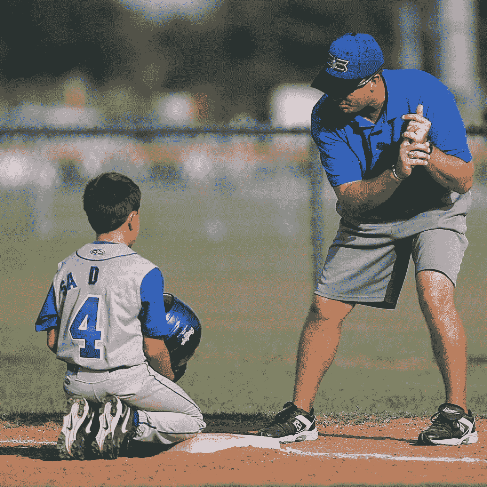

# "你在乎吗，兄弟？"这是一首歌颂我们如何领导(以及如何更好地领导)的颂歌

> 原文：<https://medium.com/swlh/do-you-even-care-bro-an-ode-to-how-we-lead-and-can-lead-better-3a0f0d041286>

呀…这个标题听起来超级精神，不是吗？

坚持住！

甚至在我接受心理学教育之前，我就对领导者如何对待和激励他们的团队非常着迷。每一个领导者、教练、老师和其他权威人士都有不同的风格——有些更注重技术和战术，有些激励人，有些难以接近、要求高但很成功，这样的例子不胜枚举。

Photo from [Pexels](https://www.pexels.com/de/foto/athlet-baseball-coaching-junge-264337/).

最有可能的是，如果你上过大学，参加过体育运动，实习过，为一个糟糕的老板工作过，或者在一次失败后担任过重要的领导职务，你就有这方面的经验。

虽然我们可以说一种领导风格不一定比另一种更好，但这种风格确实需要与情况和团队相匹配！

适应性是领导力游戏的名字。

因此，我向您展示了关于领导风格以及我们如何改进工作的一些想法:

## 1)你是领导还是…？

*   教书？
*   需求？
*   律师？
*   批评？
*   领导？

一个领导者当然应该有期望；没有目标能培养出什么样的竞争工作环境？

设定目标很重要，但实现目标不仅仅是领导者的工作。

**然而，实现它们也不仅仅是*其他人的*的工作。**

这是一个累积的努力。领导者应该授权他人为自己做工作，而不是为他们做或溺爱他们。同时，不要忍受他们。

不要牵着他们的手走向目标。期望达到高的(合理的)标准，但是当人们需要指导时，给出可操作的步骤。

## 2)你设置什么环境？

*   它是积极的吗？
*   当消极出现时，你能处理吗？
*   有激励作用吗？
*   它是严格的自我/成就驱动的吗？

管理好你所营造的氛围很重要。

如果你的团队中有一群自我膨胀的人(包括你的自我)，你可以打赌你的下一份薪水不是团队的目标——因此，一起实现团队目标的过程*——而是安抚不安全感和证明领域。*

*那真的对一个团队没有好处。*

*当冲突出现时，学会如何处理，知道如何恰当地(而不是好斗地)检查自我——包括你的——并将焦点从成就转移到建立一种让所有人受益并包容所有人的团队文化。*

*设定共同的目标、价值观和标准。在某种程度上，这将有助于团队领导他们自己，并允许你减少对告诉他们做什么的关注，而更多地关注如何充分利用每个人、他们独特的技能和他们的经验。*

## *3)你能承受高温吗？*

*你能很好地处理批评吗？*

*或者当有人接近你时，你会有所防备吗？*

*如果需要，人们应该觉得他们可以畅所欲言，无论是关于他们的表现，还是对你的担忧或建议。*

*不要好斗。*

*这实际上意味着你的团队投入了足够的精力来重新考虑你、你的结构、你的计划和你的决定。*

*听他们说完。*

> **如果你开始变得激动，说“谢谢你和我分享这些。我会以一种非居高临下的方式回复你/考虑一下”，然后离开这种情况。**
> 
> **如果一切顺利，平静而深思熟虑地回应(对我们大多数人来说，这意味着“说话前慢慢思考”)。**

*也许向对方解释你的观点，为什么你的决定仍然有效，或者努力达成妥协。*

*不管怎样，培养你和那个人之间的信任。再次，被质疑意味着人们在某种程度上关心或被这个共同的目标和标准所收买。别搞砸了。*

## *4)你承担责任吗？*

*你对自己在成功和失败中的角色负责吗？*

*还是怪团队内部功能失调？你会责怪外部环境吗？你的竞争对手？你会责怪天气、设施、地板等等吗？*

*你对你的员工的期望负责，还是他们自己承担所有的责任？*

*专家提示:没有人愿意和一个把他们丢到公共汽车底下，然后毫发无损地离开的领导一起工作。对你在成功、失败和期望中的角色负责。*

*共同的目标、价值观和标准也适用于你。*

## *5)你在乎吗？*

*好吧，有人告诉我这样问听起来很粗鲁，但是…*

> *你真的关心你的团队吗？*

*还是你只在乎他们的结果？你在乎这会让你看起来怎么样吗？*

*你培养他们的成长吗？你相信他们吗？*

*你也给他们在生活中可以使用的技能和工具吗？
_______________*

*给自己一份所有这些事情的审计报告。*

*定期重新评估你为什么处于领导地位以及你如何领导。*

*有益吗？符合情况吗？对团队有帮助吗？谁赢了？*

**如果只有* ***你*** *赢，你需要换。**

*一个好的领导者，在任何情况下，都会确保他或她的团队中没有人会从缝隙中溜走。*

*想长二头肌就长适应性肌肉。*

*毕竟，激励你的团队不是你的工作。*

*你的工作是激励自己，营造一个学习和发展的氛围。如果你促进增长，除了“上升”和(很可能)“胜利”，你别无选择。*

*我很想听听你们领导对这个话题的其他想法。让我们培养优秀的员工、创新者、学生、运动员和人类。*

***感谢阅读！如果你从这篇文章中受益，请鼓掌或分享，这样它可以帮助别人。我非常感谢你的反馈和回应，比你知道的还要多！——朱莉娅***

***更多关于教练，表演心理学，以及体育行业创业的迂回，查看** [**狮子的鬃毛博客**](http://www.whitelionperformance.com/blog) **。***

**

## *这篇文章发表在 [The Startup](https://medium.com/swlh) 上，这是 Medium 最大的创业刊物，拥有+ 378，907 读者。*

## *在这里订阅接收[我们的头条新闻](http://growthsupply.com/the-startup-newsletter/)。*

**