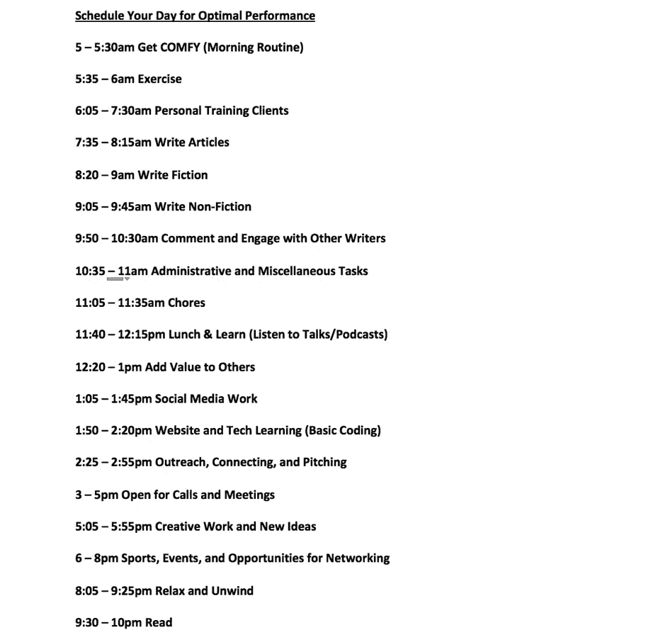

# 你很难坚持你疯狂的时间表吗？试试这个！

> 原文：<https://medium.com/swlh/do-you-have-trouble-sticking-to-your-crazy-schedule-try-this-ff4d48fa8372>

## 企业家维持受控混乱的独特方法

“A woman holding up a clipboard with a calendar in front of her chest” by [Brooke Lark](https://unsplash.com/@brookelark?utm_source=medium&utm_medium=referral) on [Unsplash](https://unsplash.com?utm_source=medium&utm_medium=referral)

对于创业者，尤其是第一次创业的创业者来说，最主要的挑战之一是在一个**你**创造投入和产出的环境中维持秩序。

*你自己创造* ***小时*** *。*

*你创造自己的* ***职业道德*** *。*

*你自己创建* ***输出*** *。*

*你自己创建* ***日程*** *。*

勇敢的创业让你超越世俗社会的传统规范，做一些点燃你内心绝对激情的事情。

*令人兴奋的是* ***。***

*是* ***肾上腺素诱发。***

*但是，它也可以* ***令人望而生畏。***

*也可以是* ***极度无组织。***

许多人冒险创业，是为了能够创造自己的时间，而不是被传统的朝九晚五的社会所束缚，这种社会一直在努力实现和坚持。这可能是开始时的主要吸引力，但很快这种自由变得低效。

# 我的创业开端

我在 23 岁这个成熟的年龄开始创业。我写并出版了一本[书](https://www.amazon.com/dp/B079DX26HS),内容是关于克服压力和焦虑的晨间常规，以及如何从你进门的那一刻起成为教室里最有效率的学生或办公室里最有效率的员工。

我在一家著名的餐饮集团做了 4 个月的管理工作，每天早上 6 点到晚上 8 点工作。

与我习惯的令人厌倦的时间相比，我作为企业家的最初几个月是辉煌的。我仍然醒得很早，因为我是一个早起的人，我四处乱逛了一会儿，在中午左右达到了我的创意高潮，创造了一些好的内容，建立了一些很酷的联系，开发了一些很酷的机会，然后又四处乱逛了一些。

我只是做做样子，但我并没有真正做任何事情。

有一天，一位有抱负的企业家兼作家问我，“对你来说，典型的一天是什么样的？”我用常见的企业家用语回应道，“真的没有时间表，我戴着这么多帽子，每天每小时都在变化。”

然后我突然想到。

这是我的问题。我对结构没有丝毫感觉。我每天都让它引导和控制我，而不是我引导和控制它。

我从来没有真正收到过关于创业时间表的明确建议，或者也许我只是没有努力寻找，但正因为如此，我决定创造自己的方法。

基础是理解在你的生活中，什么时候你最成功，什么时候你最富有成效，什么时候你正处于最佳状态。这对于每个人来说都是不同的，但是这是我对我如何以及何时发挥最佳作用的分析和解释，如果你和我有相似之处，就使用这种方法和这份指南，或者至少是它的一些变体。

# 高中建立结构

回想那些高中的日子。无论你是班上的尖子生、种马运动员、戴眼镜留长发的笨拙胖小子，还是三者兼而有之(我)，你的一天都是为你预先决定的。你被要求一节又一节地去上课，在固定的时间内从一个主题切换到下一个主题。你在课间有一点时间来恢复，你有像午餐一样的休息时间来恢复，你甚至有强制性的体育课(我最喜欢的)。

你很早就到了，很早就离开了，然后剩下的时间要么参加体育或俱乐部之类的课外活动，要么回家做作业，谁知道会做什么，直到第二天重复这个过程。

这是重复的，乏味的，漫长的，但它是一成不变的，回头看，我看到了高中时间表制定方式的所有好处。

我当时并不太喜欢它，但我非常擅长。我进去的时候是一个胖乎乎的、不自信的、安静的孩子，戴着眼镜，有一口坏牙，离开的时候是一个自信的、450 分中排名前 20 的学生，大学足球队和田径队的队长，注定要去西北大学。

# 大学以更大的自由度挑战结构

上大学测试你如何更自由、更独立、更少公式化的日常生活来控制你的生活。

是的，有课要上，有俱乐部要加入，有聚会要享受，但是没有例假，没有强制性的健身课，没有固定的午餐时间，没有从一个地方到另一个地方的系统过渡。

在大学里，有这么多分散注意力的事情，很难专注于一个时间表。有些人在这种环境中茁壮成长，在图书馆埋头苦读，在考试中取得优异成绩，在宿舍里兼职创业，利用如此多的空闲时间完成面试，但这并不适合所有人。

对包括我在内的一些人来说，自由时间意味着有更多的时间和朋友在一起，有更多的时间去体验课堂之外的生活，有更多的时间去参加聚会，这当然并不总是有益的。

我在大学表现很好，交了很多朋友，创办了一些很酷的公司和组织，并在其中工作，成绩也不错，但我从未*茁壮成长*。

我没有在班上名列前茅，我不再是最好的运动员之一，我也没有得到我的“理想工作”或类似的东西。

# 传统的“朝九晚五”重新建立了某种刚性

在放学后参加工作时，事情开始变得更像高中。你被期望在特定的时间打卡，在特定的时间离开，并且整天工作，由一个老师口述给你，但是这个老师在他或她的桌子上有更少的苹果和更少的金色贴纸。

有逻辑，有一个受控的环境，这很好，但通常这第一份工作完全是基于为别人完成卑微的任务，然后别人为别人完成一点点卑微的任务，然后别人用这些任务和信息来开会，但往往没有结果。

我不是在抨击企业界，每个人都有自己的定位，但对于那些希望从他们开始做某事的那一刻起就看到他们的影响的人，尤其是如果你希望这种影响改变世界，这可能不是你的路线。

对我来说，我终于意识到，在早上 6 点数剩下的汉堡肉饼并不完全是我所寻找的令人满意的餐馆职业，所以尽管这一天有其既定的标准，但它缺乏我所渴望的创造自由，即从头开始建造和种植东西，并为他人增加价值。

# 创业是完全不同的游戏

辞去一份稳定的工作，成为一名企业家，将你所知道或听到的关于独立的一切，完全从 30 层楼的顶层窗户扔出去。

没人告诉你什么时候醒来。

*没人告诉你什么时候去办公室。*

*没人告诉你去完成任务。*

没人告诉你去吃饭或锻炼。

那里没人告诉你任何事。

这可能是痛苦的孤独，但最糟糕的是，这可能是痛苦的难以获得动力和推动。

这会导致缺乏组织，每天都感觉一团糟，时间飞逝却没有真正感觉到自己有所成就，以及持续不断的怀疑和对失败的恐惧。

当那位有抱负的企业家问我我的一天是什么样子时，我同时经历了所有这些情绪，于是我决定做出改变。

我重新评估了我所有渴望成功的经历，渴望成为最优秀的人。无论是高中、大学、运动、工作、俱乐部、创业，我都必须选择一个我生活中的时间，无论我当时是否喜欢，我都是最有效率的，我正在茁壮成长。

这让我想起了那个胖乎乎的孩子，他成了一个高中成功的故事。我设计了一个计划，利用我的高中时间表作为一个模型，告诉我如何成为一个更有条理的企业家，并以一种既提供系统组织又提供创造性自主的方式安排我的一天。

这是我想出来的。

# 你的时间表应该模仿你达到最佳表现的时间

## 企业家控制的混乱

我的一天被分成 19 个“时间段”, 19 个不同的“主题”,从 25 分钟到 90 分钟不等。我允许自己在每个类别之间有 5 分钟的休息时间，这对于避免过度劳累或压力过大是至关重要的。

我把时间花在身体健康、个人成长和发展、边学习边吃饭、放松、休息、人际关系和娱乐上。这些都是我在高中时期最活跃的时候的特征。我留出个人时间用于创造力和思想创造，为我提供了控制和自由的正确结合。

我每天花 12 个小时做与“工作”相关的事情，并且一周做 6 天，所以一周工作 72 小时。

*我比以往更******富有成效*** *。***

***我比以往更有效率***。****

***我是* ***比以往更有创造力的*** *。***

***我是* ***比以往更有活力的*** *。***

***我正在* ***为我的事业创造比以往更多的机会*** *。***

***我是* ***比以往更快乐的*** *。***

**在构建你的一天的过程中，我将与你分享的三个最重要的属性，不管它需要什么或看起来像什么，是强度、一致性和灵活性。**

## **强度**

**这些是 19 个不同类别的短爆发或冲刺。无论你分配给一项任务的时间是 5 分钟还是 500 分钟，你最好确保它是不间断的，专注于手头的主题。**

**安排大量的时间来分散注意力，比如看电视或玩电子游戏，但是不要偏离你必须做的事情和完成你必须完成的事情的时间。**

**这是你的生计，所以让我们珍惜时间。**

## **一致性**

**这不是一劳永逸的事情。这需要几天甚至几周的时间去适应，去适应，去养成习惯。这将需要纪律，承诺和重复，让你在几周内记住这一点。**

**坚持这个计划将会让你获得你渴望和应得的成功。开始的时候试着去做，找出什么是适合你的，但是一旦实验期结束，把这个时间表牢牢记在你的脑子里。**

## **灵活性(轻度灵活性)**

**话虽如此，老话是对的，作为一名企业家，没有特定的一天。但是，我们可以接近，这是这样做的方式。**

**电话可能会在不同的时间出现，会议可能会被安排，机会可能会出现在他们分配的区域之外，但请确保相应地调整。**

**要明白你的最佳时间表并不是一成不变的。**

**但是你偏离得越远，你就越接近那个无组织、过度工作、压力过大的企业家，他不能解释你生活中一天的内在运作。**

# **增压你的早晨例行公事！**

***想了解更多关于如何发现一个有创意、独特、有趣、能让你更有效率、更有活力的早晨惯例的信息，请查看***！****

****

## **这篇文章发表在 [The Startup](https://medium.com/swlh) 上，这是 Medium 最大的创业刊物，拥有 337，320 多名读者。**

## **在这里订阅接收[我们的头条新闻](http://growthsupply.com/the-startup-newsletter/)。**

****