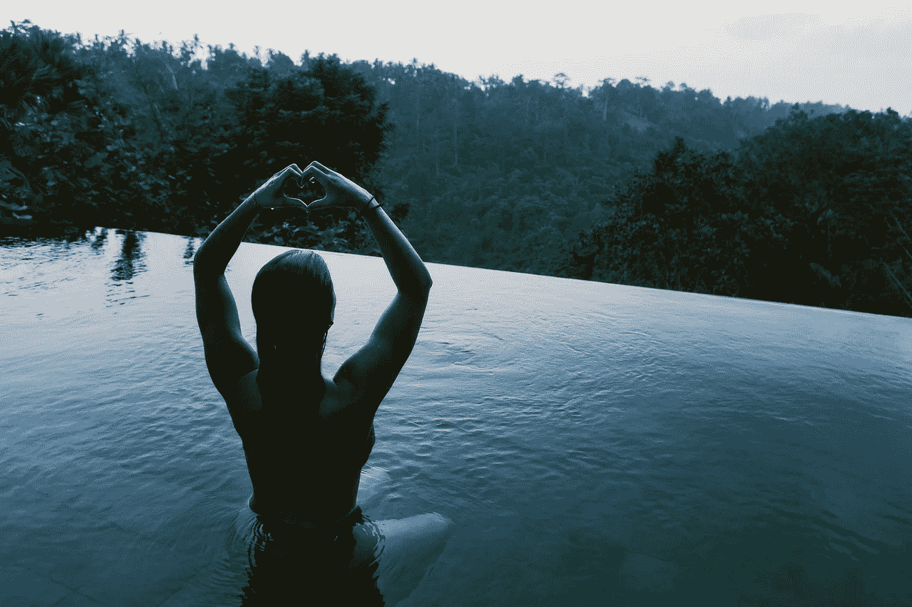

# 你冥想吗？请答应。

> 原文：<https://medium.com/swlh/do-you-meditate-please-say-yes-c4bccd3a014c>

Infinity pool and bikini required (obviously). Image: @jonflobrant

我明白了。你不喜欢熏香的味道。你喜欢伸展运动，但瑜伽文化不适合你。你已经注意到[‘精神’的人](https://www.youtube.com/watch?v=nDCUn-qtWek)可以是除了精神以外的任何东西，这是令人倒胃口的。此外，**压制所有思想的想法似乎是不可能的——更不用说是富有成效的了。**

我在 2017 年底以一种最终对我有效的方式重新定义了冥想。结果太棒了，是的，我很努力。我有自私的理由与你分享——作为一名企业家，你每天都在为我们的世界带来创新。冥想会让你的思维变得敏锐，让你在工作中更有效率和创造力，我们都会从中受益。

# 冥想按摩你的大脑

这不是一种带有怪异音乐和广藿香的**‘精神’**按摩，而是一种**运动**按摩，按摩你赖以生存的每一项功能的肌肉。冥想可以作为一个独立的工具为你服务，不参与亚文化。有临床证据表明，冥想有助于缓解健康人群的日常压力，以及不健康人群的焦虑、抑郁、失眠、癌症和慢性疼痛。

# 你不需要打地鼠你的想法

冥想有不同的方式，但作为企业家，我们的目标是让我们的大脑回到中立、有意识的状态，即“快乐”状态，在那里它可以茁壮成长。我们点击的是重置，而不是删除。你会发现，即使是一分钟不抗拒的快乐状态也能让你对一整天做出更好的反应。

It feels like this. Image: [Vincentiu Solomon](https://unsplash.com/photos/R86bzJSneuw?utm_source=unsplash&utm_medium=referral&utm_content=creditCopyText).

# 态度

舒适地坐在椅子上或盘腿坐在地板上是一种获得中立、快乐状态的简单方法。躺下来很容易入睡。你会了解你自己，以及你的身体需要什么来变得无抵抗力和当下。以下是帮助你进入正确状态的更多建议:

*   使用积极的、概括的陈述——听、想、读，任何有用的东西。
*   听听“无聊”的声音(有很多白噪音应用和视频可供选择)。
*   戴上眼罩(如果你喜欢闭上眼睛)。
*   点燃一支蜡烛，轻轻地聚焦在火焰上(如果你喜欢睁开眼睛的话)。我喜欢香味蜡烛，因为它们给聚会带来了另一种感觉。
*   使用降噪耳机。

# 有帮助的技术

划出你每天的 15 分钟，记住你要去见一个重要的人——带着你内心的寒意去赴约吧。如果你想听一段口语指导冥想，H [eadspace 应用程序](https://www.headspace.com/)是一个简单的开始。我更喜欢 Youtube 上的[这种引导冥想](https://www.youtube.com/watch?v=og4B2ZMP-uY)，但 Headspace 有更大的选择范围。

如果你走的是白噪音/音乐路线，那就用秒表或计时器应用程序来代替看时钟，这样就“设置好了，然后就忘记了”。

# 这和刷牙没什么不同。

如果你从一个享受和乐趣的地方开始每日冥想，你就不需要“动机”来“完成它”。这感觉就像是你出于基本卫生而做的事情。冥想可以消除积聚在我们大脑中的压力和消极情绪。例行公事会安慰你的身体，随之而来的头脑的清晰会把你生活的墙壁变成门，然后把它们打开。

______

[Shoshana Rubli](http://medium.com/@shoshanarubli/latest) 无法在中本聪和葛塔诺·多尼采蒂之间做出选择。

## 这篇文章发表在 [The Startup](https://medium.com/swlh) 上，这是 Medium 最大的创业刊物，拥有 318，120 多名读者。

## 订阅接收[我们的头条新闻](http://growthsupply.com/the-startup-newsletter/)。

