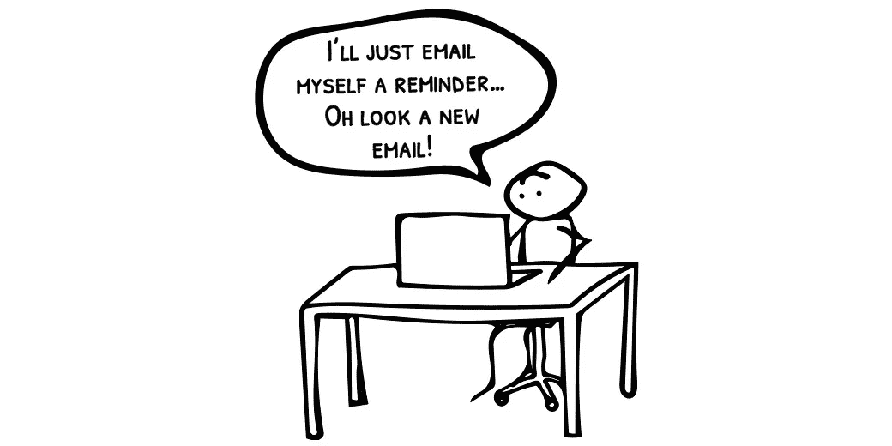
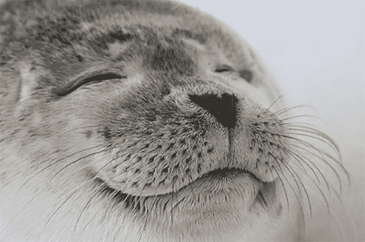
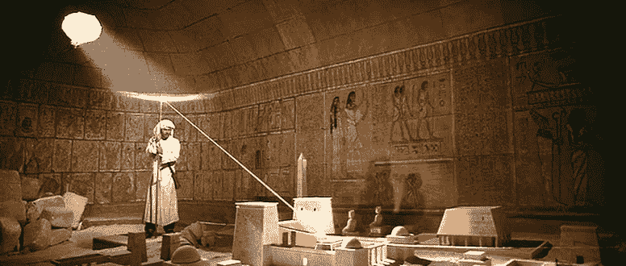
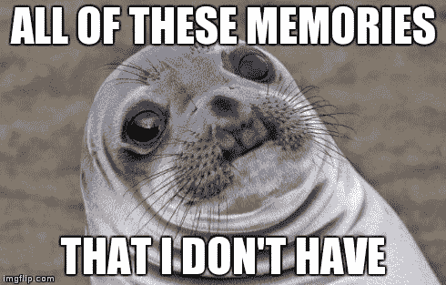
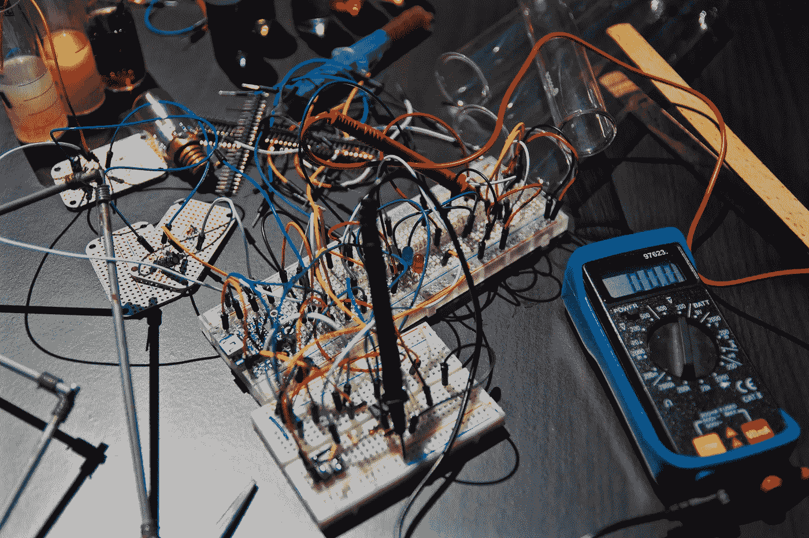
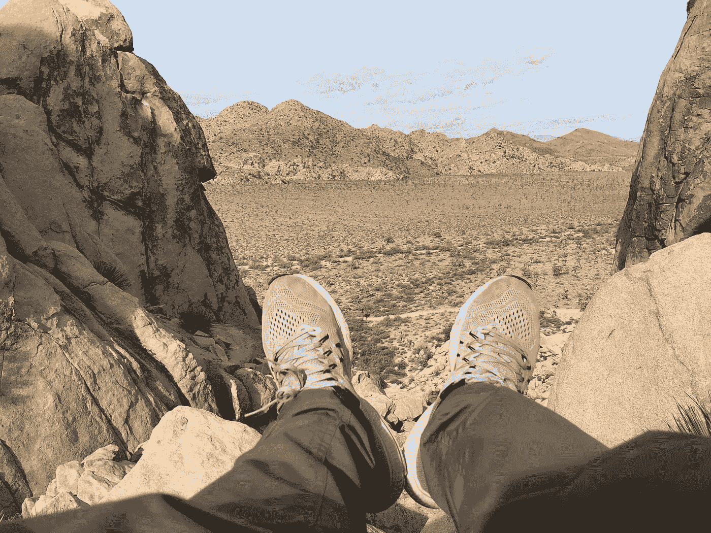

# 你记得你昨天在做什么吗？

> 原文：<https://medium.com/swlh/do-you-remember-what-you-worked-on-yesterday-7c4c8ad22a3a>

## 当涉及到商业决策时，依赖你的记忆可能是致命的。

我用一个叫做“收获”的工具来记录我的工作时间。用起来超级简单。每天我都会记录我在每个项目的不同任务上花了多长时间。这些数据对于跟踪进展和改进对未来工作的估计是非常宝贵的。

有时虽然我忘记记录我的时间。

第二天，我不得不停下来，在精神上回想我做了什么。经过几分钟的思考，我通常能回忆起重要的细节。

Yesterday, all my troubles seemed so far away…([source](https://imgflip.com/memegenerator/Satisfied-Seal))

你知道当我连续几天忽略记录时间会发生什么吗？这当然是假设性的，因为它 ***永远不会*** 发生(PS——它一直发生*)。*

**

*When the sun aligns, I can spot that email I sent last Friday ([source](http://indianajones.wikia.com/wiki/Headpiece_to_the_Staff_of_Ra))*

*即使只有几天的间隙，我也不得不回去仔细检查我的电子邮件、垃圾邮件、日历和 Trello 板。我把自己的行为拼凑起来，就像某种考古谜题。*

*现在让我们想象一下，我必须回想一个月前。*

**

*It hurts ([source](https://imgflip.com/i/gsh2h))*

*你自己试试。过去一个月、两个月或六个月，你最重要的工作细节是什么？如果你需要的话，收集这些信息需要多长时间？你要挖多深？*

*相反，我们总是根据对这些事件的记忆来做出重要的商业决策。*

*我们当然能记住真正重要的东西。重大时刻或事件会更深地印在我们的脑海中。*

*在书中，*瞬间的力量，奇普和丹·希斯谈到人类倾向于只记住一次经历中最好的、最坏的和最后的瞬间。其余的细节都被洗掉了。这本书关注的是我们如何在经历中注入更多这样的时刻。**

**如果你正在寻找提升你自己或你的顾客的某些经历或记忆的方法，这是非常好的。但是如果目标是基于过去的事件做出明智的决定，这就不那么好了。**

**如果你不记得导致一个决定的想法，结果本身有多大价值？**

**结果很重要，但并不能说明全部。为了从过去的经历中获益，我们需要知道结果之前和之后发生了什么。没有这个背景，你的大脑必须自己重建这个故事。**

# **讲故事的大脑**

**我们讲故事的大脑渴望理解我们的生活。**

**问题是我们的大脑非常乐意以牺牲准确性为代价来构建这些故事。这意味着如果我们的记忆有漏洞，我们会很乐意用新的“事实”来填补。当这种情况发生时，故事会更多地受到最近发生的事件或支持我们当前议程的观点的影响。**

**这个过程否定了结果的价值，因为它让我们以如此多不同的方式来旋转它。**

**在书中，[的*原则*](https://www.principles.com/) 出自首席执行官兼财务分析师[雷伊·达里奥](https://twitter.com/RayDalio)，他走向了另一个极端。在他的金融投资公司 Bridgewater Associates，他追求“彻底的透明”。为此，他的公司收集并记录了他或他的员工的每一次互动和决策的信息。**

**他的目标是将这些信息转化为指导未来决策的规则和算法。**

**他的方法需要大量的训练来实施。这也需要一种文化，在这种文化中，人们可以分享、记录和评论他们所做的每一个方面。**

**从他自己的叙述来看，很多人没有在他的体系中生存下来。但结果是该公司取得了惊人的成功。**

**那么，有没有更容易达成的中间立场呢？**

**如果不记录团队的每一次心跳，你能捕捉到工作的背景和结果吗？**

# **进行商业实验**

****

**Your business: Just a crazy tangle of wires ([source](https://unsplash.com/photos/3GZi6OpSDcY))**

**商业实验就像你在学校进行的科学实验一样:**

1.  **围绕你需要理解的东西精心设计一个假设**
2.  **决定如何测试，收集什么数据，持续多长时间**
3.  **做那件事**
4.  **分析结果，并用它们来帮助指导你的下一步行动**

**实验不需要做与你现在做的事情有很大不同的事情。第三步，“做那件事”是你已经一直在做的活动。**

****区别在于:****

*   **预先考虑好你打算做什么和你期望的结果**
*   **在结束时停下来回顾你的结果，以及它们对你的企业意味着什么**
*   ****全部写下来****

**我已经为我的客户和我自己的生意做了很多实验。我怎么强调这个过程中“啊哈”时刻的数量都不为过。有些发生在构建的前期或之后的分析中。当你在一个月或更长时间后看结果时，你会发现更多。**

**想象一下，你或你的团队需要做出一个重大的商业决策。想象一下，你可以用一系列过去的实验来充实讨论，而不是一张白纸。**

**猜测会少多少？**

**如果没有基于个人记忆的循环辩论，这些讨论能有多大成效？**

**如果你记录并建立在你所学到的东西上，而不是让这些细节逐渐消失，你的公司会变得多么强大。**

**当你使用商业实验时，一切都变得容易了。**

# **最后一个想法**

**我最近在约书亚树徒步旅行，决定爬上一大块巨石。这不是太极端，但有足够棘手的部分，以保证真正的重点。**

****

**当我爬上那些巨石时，我知道如果我不沿着已知的路径下山，我会遇到真正的麻烦。如果我偏离了路线，我可能会卡住或不得不爬下一个更危险的部分。**

**我需要记录我的路径，这样我就能记得怎么回去。光靠我的大脑是不可信的。**

**我拍了很多精神快照，但也用手机拍了一些真实的照片。这些照片非常方便，帮助我避免在一个特别陡峭的岩石路段偏离轨道。**

**当涉及到身体危险时，我们的本能会努力保护我们。肾上腺素让我们保持警惕。当涉及到我们的生意时，我们被欲望所诱惑,*只是去*。**

**通过记录决策和使用业务实验，您的业务可以避免悬在悬崖边。**

****

# **[使用我们的免费工作表进行实验，让您的企业远离危险的悬崖。](http://mapandfire.com/problems-we-solve/validate-business-model/?utm_source=medium&utm_medium=article&utm_campaign=do-you-remember)**

****

## **这篇文章发表在《T4》杂志《创业》(The Startup)上，这是 Medium 最大的创业刊物，有 310，538 人关注。**

## **在这里订阅接收[我们的头条新闻](http://growthsupply.com/the-startup-newsletter/)。**

****