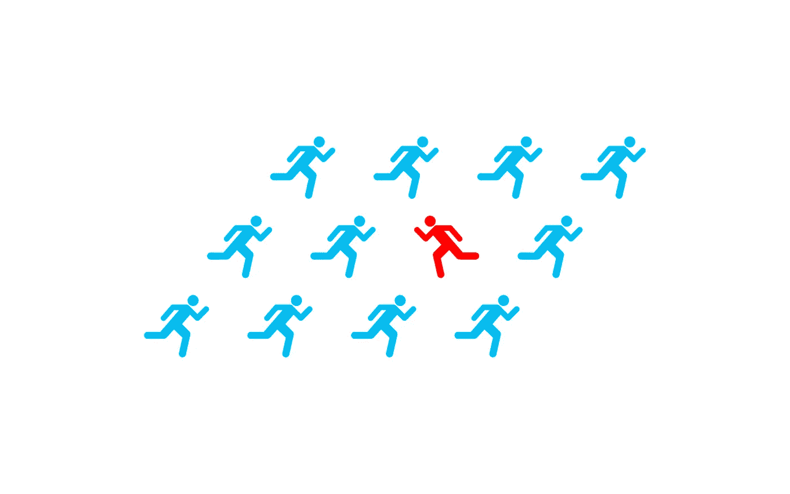
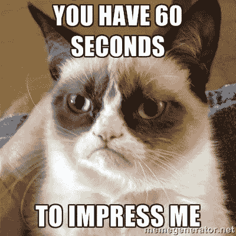
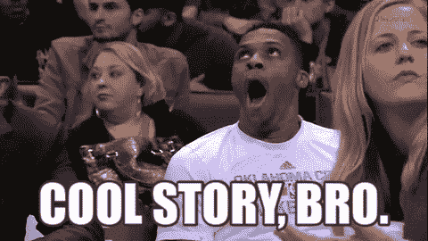

# 逆势创始人:尽全力扼杀你的想法！

> 原文：<https://medium.com/swlh/do-your-best-to-kill-your-idea-2ad5db47bb53>

***关于作者***

*大家好，我叫 Nikolay Tsenkov，是一名软件工程师出身的企业家。*

5 年前，我辞去了朝九晚五的工作，寻找最让我开心的工作类型，并在几个不同的技术领域(网络、桌面、移动、硬实时 DSP 等)之间转换。).经过多年的实验和学习，我终于发现了我余生想做的事情——我想建立对世界有重大积极影响的公司。

我学得慢，执行得快。我对一切都感兴趣。在我失败的极少数情况下，我是那种输不起的人。不是。不干了。我总是说到做到。我每天都工作。

***关于系列***

*这是我称为“逆势创立者”的系列文章中的第一篇，我将与每日视频博客(已录制 120 多集，即将发布)一起记录我从自己的冒险中获得的重要经验，以及我从许多播客、博客、书籍、采访等中提炼出的智慧。我日常消费的创业公司。我的 vlog 主要记录新产品的开发(同时也展示了我的情绪过山车，不停地为一个想法工作)。事实上，这 120 集记录了我的第一个创业产品的发展，从开始到私人 alpha(在过去的 30 多天里)，到现在，离公开测试只有几天了。*

*关于这些系列的更多更新，vlog，我的冒险和我的日常想法:你可以在 twitter 上关注我*[*@ NikolayTsenkov*](http://twitter.com/NikolayTsenkov)*。*

*享受帖子！*

# TL；速度三角形定位法(dead reckoning)

时间是你最宝贵的财富。

浪费时间的最大风险之一就是把时间投资在坏主意上。

在你实际建造任何东西之前，与聪明人和潜在客户分享你的想法，寻找一些特定的反应(以及有人会为此买单的证据)，这种简单的练习可以显著降低风险。

# 介绍

积极地试图放弃一个新的创业想法，可能非常违背直觉，但这实际上是正确的做法。

我似乎找不到原始报价，但我相信雷德·霍夫曼(合作伙伴在格雷洛克前。LinkedIn 的联合创始人& PayPal 的创始工程师)说过这样的话:

> “我喜欢聪明人告诉我‘你的主意糟透了！’。"

原因很简单——如果人们能指出你想法中的问题，而你自己似乎无法确定= >他们已经帮了你很大的忙了！

# 创意“一毛钱 10 个”

没错。每个人都有！你有他们，你的同事有他们，你的朋友，你的妈妈，每个人和任何人都有想法。

然而，*普通人和企业家之间的区别在于，我们(企业家)不会(总是)让这些想法消失，我们会追求它们。不像*正常的*人，我们不能面对一年后其他人提出同样的想法并建立一个$Xb 公司的可能性。*

不，我们抓住机会，我们愿意冒险。

嗯，*通常…* 你还是不想落得和这只猫一样的下场。

风险仍然需要*衡量*。否则(打一个非常糟糕的同义反复)我们*冒着*的风险做出愚蠢的决定，没有足够的证据做后盾，那我们*其实有**一个“赢”的机会。*

# *时间是你最宝贵的财富*

*没错。你不想在接下来的 5 年，2 年，甚至 2 个月里，花在你已经确定*没有机会解决的事情上，*在仅仅几天的工作中，对吗？*

*但是你怎么能这么快就验证一个想法呢？简单的回答是——你*不能*！对这个想法的完全验证需要你实际建造它。然而，在早期确定它不成功的可能性，这样你就可以做出一个明智的决定，决定是否追求它，这并不是不可能的。*

*据我所知，这是确定你是否应该追求一个想法的最好方法——试着找到足够多的证据证明你是错的。*

*这仍然很抽象，所以让我试着举几个例子来说明我是如何为我目前正在开发的产品做到这一点的。*

***NB！:** *顺便说一句，我不打算谈论关于消除创业想法风险的广泛话题，例如——弄清楚你的市场规模(TAM)、定价、收入模式、客户获取渠道等。让我们假设你对所有这些事情都有一个假设，那就是你想要评估的想法的* ***部分*** *(读“kill”)。**

# *1.与你所知道的最关键的聪明人交谈。*

**

*我个人认为这是做这件事的最好方法。不管你是否正在着手一个创业想法，你都应该试着和比你聪明的人在一起。那些特别诚实和挑剔的人**是无价的**。相信我，一旦你意识到他们反馈的价值，你会觉得他们只是把手伸进口袋，**给了你钱。***

*在你建立任何东西之前，找到你网络中的那些人(理想情况下，他们是其他创始人或创业顾问，甚至是你可以非正式接触的投资者),向他们推销你的想法。我认为你应该有一些图形样机，以更好地代表你想要建立的，就是这样。*

*没有在项目上投入大量的时间让**你**保持客观，同样，在接受这个反馈时，你自然会对你的想法不那么*保护*，因为，正如我们刚才所说的那样——那些东西 10 块一毛钱(在你投入时间之前)。*

# *2.与你产品的潜在客户/用户交谈。*

**

*[source](https://www.maxpixel.net/Finger-Review-Criticism-Write-A-Review-Hand-Star-3083099)*

*他们需要吗？他们会用吗？他们会为此买单吗？*

*你需要致力于一个想法，不仅人们想要，甚至*需要*，而且他们实际上**愿意** **为**买单。*

*评估与你交谈的这两类人的反馈时，你需要寻找一些特定的反应。*

***正常-反馈不正常！***

**

*[source](https://giphy.com/gifs/PIIMXAjqlO9zy)*

*当您评估来自 1 中的群组的反馈时。第二。，你的想法需要引发的不仅仅是*“哦，看起来不错。”*-反应类型。*

*对于第一批人，理想情况下，你希望看到他们反应的两极分化。如果你推销的对象是投资者——以未来投资前景的形式进行确认显然很好，但即使他们不喜欢这个想法——如果那些非常聪明的人很难说“不！”对你来说，我相信这实际上是一个积极的信号。即使他们讨厌它，你仍然可能会有所发现——如果你推销的对象中有一部分人喜欢这个想法，而另一部分人绝对讨厌它——你可能会有所发现——巨大的。*

*逆向思维并不是对每个人都有意义。*

*我讨厌举这个在业内被过度使用的例子，它有点像陈词滥调，但 99.99%的人在早期不会认为 AirBnB 值得他们投资，只是因为这个想法太逆势了:“你会在互联网上发布你家的照片，这样你就可以让陌生人过夜了？”。保罗·格拉厄姆有句名言:*“交易双方的怪人是谁！?"*。他(YC)最终投资了这家公司。*

***不好的征兆***

*你绝对不希望看到的是你的想法得到了证实——没有人喜欢这个想法(显然是一个不好的迹象)。但是，即使是普遍积极的反应，没有太多的兴奋和任何两极分化的因素，仍然是一个不好的迹象。有些人(彼得·泰尔就是一个例子)甚至会说，如果每个人都对这个想法感到兴奋，那也不好！为什么？因为如果这个想法对每个人都有意义，在一个月内将会有几十个竞争者，在几个月内:几百个，在一年内，嗯…我记得在中国的雷德·霍夫曼和彼得·泰尔之间的一个小组，谈论一个具体的想法，目前仅在中国就有大约…嗯，嗯， **10，0 00 个克隆体**…是的，你没看错。10k。*

***“明显”通常意味着“不好”***

*在一些例外的情况下(讽刺的是，我认为 PayPal 是技术和经济行为的一个非常明显的进步)，我确信有一些团队设法达到了逃逸速度，只是将竞争对手甩在了后面，但这需要……一个**难以置信的执行**,并且通常在很早的时候就消耗掉大量现金。请记住，当 PayPal 达到逃逸速度时，他们的策略是**真的给钱**。如果没记错的话，他们最初会向每个新用户赠送 20 美元，然后转而向每个在平台上购买/交易的新用户赠送 20 美元。甚至在那个时候，当我确信*默默无闻*在他们的技术安全中发挥了重要作用时，他们不仅面临着来自竞争对手和不得不筹集大量资金的巨大问题，还面临着从平台窃取信息的黑客(你应该听/读/看 PayPal 联合创始人之一麦克斯·拉夫琴讲述的故事)。*

*除此之外，我相信，随着越来越多的人能够为相同的想法而竞争，这种执行方式的门槛会逐年提高。*

***潜在客户的反应，寻找***

*从你的目标受众来看，你必须看到对产品的兴奋感，以确认有人真的会使用它。但如果这种观点如此逆势，以至于你甚至在第一组中也观察到了两极分化，我可能不会担心第二组的最初反应。这可能是逆向投资，人们看不到自己在使用它。当你有 MVP 的时候，你将能够在几个星期到几个月的时间内与第二组一起测试，不管怎样，这还为时过早。现在，我们试着决定你是否应该建造这个 MVP。*

# *3.在打造 MVP 的时候，不要把头埋在沙子里。*

**

*[source](https://wonderopolis.org/wonder/do-ostriches-really-bury-their-heads-in-the-sand/)*

*即使你得到了外部的认可，并开始着手一个 MVP — **不要停止尝试扼杀这个想法**！*

*不断思考过去已经死亡的类似产品—为什么会发生这种情况？*

*继续思考竞争对手——你会和那些太大的公司竞争吗？他们会做这样的事情吗？他们有资格做这样的事情吗？他们能不能把你的整个想法作为一个新功能来“开启”呢？你的防御能力如何(这里的“护城河”是什么)？*

*最后，我的最后一点是一个问题，对我来说很难回答。我总是对它感到不安全，我相信许多有成功建筑公司记录的人，并不真的需要总是检查这一个。*

*但是作为一个第一次创业的人，我认为这是一个非常重要的问题:*

# *4.你是建造它的合适人选吗？*

**

*你是在解决自己的问题还是别人的问题？你为什么会受这个影响？为什么只有你有资格/有能力解决这个问题？*

*我最近得出了一个结论:有很多想法，我认为有潜力成为一家 10 亿美元的公司，我对它们非常有热情，我有一些关键的见解(或专业知识)，这使我成为实现这些想法的绝佳人选。为什么不专门研究那些**？！***

***因此，在我人生的这个阶段，我只致力于我有热情的想法，瞄准一个足够大的市场，我要么是*独一无二*合格，要么是*足够合格*去创造它们。***

# ***反向结论***

***不要害怕人们挑战你的想法。从聪明诚实的人那里寻找反馈。拥抱它。
用吧。如果它扼杀了你的想法——太好了，你没有浪费太多时间。下一件事！
如果没有——太好了，你现在有证据表明你应该去建立一个 MVP。***

****巨大的“谢谢！”感谢 Alex Gilleran、Vassil Terziev、Veselka Valchkova 和 Evgeni Petrov 阅读了这篇文章的初稿，并提供了令人惊叹的反馈。****

******

## ***这篇文章发表在 [The Startup](https://medium.com/swlh) 上，这是 Medium 最大的创业刊物，拥有+ 380，266 名读者。***

## ***在这里订阅接收[我们的头条新闻](http://growthsupply.com/the-startup-newsletter/)。***

******