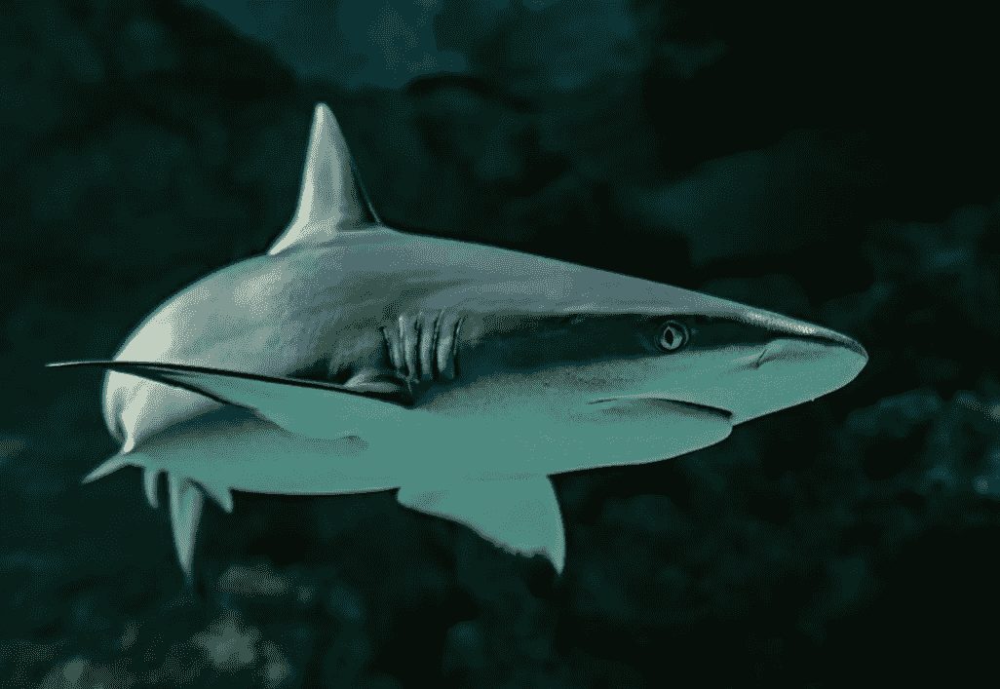

# 做你的工作，做一条鲨鱼

> 原文：<https://medium.com/swlh/do-your-job-be-a-shark-2622f5eac31f>

Unsplash.com

我们都有过这样的感觉:你被清晨的闹钟吵醒，感觉昏昏沉沉的。

“再多五分钟，”你告诉自己，而事实上，五分钟可以很快变成更长的时间。

前一天晚上设置闹钟时，我们清楚地知道自己在做什么，但允许我们疲惫的大脑与我们协商。

这种感觉从时间开始就有了。早在公元 160 年，马可·奥勒留就在他的著作《沉思录》中写下了关于这一点的一段话:

> *“黎明时分，当你起床有困难的时候，告诉自己:‘我要作为一个人去上班了。如果我要做我生来注定要做的事，我有什么可抱怨的呢……或者这就是我被创造出来的目的？蜷缩在毯子下取暖吗？*
> 
> *但是这里更好……所以你生来就感觉很好？而不是去做事情，去体验？难道你没有看到植物、鸟儿、蚂蚁、蜘蛛和蜜蜂都在尽自己最大的努力完成各自的任务，让世界变得井然有序吗？*
> 
> *热爱自己工作的人会因为工作而筋疲力尽，他们甚至会忘记洗澡或吃饭。你对自己本性的尊重是否不如雕刻师对雕刻的尊重、舞者对舞蹈的尊重、守财奴对金钱的尊重或攀附社会地位的尊重？*
> 
> 对你来说，帮助别人的价值降低了吗？不值得你努力？”

这个信息简单明了，让我想起了比尔·贝利奇克:“做好你的工作”——因为这就是我们生来要做的。

无论你是首席执行官、实习生、销售人员还是杂货店收银员，你的工作都很重要。如果你做得好，你可以帮助这个世界变得更好。

无论你在寻找什么——更多的钱、升职、新工作、豪车——都是做好今天的工作的另一面。至少，这需要从温暖舒适的床上爬起来。

换句话说..

> 鲨鱼会抱怨星期一吗？不。他们一大早就起来咬东西，追逐狗屎，变得可怕——提醒每个人他们是一条该死的鲨鱼。

# 关于作者

[Tom Alaimo](https://www.linkedin.com/in/tom-alaimo-573a1878/) *是一位充满激情的 B2B 销售专业人士。他目前是* [*千禧一代动力播客*](https://soundcloud.com/ryan-warner-799706255) *的主持人，在这里他帮助千禧一代快速跟踪他们的个人发展。Tom 也是 TechTarget 的客户经理，住在旧金山。*

[网站](http://tomalaimo.com/) | [播客](https://soundcloud.com/ryan-warner-799706255) | [邮箱](mailto:thomasalaimo7@gmail.com) | [推特](http://twitter.com/tommytahoe)|[LinkedIn](https://www.linkedin.com/in/tom-alaimo-573a1878/)|*|*|[脸书](https://www.facebook.com/thomas.alaimo.12) | [Instagram](http://instagram.com/tommytahoe) | [媒体](/@TomAlaimo_TTGT) |

## 这篇文章发表在 [The Startup](https://medium.com/swlh) 上，这是 Medium 最大的创业刊物，拥有+364，117 名读者。

## 在这里订阅接收[我们的头条新闻](http://growthsupply.com/the-startup-newsletter/)。

