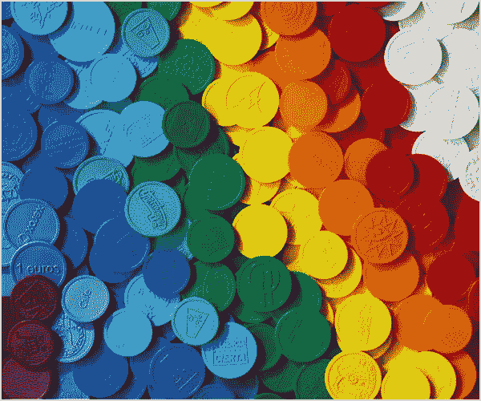

# 区块链需要令牌吗？

> 原文：<https://medium.com/swlh/does-a-blockchain-need-a-token-66c894d566fb>

经常给围绕比特币和区块链的困惑火上浇油的一点是，两者可以互换的假设。是的，比特币确实是由区块链驱动的，但并不是所有的区块链都使用比特币。事实上，一些区块链不使用任何加密货币或代币。根据区块链或分布式分类帐的类型，令牌会有很大的不同。

让我们先了解一下基础知识:

*什么是代币？*
用最简单的话来说，它只是一个价值单位。[令牌是您控制的特定数量的数字资源，您可以将控制权重新分配给其他人。](https://bitsonblocks.net/2015/09/28/a-gentle-introduction-to-digital-tokens/)令牌可以采取多种形式，我将在下面解释并提供示例:

1.  **润滑车轮——需要令牌来驱动区块链**
    对于那些熟悉比特币区块链的人来说，验证过程需要执行复杂的计算数学。第一个找到解决方案的矿工向网络上的其他人宣布，然后这些矿工检查资金发送者是否有权花钱。如果有足够的人批准，该块将被添加到分类帐中。最先解决问题的矿工获得一笔费用作为补偿，最初是 12.5 比特币。在这个例子中，比特币是提供给矿工履行其职能的财务激励。同样，“气”是以太坊上每一笔操作和交易的执行费。它的价格用乙醚表示，并由矿商决定，他们设定他们准备接受交易的最低价格(现在让我们把它与交易所的市场价值分开。)由于存在与交易相关的成本，重新创建相同交易的动机大大降低。
    我喜欢把它们比作给我的车轮上油的想法，以确保车轮旋转和汽车运行——这个过程需要时间和精力。某人或某事需要为付出的努力得到补偿。
2.  **资产——对可替代和可交易的资产的权利**
    资产是指其价值可以转换为某种经济单位的任何东西，如现金。例子包括债券、证券、股票，甚至汽车和房子。通过给资产分配一个“令牌”,可以很容易地在区块链上跟踪该资产的来源。我们已经有了集中的登记处和系统，允许你存储关于这些资产的信息，但是区块链允许你做更多的事情。您可以证明资产的所有权历史，将资产分成更小的所有权部分，通过加密增强安全性，并通过智能合约嵌入额外的管理和业务逻辑，从而提高该资产的流动性。
3.  股权——当公司首次公开募股或上市时，股票的购买者成为该公司的股东。作为公司的所有者，他们现在有投票权。类似地，公司可以通过首次发行硬币(ICO)来筹集资金。投资该公司的人被授予代币，如果该公司正在创造的服务或产品是成功的，代币通常会升值。然后它可以被稀释成更小的数量或者在交易所交易。许多人会称之为安全，不受任何一个国家的监管。证券交易委员会认为，这些代币应受联邦证券法规的约束，因此，对寻求发行这些类型代币的企业发布了越来越多的指导。
4.  **货币——参与者之间的一种支付方式**
    货币代币可以作为一种支付方式，比如在当地咖啡店购买你的早茶或者支付清洁服务的费用。这个用例还没有被广泛采用，坦白地说，可能是最不可能扩展的应用程序之一。截至目前，加密货币波动性很大，并经历了剧烈的日内价格波动。这个用例假设商人愿意承担巨大的汇率风险。此外，区块链传统上比信用卡网络慢得多，信用卡网络每秒可处理多达 52，000 笔交易。

这些令牌是互斥的吗？

事实上没有。

一枚比特币可以用来支付你的咖啡和“润滑”比特币区块链的轮子。比特币也可以被视为一种资产或价值储存手段，就像持有黄金一样。同样，以太为以太坊区块链提供能量，被认为是一种价值储存手段。

*有没有不使用代币的区块链/分布式总账？*

是的，R3 的 Corda 和 IBM 的 Fabric。

关于 Corda 的共识是在交易层面达成的，并且只涉及交易的相关方。没有“工作证明”或“矿工”来核实交易。正如 Philipp Sandner 在他的博客文章[中解释的那样，“共识是基于交易有效性和交易唯一性的。通过运行与交易相关联的智能合约代码、检查所有必需的签名以及确保所涉及的任何交易也是有效的，来确保有效性。唯一性与事务的输入状态有关。具体来说，必须确保所讨论的事务是其所有输入状态的唯一消费者。换句话说，不存在消耗任何相同状态的其他事务。这样做的原因是为了避免重复支出。”](/@philippsandner/comparison-of-ethereum-hyperledger-fabric-and-corda-21c1bb9442f6)

虽然令牌当然可以引入到 Corda 平台上，但它不是平台固有的，也不需要“润滑轮子”。

**来源:**

代币简介:【https://bitsonblocks.net】T2

以太坊、Hyperledger Fabric、Corda 对比:[https://medium . com/@ philippsandner/comparison-of-ether eum-Hyperledger-Fabric-and-Corda-21 C1 bb 9442 f 6](/@philippsandner/comparison-of-ethereum-hyperledger-fabric-and-corda-21c1bb9442f6)

## 这篇文章发表在 [The Startup](https://medium.com/swlh) 上，这是 Medium 最大的创业刊物，有 273，103+人关注。

## 订阅接收[我们的头条新闻](http://growthsupply.com/the-startup-newsletter/)。

