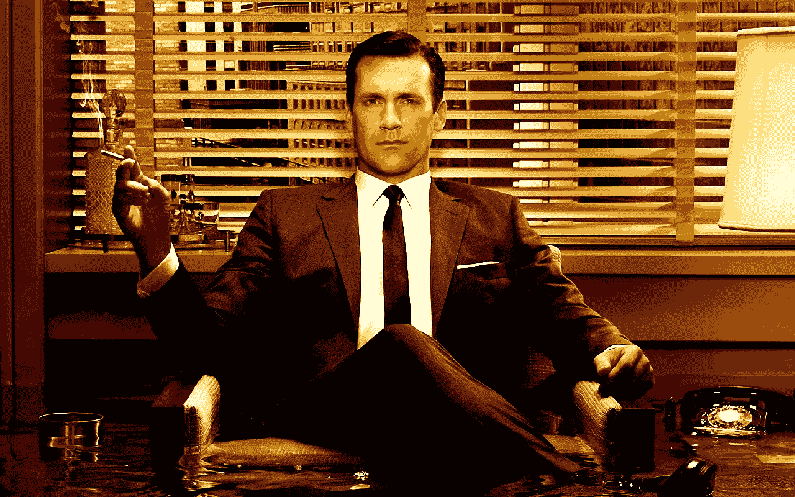
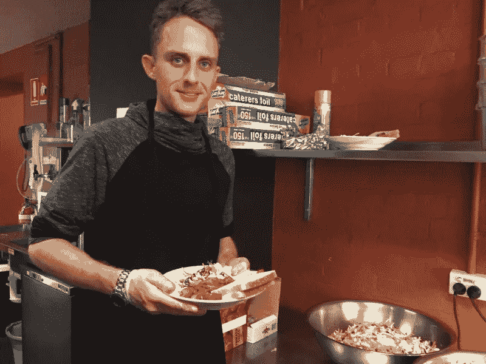
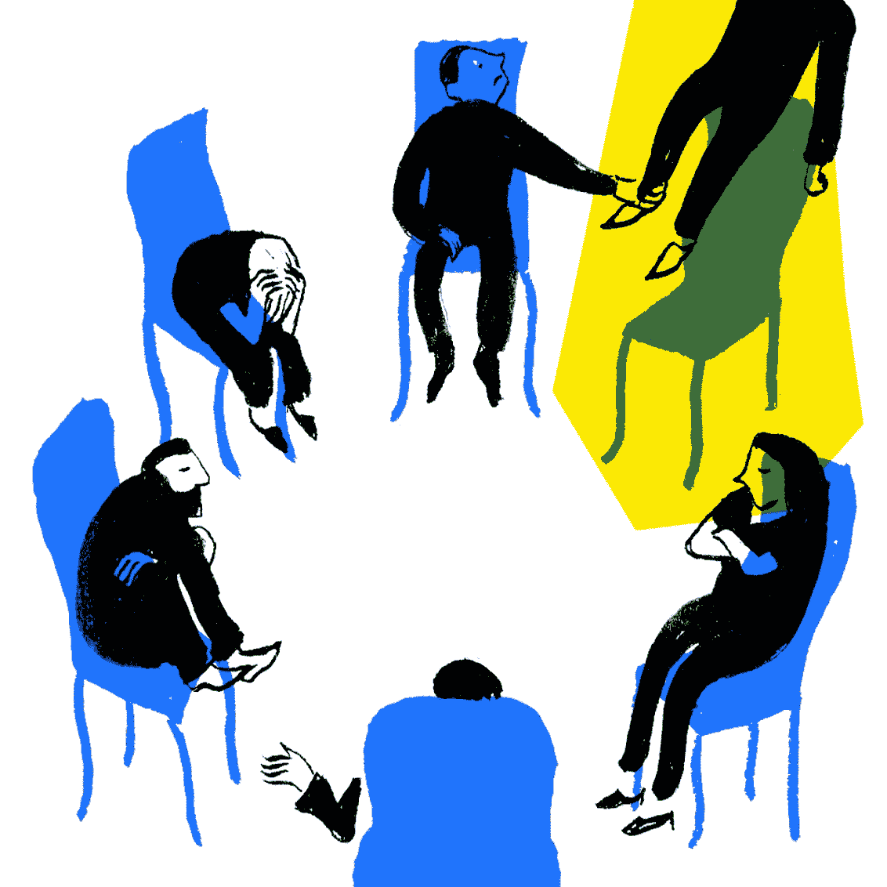

# 有人从他们的 LinkedIn 个人资料中获得价值吗？我做到了。！！

> 原文：<https://medium.com/swlh/does-anyone-get-value-out-of-their-linkedin-profile-i-did-7ec7020054b1>

Image Credit: [AMC television series](https://www.amc.com/all-shows) Mad Men

像 LinkedIn 这样的平台通常被认为是一种浪费。

它们被描述为成年人的电脑游戏，人们在其中争夺注意力。这种思维方式非常短视。

在过去的 12 个月里，我的 LinkedIn 档案是我成功的最大功臣。

## LinkedIn 给了我:

1.  一个从金融工作到数字营销工作的机会
2.  我非常喜欢的一家公司的咨询工作
3.  许多四位数以上的演讲机会

# LinkedIn 的最大价值

Linkedin 的这三份礼物很棒，但更有价值的是一个全新的网络。

我花了 10 分钟写了很多非常吸引人的帖子，然后被邀请参加了四个不同的群聊。通过这些小组，我结交了许多新朋友。

七年后，当我想退出金融行业时，我咨询了这些新朋友，他们帮助了我。

Image Credit: [NPR.org](https://www.npr.org/)

我还遇到了一个来自尼日利亚的年轻人，他通过他的手机镜头向我展示了我从未见过的世界的一面，一直到我回到了奥兹国。现实生活中的人际交往对许多人来说很难，因为它变成了一场试图超越对方而不是相互倾听和学习的竞赛。
LinkedIn 不同，因为聊天是通过文本开始的，你可以决定谁对你有价值。

> 通常 LinkedIn 上与你相反的人是最有价值的。

我的几个新朋友来自金融业。他们宣扬个人品牌(我讨厌这一点)，但他们也谈论其他话题。

从我通常不会关注的地方获得意见和想法让我成长，而不仅仅是想和生产力或自助大师们在一起。

# 为什么你们大多数人没有从 LinkedIn 获得价值

耐心。

你给平台十秒钟然后放弃。

你会陷入“喜欢”和“评论”的怪圈，而不是仅仅给予而不想得到任何回报。

我在 2014 年开始在 LinkedIn 上工作，没有任何隐藏的议程。我在寻找一个出口来帮助别人，并试图激励我的一些同事。当时没有多少内容创作者，都是关于简历和分享来自彭博的文章。

尽管如此，我并没有失去耐心。我不停地发表我的想法，没有注意到订婚。我一直这样做，直到 2017 年，事情终于发生了变化。

参与度提高了很多，但对我来说最突出的是，因为这个平台，我有了更多的意义。

> “我遇到了我从未想过会遇到的人，因为我不想从任何人那里得到任何东西”

# LinkedIn 改变了我的思维方式

平台让我从思考*“我能得到什么？”*到*“我能给什么？”*

这种思维方式从根本上改变了我在加入 LinkedIn 之前自私、傲慢、混蛋的样子。

通过消费像 Oleg 和 brig ette(LinkedIn 的神和女神)这样的人的内容，我想开始以他们为榜样。我在这个平台上的工作不再仅仅是复制粘贴我在其他地方写的博客文章或者分享 YouTube 视频。

> Oleg 和 Brigette 教我分享我的职业奋斗，帮助人们寻找工作，并利用平台的曝光率在社区中做好工作。

做得最好的帖子是我在施粥场给无家可归者提供食物。树立一个好榜样，向人们展示其他的思考方式，成为我今后所做一切的基础。

Soup kitchen post

# LinkedIn 向我展示了什么样的特质是重要的

谦逊脱颖而出。

我专门为 LinkedIn 写的一篇病毒式文章是关于优秀销售人员的特质。在那之前，我也有过另外两篇病毒文章。他们都有一个共同的主题:**我告诉每个人关注他人，少关注自己。**换句话说，接受谦逊的品质。

像 LinkedIn 这样的平台向我们展示了世界的样子，以及我们作为人的样子。

> “没错，的确有网络巨魔和仇恨帖子，但更重要的是，那些帮助人们、关注谦逊的帖子总是会得到更多关注。这是因为人类是善良的，Linkedin 通过我在新闻订阅中看到的内容向我展示了这一点。”

# LinkedIn 成了我职业生涯的治疗手段

我们都知道写作可以治疗疾病。嗯，在 LinkedIn 上写作成了我的一种治疗方式。

当我的职业生涯出现问题时，我会用 LinkedIn 作为发泄情绪的渠道。我会这样做*** * *谨慎***** 列出糟糕的老板、客户问题、让我心烦的事情等等。我总是试着往好的方面想，这样听起来就不像是在抱怨，这帮助我解决了这个问题。

LinkedIn 疗法不仅对我有价值，对那些在职业生涯中遭受类似问题并需要逃避或解决方案的人也有价值。

Image Credit: [Jennifer Phelan](http://j-phelan.com/)

# LinkedIn 最大的价值？

作为一个人成长。

我发表的每一篇文章都成了我职业生涯的另一块拼图。

> “LinkedIn 帮助我理清头绪，了解我是谁，更重要的是，我能成为什么样的人”

在电脑屏幕后面，我可以塑造自己的角色，并在这个过程中大规模地帮助他人。

我只能说 LinkedIn 成就了我的事业。

这就是 LinkedIn 的价值。

# 行动呼吁

如果你想提高你的工作效率，学习一些有价值的生活窍门，那就订阅我的私人邮件列表吧。你还将获得我的免费电子书，它将帮助你成为改变游戏规则的在线影响者。

[**点击这里立即订阅！**](http://timdenning.net/free-ebook)

## 这篇文章发表在 [The Startup](https://medium.com/swlh) 上，这是 Medium 最大的创业刊物，拥有+ 380，756 名读者。

## 在这里订阅接收[我们的头条新闻](http://growthsupply.com/the-startup-newsletter/)。

