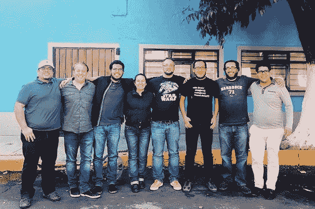

# 远程办公远程工作吗？

> 原文：<https://medium.com/swlh/does-working-remote-remotely-work-82f6e844b359>

## 电信之争和不可忽视的趋势。

我经营一家数码产品开发公司， [King Tide](https://kingtide.la/) ，总部在洛杉矶。我们在墨西哥城有一个分支办公室，有 7 名全职员工，并且人数还在不断增加。我们有灵活的休假和远程工作政策，以及一些完全远程工作的独立承包商。我这样说并不是谦虚地吹牛，而是因为我经常被问到我们如何管理远程员工，以及它如何影响我们的业务工作流程。

在我们不太遥远的过去，远程工作几乎是不可能的。糟糕的互联网连接、陈旧的商业惯例和缺乏监管使得员工无法在舒适的家中工作。

如今，远程工作正成为一种普遍做法，47%的人[声称他们每周至少有几天远程工作。随着技术和互联网速度的进步，加上 Asana(项目管理)、Slack(沟通)和 Toggl(时间跟踪)等允许深度协作的工具，管理远程员工变得更加“可管理”。这不仅仅是成为一种*认可的*惯例，而是一种*预期的*惯例。随着千禧一代进入劳动力市场，他们带来了这样的期望，即人们应该有能力和自由远程工作，而不是局限于办公室或办公桌。*“如果我们正在完成工作，为什么我需要来办公室？”—千禧一代*](https://www.nytimes.com/2017/02/15/us/remote-workers-work-from-home.html)

到 2020 年，预计将近四分之三的美国劳动力将远程工作。好像互联网和社交媒体还没有把人们分开，而“把他们聚在一起”，现在我们将花一天的大部分时间独自工作？

本文的重点不是为支持企业远程办公设计提供有力的理由，而是解释其利弊，以便您可以决定它是否适合您的企业。像我一样，你可能会在灵活的远程工作模式中处于中间位置，如果是这种情况，我将概述一些确保远程工作*工作*的好方法！

# 远程工作的好处

## **降低开销**

无论你是大公司还是中小型公司，作为雇主，控制成本是你最优先考虑的事情之一。让员工远程工作会减少你的开销。你可以在一些小事情上省钱，比如食物和水、清洁服务、家具、设备甚至租金。 [Global Workplace Analytics](http://globalworkplaceanalytics.com/telecommuting-statistics) 估计一个典型的企业平均每年可以节省 11，000 美元。像安泰和美国运通这样的大公司每年为 T2 节省了 1500 万到 7800 万美元。

## 提高生产力

人人生而平等，但员工的健康和生产力却各不相同。有些人在清晨或深夜有高峰时段，典型的 9-5 工作日可能会错过这些高峰时段，以完成富有成效的工作。办公室环境也有很多令人分心的东西，据估计，美国[的雇主每年因流言蜚语、过度通勤和健康问题等而损失 1.8 万亿美元。](http://blog.surepayroll.com/productivity-prohibitors-how-to-stop-them-in-their-tracks/)

## 更多的自由和快乐

员工有更多自由的时候最开心。没有严格的办公室时间表，你可以选择在哪里工作。你可以在家里的办公室、沙发上、吊床上、咖啡店里、海滩上工作..你明白了。你想什么时候工作都可以。清晨，花几个小时上网，吃晚饭，然后回到网上。灵活性会让员工更加快乐，而快乐的员工会更加努力工作，更加忠诚。根据英国卡迪夫大学研究人员的一项研究，远程工作的人比正常工作时间更有可能加班。

> “我们喜欢给人们在他们想去的地方工作的自由，因为他们知道自己有动力和专业知识来出色地完成工作，无论他们是在办公桌前还是在厨房里。你的工作从来没有在办公室完成过，也永远不会。”—理查德·布兰森

# 你需要听到的残酷事实

虽然远程工作已被证明是一种有价值且更高效的工作方式，但它不会也永远不会取代与人面对面交流的价值。

*   **协作:**没有什么技术进步能比与你的同事在一起更能匹配完美的协作环境了。当然，如果你需要面对面的交流，你可以参加视频会议，使用谷歌文档分享信息，甚至可以使用[vision](https://www.invisionapp.com/)在数字白板上画草图，但你不能进行即兴对话或自发地开始白板创意。
*   **团队午餐或快乐时光**:我们在办公室建立的一些最有意义的联系是我们带出了办公室的快乐时光和午餐。这是同事成为朋友的时候，也是一对一的会面变成治疗的时候。
*   作为一名雇主，很难让远程员工或承包商了解一天中发生的事情。如果我有一个很棒的会议或电话，发现了一个新的候选人，或者遇到了一个潜在的大客户，我必须特别有意识地努力更新它们。这些信息对于分享企业的日常健康状况至关重要。

# 高效工作远程策略的关键

## 使用工具管理您的业务

*   [**Slack**](https://slack.com/)——如果你的团队中有两个或更多的人，并且你还没有使用 Slack，现在就去 Slack.com 创建你的商业账户。Slack 是有史以来增长最快的商业应用，也是团队内部沟通的最佳方式。([他们是这样做的](https://blog.hubspot.com/marketing/slack-fastest-growing-business-app)
*   ****——**项目管理工具几乎是每个企业的必备之物。有数百种选择，但 Asana 是中小型企业的一个伟大的工具。这允许您在基于云的工具中创建项目、分配任务以及就特定项目进行交流。([大本营](https://basecamp.com/)、[吉拉](https://www.atlassian.com/software/jira)、[特雷罗](https://trello.com/)、[里克](https://www.wrike.com/)、[阿凯洛](https://www.accelo.com/)等等)******
*   ******[**Toggl**](https://toggl.com/) —你无法改善自己无法衡量的东西，时间追踪是衡量自己的第一步。对于我们的业务来说，这是一个很难整合的过程，但现在我们跟踪一切，结果确实重塑了我们的业务。******

## ****每周(或每天)站一次****

****每周一早上，我们作为一个团队站起来 15-20 分钟，并进行每周检查，以协调每个人，创造透明度，并变得更加高效和富有成效。看起来是这样的:****

*   ******胜**:上周你完成了什么？****
*   ****目标:本周你在做什么？****
*   ****挑战:是什么阻碍了你的前进？****
*   ******感恩**:你感恩什么？****

## ****奖励表现胜于表现****

****作为一个管理远程团队的雇主，奖励表现比奖励存在更重要。虽然每天来办公室应该有所收获，但如果员工更喜欢远程工作，而且他们工作出色，你需要奖励他们。****

*   ******记录指标**(已完成的项目/任务):如果你为员工正确地设定了每周目标，你应该可以看到他们通过使用你的 PM 工具完成了多少工作。****
*   ******Kudos** :在你更新或签到的时候给你的团队打招呼，对他们的工作表示感谢。****

****你远程工作吗？这对你有用吗？我很想听听。请在下面的评论中与我分享！****

## ****这是从哪里来的****

****这个故事发表在[值得注意的](http://blog.usejournal.com)上，每天都有成千上万的人来这里了解塑造我们喜爱的产品的人们的想法。****

****关注我们的出版物，查看更多由 [Journal](https://usejournal.com/?utm_source=usejournal.com&utm_medium=blog&utm_campaign=guest_post) 团队报道的产品和设计故事。****

********

## ****这篇文章发表在 [The Startup](https://medium.com/swlh) 上，这是 Medium 最大的创业刊物，拥有+365，945 读者。****

## ****在这里订阅接收[我们的头条新闻](http://growthsupply.com/the-startup-newsletter/)。****

********