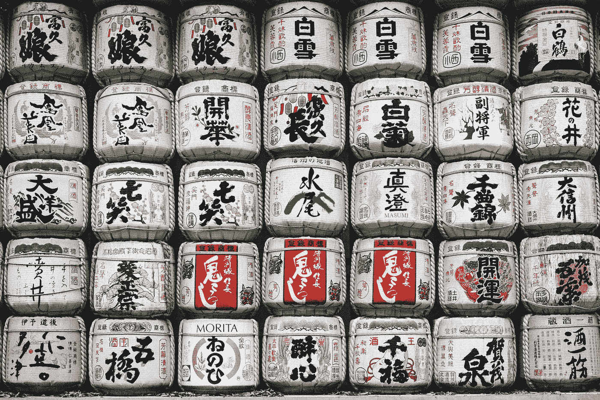

# 你的受众对你有足够的信心购买吗？

> 原文：<https://medium.com/swlh/does-your-audience-have-enough-confidence-in-you-to-buy-6feb3d33f0f6>

Photo by [Erik Eastman](https://unsplash.com/photos/yiptq3TFiX8?utm_source=unsplash&utm_medium=referral&utm_content=creditCopyText) on [Unsplash](https://unsplash.com/?utm_source=unsplash&utm_medium=referral&utm_content=creditCopyText)

你可能通过出色的营销吸引了他们的注意力，并提供了做出购买决定所需的所有信息，但你如何让他们在所有人中选择 ***你*** ？

我一直在想…

*   *是什么诱使用户“购买”然后再购买？*
*   你如何让你的观众信任你？

# 你是:

*   在线或线下销售产品，或
*   推广您的咨询服务，或
*   提供服务或体验？

根据业务类型的不同，体验和期望会有所不同，但考虑因素是相似的:

*   质量(价值、知识)
*   价格
*   可用性和便利性
*   排他性
*   客户体验

# 质量

用户希望以最实惠的价格获得最高的质量。

质量**服务**或者**产品**是什么样子的？

*   它达到或超过预期
*   它是有益的、有趣的或有趣的
*   持久、可预测的体验
*   如果有问题，则以专业的方式进行整改
*   无论是口头传播还是网络传播，都有良好的评价、评论和反馈
*   Linkedin 或商业网站或社交媒体上来自客户、顾客、同事的精彩推荐

在专业咨询服务方面，你是否有令人印象深刻的客户名单或强有力的案例研究？你发表过文章或白皮书吗？你会从你的网站/在线个人资料中链接到它吗？

# 价格

*   当从可靠的来源购买时，价格不再是一个问题。无论你是在网上购买服装还是专业建议，这都是正确的。
*   当用户不知道服务提供商时，价格是最重要的。
*   当产品或服务质量不同时，价格很重要。
*   如果有投资回报的话，价格是最不重要的**或**用户学到一些东西**或**它改善了他们的生活或他们只是享受它。

# 可用性和便利性

有时候，可用性和便利性排名很高——当我在街角的咖啡店点一份三明治的时候。

如何让自己的专业服务更便捷？

*   为全球客户提供在线咨询服务
*   跨时区提供，以适应离岸客户
*   whatsapp 为您的服务业务提供支持和沟通。(最近，我让一名管道工通过视频电话诊断了一个问题，因此他确切地知道应该带些什么。这项工作不到 30 分钟就完成了。)

# 排他性

有时候人们必须让 T21 有适合自己的东西——比如苹果产品。其他时候，他们想向你展示他们拥有别人没有的东西！

你是哪家供应商？

谁是你的观众？那些需要合群或者排外的人？

如果是排他性的，那么你

*   需要你的理想客户或一小群理想客户推荐你的业务
*   推销梦想、抱负和形象，而不是你实际产品/服务的无聊细节
*   分享之前和之后的故事，以显示您的工作的影响

# 客户体验

根据我们购买的产品，对**在线支持**和客户体验有不同的期望。

**例子:**

*   我在购买电子书时没有什么期望。只要在线结帐过程是正常的，我能够成功下载这本书，我不期待多余的东西。
*   然而，在网上购买服装时，我最感兴趣的是物有所值。它应该看起来就像在网上商店一样好。我的期望包括高质量的产品、安全的结账流程、高效的送货服务和有益的客户支持。

# 现有客户与新客户

从现有客户那里获得销售要容易得多——尤其是那些对你的品牌有过正面体验的客户。

但是第一次购买非常重要！它决定了购买模式的未来——他们会再次购买吗，他们会成为你的粉丝吗，他们会推荐你的产品/服务吗…

一旦他们迷上了你的内容或专业建议，他们甚至可能会寻找你的内容，而不是你需要吸引他们。

> 如果我从你这里购买并且喜欢你的产品，我会一次又一次地从你这里购买。如果我能把我学到的东西货币化，我会从你这里购买，不考虑价格。

## 对浪漫客户有多重要？

首先，免费赠品(包括免费咨询和内容)、折扣和宣传片可能有助于吸引你的观众。

但是创意人员不应该*不得不*通过提供几十种免费电子书、工作表或图标集来慢慢吸引用户。一些好的赠品没问题。即使是一件展示你的附加值的高品质物品也足够了。

*最初发布于 2017 年 2 月 9 日我的网站上*

## 这篇文章发表在 [The Startup](https://medium.com/swlh) 上，这是 Medium 最大的创业刊物，拥有 275，365+人关注。

## 在此订阅接收[我们的头条新闻](http://growthsupply.com/the-startup-newsletter/)。

