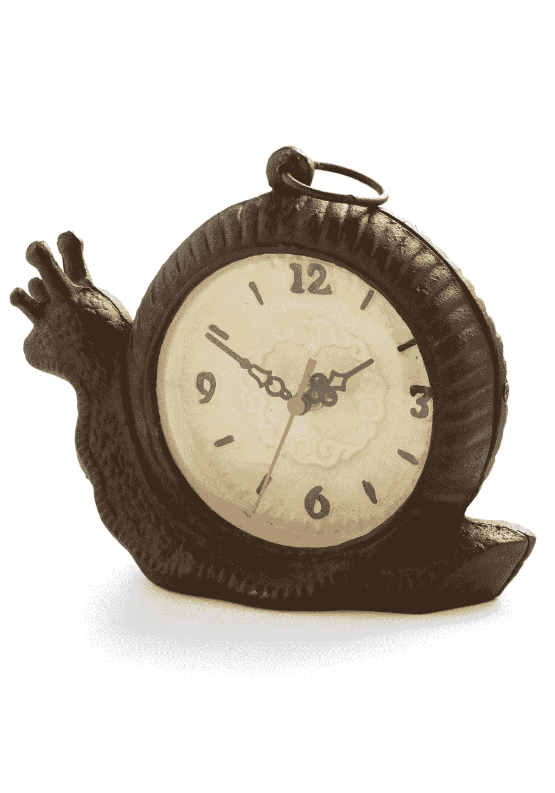

# 你的日子过得慢吗？

> 原文：<https://medium.com/swlh/does-your-day-go-by-slowly-23a8115752be>

## 你可能想看看为什么。

最近我的日子过得很快。我不确定这是好事还是坏事，也不确定为什么会有这种感觉。

我总是在早上 5 点到 6 点之间或者 9 点到 10 点之间醒来，这取决于每天的情况。这可能是原因之一，但两组时间都过得很快。

当我在 6 点钟醒来时，我已经读了一个小时的书，写了一篇中型文章，吃了早餐，并且在 9 点钟之前做了一次锻炼。当我九点醒来时，我躺在床上看书。

然后通常我会在 2 点去上课。早上 6 点标志着我一天工作的结束。我可以放松和阅读，花时间做晚餐，和人们交谈。

上午 9 点的日子有点不同，我通常会做一顿简单的晚餐，写我的每日中级文章(我在早上 6 点的日子里是在早上 7 点写的)，然后读点书。

在这两天里，我的脑海里一直有一个声音:“你工作够努力吗？你做了你应该做的一切吗？”

我想那个声音是我的日子过得如此之快的原因。

我总是努力保持高效率。即使我没有早上 6 点开始，我也接受这一天，只关注我需要完成的最起码的事情。通常是学校作业或中等写作。

在早上 6 点，我可以做很多事情。我可以专注于我的学业和写作。但我也有时间进行创造性写作或个人发展工作，比如创建一个框架或列出目标和优先事项。或者只是简单地多读书。

不管怎样，我都专注于一项任务。我从一个任务到另一个任务，通常完成我需要做的事情。这一天感觉过得很快，因为我总是在想我面前有什么。过去，我花了很多时间在停机上。社交媒体，游戏，不必要的媒介阅读。这都是非常被动的行动。

最近我一直专注于积极主动的行动。做优先任务，不要休息太久。甚至我的休息时间也是富有成效的，通常是阅读我的每周书籍或者真正的休息和玩游戏。

与上个月或更久以前相比，看看我现在做的有什么不同是很有趣的。

## 这篇文章发表在 [The Startup](https://medium.com/swlh) 上，这是 Medium 最大的创业刊物，有 288，884+人关注。

## 订阅接收[我们的头条](http://growthsupply.com/the-startup-newsletter/)。

