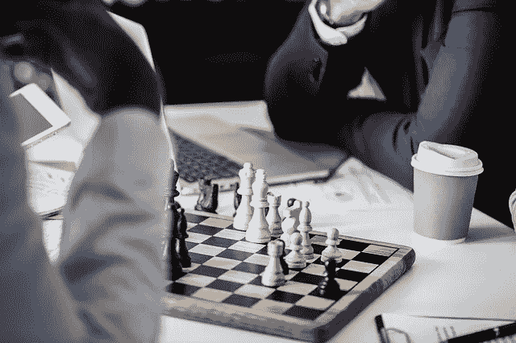

# 你的世界观是否造成了不必要的压力和糟糕的表现？

> 原文：<https://medium.com/swlh/does-your-world-view-cause-unnecessary-stress-and-poor-performance-de5fb0325459>

[rawpixel/pixabay](https://pixabay.com/en/chess-business-gameplan-3242861/)

我们看待世界的方式影响着我们对待生活的方式。我们大多数人认为生活是一场有赢家和输家的零和游戏。那种世界观是不准确的。这会导致不必要的压力和糟糕的表现。

**人生如一盘棋**

如果你把生活看成一盘棋，你会有三种可能的结果。

*   你赢了。
*   你输了。
*   画吧。

**生活如同扑克游戏**

如果你把生活看做一场扑克游戏，你又会有三种可能的结果。

*   你最终得到的钱可能会比开始时多。
*   你可能会以比开始时更少的钱结束。
*   你可能会得到完全相同的金额。

让我们省略支付给纸牌室的耙子。假设玩家不能在牌桌上添加或取走筹码。

在这种情况下，在游戏开始、进行和结束时，桌上的钱数是相同的。它只是在整个游戏中重新分配给玩家。

**生活是一场有赢家和输家的游戏**

大多数人认为人生是一场有赢家和输家的零和游戏。有些人认为他们处于不利的地位。他们把损失归咎于赢家。

其他人认为他们必须无情地竞争，击败他们遇到的每一个人。不用说，这两种方法都不准确。这两种方法都让生活变得更加艰难。

生活不是零和游戏。

我们以 Medium 为例。假设你想在 Medium 上最大化你的追随者。是不是意味着你要最小化别人的关注者？不，社交媒体不是这样的。用户可以关注任意多的人。

你可能会说，有固定数量的人在媒体上花费固定的时间。如果你想最大化你的属性，你必须最小化其他人的属性。

这个假设正确吗？媒体上有固定的人数吗？不，那是一个可变的数字。中型用户在 it 上花费的时间是固定的吗？不，那也是一个可变的数字。

如果你和我生产高质量的内容，并为我们的读者提供价值，我们将吸引更多的读者和阅读时间。

**总体经济**

从总体上考虑经济。你可能认为经济中流通的货币是固定的。同样数量的钱在人们之间重新分配。这也不对。

每年，企业都会向市场提供大量的商品和服务。结果，价格下降了。为了对抗通货紧缩，中央银行印钞票。

这样，经济中的商品、服务和货币的总量预计会逐年增加。总的来说，经济不是零和游戏。

什么是最好的生活方式？

如果生活不是一个有赢家和输家的零和游戏，那么指责别人或试图击败他们是没有意义的。

> 如果系统中的总价值是可变的，那么生活的最佳方式就是尽可能多地创造价值。

这个游戏不是为了打败对方。这是关于打破你过去的表现。因此，最好的生活方式是不断改进。

在**持续改进**中，你衡量你今天在哪里。然后，你试着每周、每月、每年提高你的成绩。

持续的进步消除了所有因为试图打败别人而产生的不必要的压力。它会让你尽你所能达到最好的结果。

**轮到你了**

*   你相信人生是一场有赢家和输家的零和游戏吗？
*   你相信有人赢了，你就输了吗？
*   你想打败每一个遇到你的人吗？

***如果你觉得这篇文章很有价值，注册*** [***每周简讯***](https://ideavisionaction.com/email-newsletter/?20180422) ***就可以收到我关于创业、企业家精神、领导力和自我提升的文章综述。***

## 这篇文章发表在 [The Startup](https://medium.com/swlh) 上，这是 Medium 最大的创业刊物，拥有 318，120 多名读者。

## 在这里订阅接收[我们的头条新闻](http://growthsupply.com/the-startup-newsletter/)。

