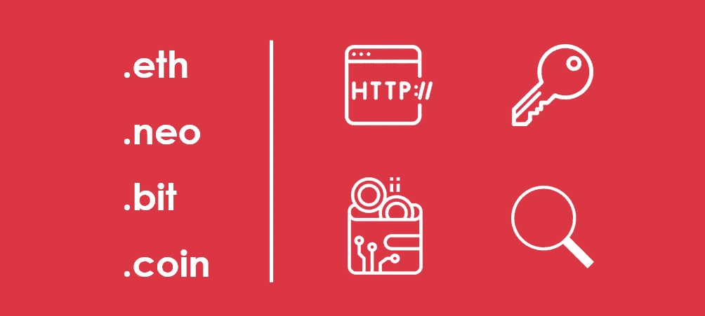
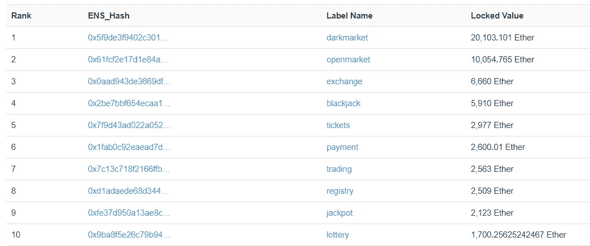

# 区块链上的域名系统——是“维生素”还是“止痛药”？

> 原文：<https://medium.com/swlh/domain-name-systems-on-blockchain-a-vitamin-or-painkiller-1525653988>

*最近，*[***ICOscoring***](https://icoscoring.com/en/)*团队在一个新的领域发现了几个项目，以前没有深入探索过——区块链域名领域。虽然没有被媒体完全报道，但这一领域吸引了许多投资者，他们希望了解这类项目的市场规模和公平市值。*

# **技术概述**

钱包地址或公钥是一长串十六进制的数字和字母。由于它们的长度和复杂性，人类几乎不可能记住哪怕一个公钥。这就是为什么总是需要复制和粘贴钱包地址来进行交易。因此，加密货币的大规模采用速度要慢得多。

允许为加密货币钱包创建类似 DNS 名称的新协议就是为了解决这个问题而开发的。这种类型的协议已经在以太空间中开发出来，并被命名为 [ENS](https://etherscan.io/ens) 。

> *使用 ENS，可以将加密货币发送到一个简单的、人类可读的地址，例如*
> 
> ***【John Smith . eth】***
> 
> *而不是一长串随机的数字和字母，比如*
> 
> ***【0x 55 B3 d0hs 6294 xsqot 1270 odq 47 c】***

这些协议的引入可以使最终客户的加密货币交易更加简单。

这类项目已经开始在区块链其他地方受到关注。

最近，在近地天体区块链上宣布了一项类似的协议。该协议被命名为 NNS 协议。另一个相关项目是 [IOV](https://www.iov.one) 。除了人类可读的名字， [IOV](https://www.iov.one) 还旨在通过引入中间地址系统来简化跨不同区块链的交易。 [NXT 别名](https://peername.com/nxt/)、EmerCoin 的[Coin](https://peername.com/emercoin/)和 [PassCard](https://onename.com/) 都在做一些类似的产品。

# **市场规模**

毫无疑问，这一部分的项目到时候可以利用。

然后，有必要评估这类项目的市场规模。这里的经验法则将是以太坊 ENS。以太坊 ENS 允许购买”。eth”域名。现在，这项服务只提供购买超过七位数的域名。然而，预计在未来两年内，该系统将出现，并允许购买较短的名称。

让我们看一下 ENS 中使用的定价策略。

ENS 拍卖从 72 小时的投标期开始。当所有的投标都提交后，参与者还有 48 小时来展示他们的投标。出价最高的参与者赢得拍卖，并必须冻结智能合约中第二好的价格。拍卖结束后，第一次和第二次出价之间的差额将退还给获胜者。这笔钱在智能合同中保存一年，到期后可以返还给赢家。

所有失去拍卖的参与者都必须支付所提交出价的 0.5%的佣金。

如果拍卖中只有一个参与者，一个自动赢得拍卖并支付 0.01 ETH，这是最小的可能出价。

这个域名可以随时出售。但是，应该注意的是，这种定价方法是暂时的，在未来两年内可能会发生变化。

自 2017 年 5 月 ENS 推出以来，已经发起了超过 75 万次拍卖，现在，在 ENS 系统中注册的域名超过 21.2 万个。因此，超过 17 万个 ETH 被锁定在智能合约中，价值约 1 亿美元(截至 2018 年 6 月 22 日 ETH 价格)。

根据 ENS 的官方统计数据，自启动以来收取的费用估计约为 150 万美元。应该注意的是，这个数字不包括通过域名销售在二级市场上转售域名收取的额外费用。经过这些简单的计算，可以看出 ENS 的市场潜力等于几千万美元。

这里只是 ENS 系统中最贵名字的入围名单。

黑市——20000 瑞士法郎(大约。1200 万美元)

*开放市场— 10000 ETH(大约。600 万美元)*

*交易所——6600 ETH(约。380 万美元)*

*21 点— 5900 ETH(大约。340 万)*

同时，1600 多个地址各自拥有十个以上的地址。这表明购买”。eth”地址通常是为将来的转售活动而创建的。

# **案例研究:NNS 的公允价值——基于新区块链的域名服务**

据传闻，NNS 通过出售 10%的代币，在私人出售中筹集了大约 300 万美元。让我们试着估算一下这些代币的公允价值。

[NNS](https://neons.name/#page-top) 令牌将用于购买近地天体区块链上的域名。这就是为什么我们可以使用以太坊 ENS 作为新 NNS 的代理，根据后者的规模进行调整。

NEO 市值比以太坊小 22 倍。因此，通过一些简化，我们可以假设，对于 NEO 上的相同域名，与 ENS 相比，客户愿意支付的费用少 15 倍，相当于 660 万美元。平均每个名字在 ENS 上有三次投标。因此，我们可以估计第一年对 NNS 的投标总额约为 2000 万美元。中标者支付所有投标，所有其他投标人支付 5%。我们估计增长率为 20%，贴现率为 30%。因此，根据戈登模型，我们可以预期每枚 NNC 代币的**公平市价等于 0.00733 美元**。

> *因此，以初始价格出售的整个令牌上限将仅用于满足第一年出售的域名的需求。这就是为什么预计代币价格将大幅上涨。*

而且，平台会从每笔投标中抽取 10%的佣金。这些费用集中在一个特定的资金池中，由 NNS 代币持有者自动分配。这可能会进一步推高代币价格。

# **结论**

我们看到了域名在区块链的潜在市场规模，以及这些服务对区块链大规模采用的巨大影响。然而，这一领域的主要风险将是不明确的市场规模估值和可比项目的微弱吸引力。

> **未来感悟，订阅**[**ICOscoring Telegram**](http://t.me/icoscoring)**频道，访问我们的** [**网站**](http://icoscoring.com) 。

## 这篇文章发表在 [The Startup](https://medium.com/swlh) 上，这是 Medium 最大的创业刊物，拥有 338，320 多名读者。

## 在这里订阅接收[我们的头条新闻](http://growthsupply.com/the-startup-newsletter/)。

