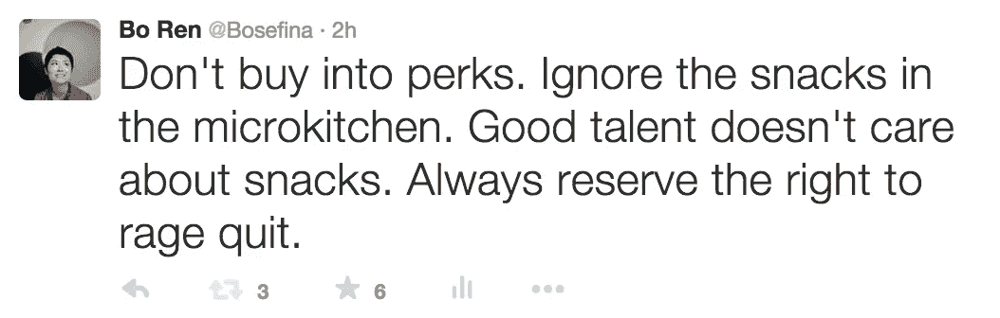
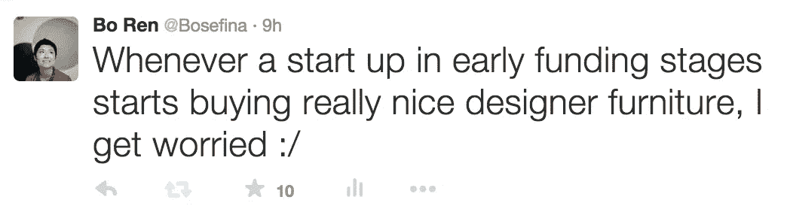
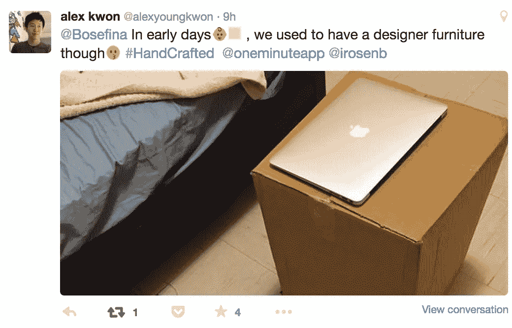

# 不要在意零食

> 原文：<https://medium.com/swlh/don-t-care-about-the-snacks-1ea0842a6fbe>

## 硅谷的谦逊、专注和节俭到哪里去了？

当我差不多五年前到达硅谷时，我认识两个人。我在不平整的宜家蒲团上睡了三个星期。我的背很痛，但我很感激我朋友的慷慨。

我在 sun run 申请了我的第一份创业工作，得到了一个客户服务的职位。我的工资微薄，勉强够付房租。前两年我们的微型厨房里没有零食。零食送达的第一天，我问我们的首席执行官林恩·尤里奇对它们的看法。她从厨房的水槽边抬起头来，一边往自己的 Klean Kanteen 水瓶里装水，一边说:“我没注意到我们还有零食。”当林恩走进我们的厨房时，她一直在沉思，忘记了看小吃。那个时刻铭刻在我的记忆中。

# **真正的人才不在乎零食。**

如今，湾区的人们在加入公司之前，会比较薪酬待遇和公司福利，如办公室按摩、零食选择、美食和办公室狗。我不禁在想，我们是不是已经失去了专注和谦逊？

当公司争夺相同的人才时，津贴已经成为湾区的常态。额外津贴不同于带薪产假、健康保险和带薪休假等福利。额外津贴是生活方式的便利设施和增加公司“乐趣”的小东西。这是简单的供求关系在起作用。由于优秀人才的供应有限，A 公司将通过额外津贴来区别于 B 公司。由于变得越来越轻松，公司已经走上了让硅谷变得享乐主义的不归路。过度现在是常态，这让我害怕。技术享乐主义主宰一切。

当我访问一家拥有 1500 万美元资金的初创公司，他们有很好的设计师家具时，我很担心。我担心投资者、员工和用户。漂亮的家具很重要，但不是最终目的。一个伟大的产品，专注于解决人类问题，以及对用户的承诺才是最重要的。但是当你坐在赫曼米勒 Aeron 的椅子上，吃着有机草莓，你就远离了你试图解决的人类问题。如果你在为穷人、被剥夺权利的人和弱势群体开发产品，额外津贴会冲淡你对人类处境的同情和看法。

在 7 月份的一次研究旅行中，我访问了特拉维夫的一家视频聊天应用初创公司 [Rounds](https://www.rounds.com/) 。我被他们的简朴和狭小的办公室打动了。Rounds 获得了 2200 万美元的资金，最近又获得了红杉(Sequoia)领投的 1200 万美元 B 轮融资，但仍保持着精益的创业生活方式。30 个人挤在一间小办公室里，没有小吃，没有高档家具，努力工作。海湾地区坐拥 2000 万美元的公司不会放弃大规模的办公室升级。Rounds 这样的公司给了我希望。量入为出的能力显示了远见和勇气。

我的朋友 [Alex Kwon](https://twitter.com/alexyoungkwon) 在唐人街的一个工作室里制作了 [OneMinute](http://oneminute.me/) ，里面有大约 50 人共用的公共浴室。他在附近的体育馆洗澡。他在麦当劳、合作空间和咖啡店工作。他和他的创始工程师艾萨克最近在 7 月份搬到了一起。我钦佩亚历克斯和艾萨克的节俭、勤奋和奉献精神，尽可能打造最好的传送应用程序。通过节俭生活，他们推迟了筹款。这些家伙做得很好，以低燃烧率自举。

我想在一些约束下生活，因为约束孕育创新。我信奉节俭、勤奋和品格。我并不提倡亚马逊文化或严苛的劳动力，而是希望硅谷的居民更加了解我们的日常消费、办公习惯和第一世界的抱怨。说到全职陪产假和带薪休假，我们还有很长的路要走。

像林恩一样，我试图承认、欣赏并最终忽略我的额外津贴。它们很好拥有，但不是必需的。我从来不想仅仅依靠额外津贴就能在一家公司获得快乐。我想保持饥饿，不受金色手铐的束缚。所以，下次当你考虑一家公司的薪酬和文化时，问问自己“我真的需要额外津贴吗？”

答案大概是“没有”。额外津贴不是决定性因素。

*发表于* **创业、旅游癖和生活黑客**

-