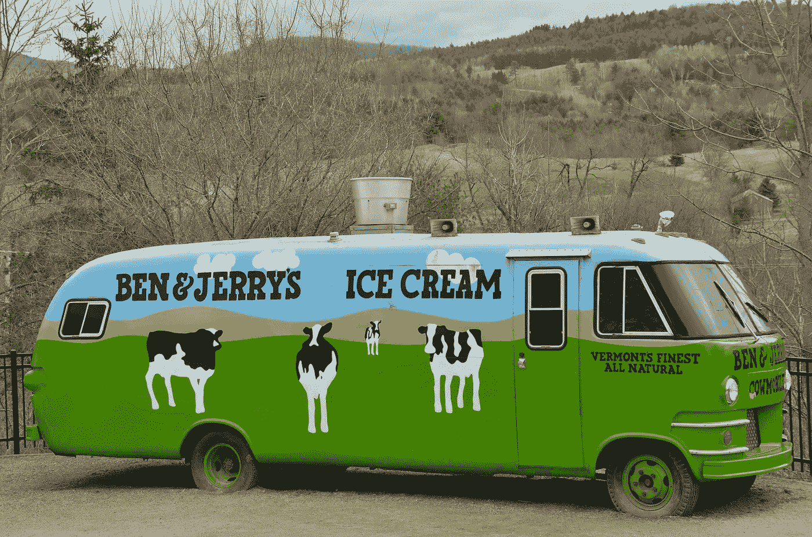

# 做好事不要回避做好事

> 原文：<https://medium.com/swlh/dont-avoid-doing-well-when-doing-good-866705af3f28>

## 在你的创业中加入价值观驱动的方法

[Source](https://pixabay.com/en/america-new-england-vermont-1425151/)

我有点假正经，所以我必须承认，当我去 www.nuleos.com 的时候，社会变革并不是我首先想到的。社会公益内衣。你不会有点怀疑吗？但我在 4 月份的联合之路活动中遇到了创始人多萝西·阿明，她正在学习如何建立具有社会影响力的企业。

我和她聊了起来，我突然意识到，在试图将社交目的融入她的生意的过程中，多萝西实际上是在给自己加税。她的目标是在销售高级时装紧身衣的同时，树立女性赋权意识。但是，通过将一定比例的收益捐赠给“一个旨在提高社会意识和社区参与的非营利组织”，多萝西含蓄地认同了这样一种信念，即她无法在做好事的同时做好事——她牺牲了一部分利润来为自己的社会使命做出贡献。

但其实做好事不一定要付出代价。我鼓励多萝西从“开明的自我利益”出发来处理她的商业模式——认识到她的企业中那些有能力产生社会影响的事情也可以让她为自己做得更好——并在这个过程中创建一个社会目的企业。我和多萝西一起工作，想办法让她的社会使命能够真正地*增加她的收入，或者*降低她的成本？我开始想，是否有她可以与之合作的组织来为这两者建立管道。**

From [nuleos.com](http://nuleos.com/lookbook.html).

在多萝西的案例中，她的企业面临的一项重大成本是从全国各地雇佣著名的魅力模特来为她的服装做模特。通过与当地一家组织合作，让她所在社区的女性成为 Nū Leos 的模特，该公司可以体现女性赋权的使命，同时降低她们的拍照和模特费用。

让我们看看北方的安大略省，在那里，Oliberté Limited 已经成为世界上第一家获得公平贸易认证的鞋类制造公司。通过在埃塞俄比亚的亚的斯亚贝巴制造鞋子，Oliberté能够降低成本，而他们的客户每购买一双鞋，就为提高工人的生活水平做出了贡献。支持其社会目的是奥利伯特模式的组成部分，他们不必因为行善的使命而克扣利润。

对于多萝西来说，当地的合作伙伴关系甚至可以增加收入，因为为商品做模特的女性——在支持多萝西设计的过程中感觉很美，变得更有力量——成为了该品牌更忠诚的顾客。这种伙伴关系将她的使命与她的成功结合起来，使行善和做得好在她的商业模式中不可分割地联系在一起。

以本&杰里的为例。除了提供美味的食物，这家 [B 公司](https://medium.com/u/9ca20fe7192d?source=post_page-----866705af3f28--------------------------------)还与当地的奶牛场合作，这些奶牛场采用可持续发展的做法，使用节能冷冻技术，并积极参与公平贸易运动。通过这样做，他们建立了一个忠诚的有社会意识的客户群，在这个过程中增加了收入。该公司以这些社会价值观作为其模式的核心，他们的社会使命一直是他们业务的核心。这两个部分是不可分割的，相互补充和支持。

有意做好，做好事应该是竞争优势。事实证明:无论是哪个行业或产品，采用价值观驱动的方法的公司总是跑赢市场。

最终，由每个企业主来决定如何将他们的社会公益嵌入到他们的商业模式中，创造一个社会目的的企业。你可以利用什么样的伙伴关系来确保你在做好事情的同时*也能做好事情*？**

## 由我阅读更多内容:

 [## 只是改变

### 加入 Tynesia Boyea-Robinson 的《Just Change 》,她将分享关于创新方法的故事和案例研究…

www.tyboyea.com](https://www.tyboyea.com/just-change/) 

## 这篇文章发表在 [The Startup](https://medium.com/swlh) 上，这是 Medium 最大的创业刊物，有+ 378，907 人关注。

## 订阅接收[我们的头条新闻](http://growthsupply.com/the-startup-newsletter/)。

