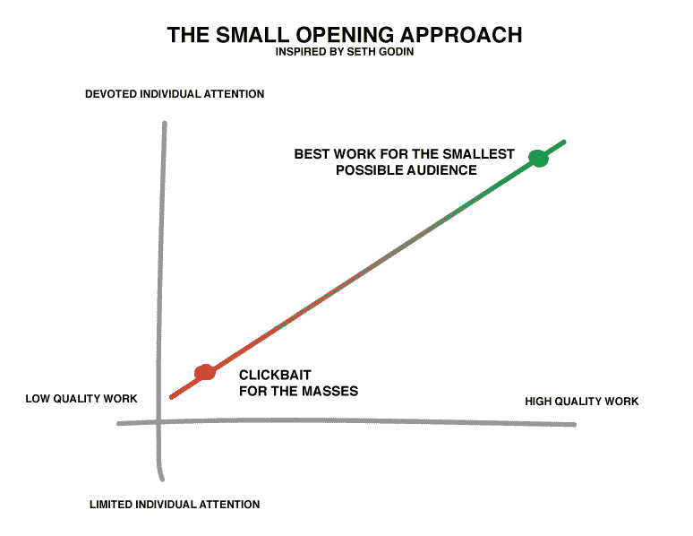

# 不要成为纽约时报的畅销书作家

> 原文：<https://medium.com/swlh/dont-be-a-new-york-times-bestselling-author-73233a92dc1f>

## 做一个被爱的人。

[Kanye](https://unsplash.com/photos/XUdIi04ohps?utm_source=unsplash&utm_medium=referral&utm_content=creditCopyText)

为了成为纽约时报的畅销书作家，你会做些什么？

你能输入时间吗？他们说工作量很大。

如果你真的投入了时间和精力，你会再写一本书吗？另一个？

《T2》这部《T3》会令人失望吗？

或者你会因为热爱这门手艺而这么做吗？你会为了学到东西而这样做吗？你会为了信息这么做吗？

## 四周。200 万。40 000.

没有一个数字能动摇你的信念或改变你的动力。无论是畅销书排行榜上的周数、在频道上的浏览量，还是你为上榜而支付的金额。

等等。你能为 NYT 畅销书排行榜上的一个位置付费吗？

> [是](https://www.wsj.com/articles/SB10001424127887323864304578316143623600544)。

你听到的噪音是期望的破灭。

你以为就这样了吗？当你上了名单，你就成功了？

想想那些畅销书作家，他们不停地写一本又一本的书。没有登上畅销书排行榜并不能阻止他们成为作家。

> 让看门人喜欢是个错误。
> 
> 塞思·戈丁

事实上，如果他们十年前写了一本书，而这本书进入了排行榜，那就意味着他们不是作家。

他们只写了一本书。

我们喜欢给有限的成就施加压力。我们设立了酒吧。目标。我们认为，当你的点击量达到 1000 万次，*那么*你就成功了。

但是那些达到这些里程碑的人会告诉你，他们并没有为之奋斗。他们可能会说，他们很高兴也很感激每天有做自己喜欢的事情的自由。

## 就这么简单。

这也是他们为什么继续工作的答案。

所以*真的*，你为什么开始写作？是虚荣吗？还是因为手艺？是关于传递一个重要的信息吗？

是关于个人影响吗？

说到做你一生的工作，首先要弄清楚的是你的价值观。你不可动摇的信念。你把你的信息和信念结合起来。它们定义了你想要种植的种子种类。

然后，你专注于种子。

> 当我们在制作最好的作品，也就是我们寻求制作的作品时，我们的目标不是去倾听曲线中间(大众市场)的人们。他们不听我们的。
> 
> 塞思·戈丁叉腰

目标是专注的个人关注。

不要试图让每个人都喜欢它。你必须寻找最少关心你的人。那些准备好听新东西的人。

尽可能少的观众。

他们愿意听你的。他们关心。你来这里是为了让他们的日子好过一点。或者好多了。

如果你没有，他们会告诉你哪里出了问题。当你这样做的时候，他们会告诉他们的朋友。你们一起踏上了旅程。

你踏上了通往曲线中间的旅程。你在做最好的工作，人们因此而欣赏你。

现在你成功了。

*感谢阅读！如果有什么引起共鸣的请留下评论* ❤️

*我喜欢和世界各地有创造力的人交流。所有的人都有创造力。*

*继续，并与我联系:*

[推特](https://twitter.com/uhmrt) | [领英](https://www.linkedin.com/in/uhnak/) | [脸书](https://www.facebook.com/uhmrt/)

## 这篇文章发表在 [The Startup](https://medium.com/swlh) 上，这是 Medium 最大的创业刊物，拥有+ 373，968 名读者。

## 在这里订阅接收[我们的头条新闻](http://growthsupply.com/the-startup-newsletter/)。

