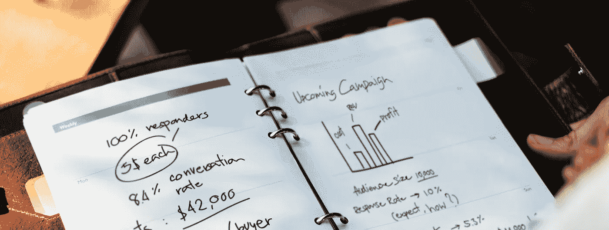

# 不要做一个有抱负的企业家

> 原文：<https://medium.com/swlh/dont-be-an-aspiring-entrepreneur-60a07c6669f9>

## 为什么你不应该犯和我一样的错误

Source: [Unsplash](https://unsplash.com/photos/aOYA7D3fse8)

我过去称自己为“有抱负的企业家”，从定义上来说，我现在仍然是。

我还是想创业，想创造一些东西，解决世界上的一个问题。但我最近意识到，我不一定应该接受这个头衔。它远没有看上去那么迷人。