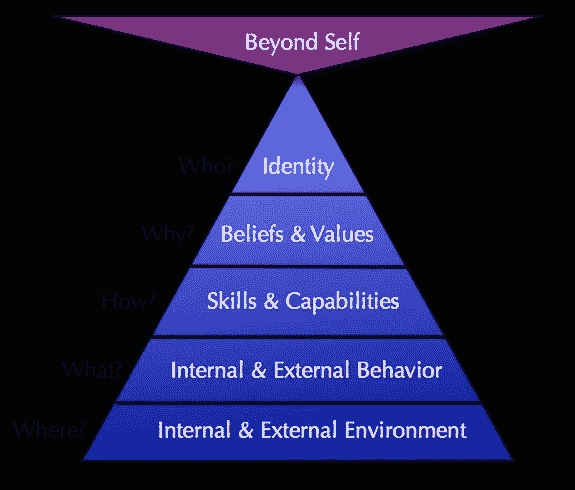

# 不要以没有信仰为耻，要相信上帝相信你

> 原文：<https://medium.com/swlh/dont-be-ashamed-to-not-have-faith-be-sure-god-believes-in-you-6acdb13682ce>

[Credit](https://unsplash.com/@joshuaearle?utm_source=medium&utm_medium=referral)

## 原谅我，他也会的。

当人们问我是否信教时，我喜欢回答:“我不相信上帝，但我确信他相信我。”在我被钉在十字架上烧死之前，我不想争论上帝是否存在。现在不是时候，也不是地方，真的，我不在乎。我对宗教没有意见。我接受了天主教洗礼，我的女朋友是犹太人，我有很多穆斯林朋友，我正在研究佛教。

那么我的目标是什么？

> *“嗯，首先要让人们明白他们应该回避私人问题。即使对不明智的治疗也要明智地回应。”*
> 
> *——老子*

其次，不要以我相信什么和不相信什么来评判我。如果我不相信上帝，但相信有鬼，那我是不是一个怪人？反正我不相信有鬼。让我纠正一下。我不相信有鬼。但是像上帝一样，我不在乎。你也不应该。我是说，如果鬼魂存在，你会怎么做？它真的会影响你的生活方式吗？可能不会，因为你看不到它们。

上帝也是如此。

> 对上帝的信仰是美好的。但是对自己的信心是必要的。

我理解许多人需要相信更高的东西。当你知道马斯洛的需求层次理论时，这其实是很容易理解的。最重要的是更高的目标，创造力。神经语言程序层次也是如此。

在顶端，你有灵性。

[Credit](https://majkic.in.rs/may-the-force-be-with-you/)

男人需要指导。你见过没有统治者的国家，没有 CEO 的公司，没有队长的团队吗？从来没有，或从来没有任何工作。但是当你的国王、总统或你自己都不够好的时候，还有谁能帮助你呢？上帝会的。他当然会，但是你呢？不管上帝是否存在，你都存在。如果他存在，他创造你是有目的的。你不好奇是哪一个吗？

如果他没有，好吧，反正你在这里，所以一定有一个原因，因为有一个很好的机会，你永远不会出生。

# 集中

在 NLP 中，我们学习更多地关注解决方案而不是问题。当你有自己要关心的时候，为什么你那么关心鬼，吸血鬼，外星人，上帝？先相信自己。我们都是。他也是，即使你不在乎他。

所以不要躲在祈祷后面。开始工作。把事情做好。是时候了。

# 三二一…开拍！

[Get in touch](http://nickbnns.com)

 [## 你认为奇迹是胡说八道是对的吗？

### 奇迹到底是什么？

medium.com](/swlh/are-you-right-to-think-miracles-are-bullshit-c22c54f09f50)  [## 癌症杀死了我爸爸

### 我怎么能原谅它呢？

theascent.pub](https://theascent.pub/have-you-lost-a-close-one-to-cancer-too-df46fe67557c)  [## 当心:这个世界扼杀了你的雄心

### 如何让自己的生活重回正轨？

medium.com](/swlh/beware-the-world-kills-your-ambition-c4f0b4c4c978) 

*最初发表于*[*nickbnns.com*](https://nickbnns.com/blog/godbelievesyou/)*。*

## 这篇文章发表在 [The Startup](https://medium.com/swlh) 上，这是 Medium 最大的创业刊物，有+388，456 人关注。

## 订阅接收[我们的头条](http://growthsupply.com/the-startup-newsletter/)。

