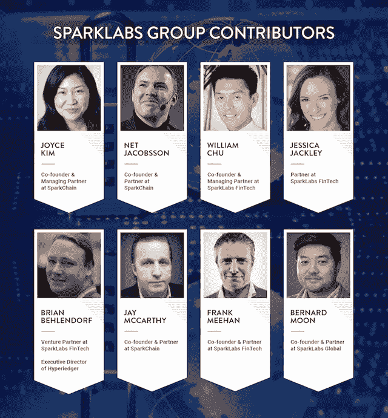

# 不要做哑巴钱:如何投资 ico 和区块链创业公司

> 原文：<https://medium.com/swlh/dont-be-dumb-money-how-to-invest-in-icos-and-blockchain-startups-698a29e27381>

Image Credit: BigStockPhoto

我们在 [SparkLabs FinTech](https://www.facebook.com/SparkLabsFinTech/) 和 [SparkChain Capital](http://www.sparkchaincapital.com) 的团队很高兴能够在[开设我们的新博客，在福布斯发布平台上报道货币](https://www.forbes.com/sites/sparklabs/#1824bb1223b9)、加密货币和区块链创新的未来。我们将涉及广泛的主题，因此我们期待着与大家一起产生想法、反馈和讨论。

作为背景资料， [SparkLabs Group](http://www.sparklabsgroup.com) 自 2014 年以来一直在投资加密货币和区块链领域，但他们的经历各不相同，从我们 SparkChain 的管理合伙人 Joyce Kim ，他是比特币的早期投资者和 [Stellar Protocol](https://www.stellar.org/) 的创始人，到今年早些时候才开始深入研究的我。这些是我的观察和想法，因为我每个月都在变得更加投入。

(*本文最初发表在* [*我们的福布斯博客上，原文从*](https://www.forbes.com/sites/sparklabs/2017/12/05/dont-be-dumb-money-how-to-invest-in-icos-and-blockchain-startups/#1755570f7c74) 下方开始)

早期创业投资没有改变。投资方式以及活跃天使和风险投资家在创业公司中寻找的东西都没有改变，那么对于加密货币投资者来说为什么要改变呢？对于一些年轻的千禧一代加密投资者来说，我可能听起来像退休的约翰·伍登或欧比万·克诺比，但如果只是融资机制而不是建立成功公司的实际路径，这些因素没有理由改变。

(Alec Guinness as Obi-Wan Kenobi in “Star Wars: Episode IV — A New Hope”)

就在几年前，许多无法获得种子资金的创业公司正在推出自己的 ico。他们的商业模式改变了吗？不。他们的团队？不。什么变了？只是他们投资者的目标受众。

为什么创业公司通过 ICOs 融资的门槛这么低？你有一份写得很好的白皮书，所以你应该能筹集到 1000 万美元？你有一个来自谷歌和脸书的团队，或者共同创立了一家被收购的公司？也许大多数新的创业投资者不知道种子资本在某些领域的门槛有多高。大多数种子基金甚至不会考虑六个月后留存率低于 20%的移动应用或营收低于 50 万美元的电子商务公司。

**别变成哑巴钱**

显然，幕后有机制从这些低标准中受益(*即 alpha 或 vaporware* 中的产品)，因为许多 ico 是由抽水和倾倒的鲸鱼[驱动的。即使一个代币的价格下跌 20%，这些投资者仍然做得很好，因为他们可能是以 40%的折扣购买的。](http://www.businessinsider.com/ico-cryptocurrency-pump-and-dump-telegram-2017-11)

不要成为这些 ico 末尾的散户，手里拿着一堆虚幻的代币，或者永远不会推出产品的纸老虎的股票。当大多数公司的研究报告读起来像 20 世纪 90 年代的报告时，整个 ico“行业”都有问题，当时信息很少，炒作很浓。

**在 ICO 转换你的种子投资**

投资标准不应该改变，条款也不应该改变。我们最近投资了一家与区块链相关的初创公司，该公司正计划推出 ICO。在审查他们的可转换票据文件后，我们的团队提出了我们的投资在 ICO 不转换的事实。如果一家公司通过 ICO 融资 500 万美元、1000 万美元或更多，那么种子轮投资者的可转换债券不应该被搁置，而应该转换为股权。我们与创始人进行了简单的交谈，他们也表示同意，可转换票据的条款也发生了变化。

**小心毛鼻袋熊**

观点可能会有所不同，但在我看来，随着监管机构的介入和 ICO 热潮的降温，公用事业代币将与股票挂钩，这一点似乎很清楚。创建一个成功的创业公司和产品已经够难了，但除此之外，还要围绕你的代币创建一个成功的生态系统？这就像同时创建 Eventbrite 和 Evernote，同时在 80 天内环游地球——一个巨大的任务。因此，我认为绝大多数公用事业代币最终将以某种方式与股票挂钩。

Image Credit: BigStockPhoto

将会有罕见的效用令牌可以成功地证明它们的存在，但不是很多。也许和现存的大约 200 只毛鼻袋熊一样稀有。目前，专注于 ICO 的法律界本身正在辩论，在库利 LLP 出版的 SAFT 白皮书的回应中，一个纯粹的公用事业令牌是否将被视为证券。因此，许多将自己定位为“公用事业代币”以避免被视为证券的 ico 可能不会成功。

我收到的数十个 ICOs 推介中，大多数都是这样的:

创始人:“我们正在推出一个令人敬畏的小工具，并围绕它创建一个利用我们令牌的生态系统，这将破坏现有的生态系统……你应该投资我们的 ICO，因为这将是一项伟大的投资。”

我:“你是一个纯粹的效用令牌，为什么这是一个伟大的投资？”

创始人:“嗯，一旦人们采用我们的产品，我们的生态系统起飞，我们的代币的价值将成倍增长！”

如果 WhatsApp 为其聊天社区推出一个实用令牌，那么这可能是有意义的，因为他们已经有了一个庞大的用户群。我设想五年后，创造真正的实用令牌将成为创业界的圣杯。

**ico 将颠覆中期风险投资**

最后，我相信 ico 会一直存在。即使在全球各地的监管机构尘埃落定之后，ico 仍将是寻求资金的企业家的一个可行选择。有很多关于 ico 将如何取代或破坏风险投资的讨论，但我认为这非常值得怀疑。

你只要看看 Y Combinator 就知道早期风险投资的价值了。他们每一批 120 家或更多的公司中，大多数不需要他们的 12 万美元投资。最优秀的企业家想要聪明的钱。当 SparkLabs 的[物联网&智慧城市加速器](http://www.sparklabsiot.com/)于 2016 年 11 月推出时，第一批有 16 家公司，在进入该计划之前，每家公司平均筹集了 280 万美元。他们都不需要我们 50，000 美元的投资，但他们想要的是进入我们的团队、网络和项目。

如果你看看 A 轮投资者，如红杉、Accel、Benchmark 和 Greylock，他们的钱仍然是大多数企业家所渴望的。我相信从长期来看，ico 会影响风险投资的中期阶段，但不会取代它们。对于许多连续成功的企业家来说，ico 将是他们在 B 轮、C 轮和后续轮寻找替代资金来源的一个选择。

作为加密货币和区块链领域的投资者和企业家，这是一个非常激动人心的时刻。投资者现在应该做好准备，迎接将建立在区块链科技基础上的新一波独角兽。

Image Credit: BigStockPhoto

## 这篇文章发表在[《创业](https://medium.com/swlh)》上，这是 Medium 最大的创业刊物，有 273，384+人关注。

## 在这里订阅接收[我们的头条新闻](http://growthsupply.com/the-startup-newsletter/)。

