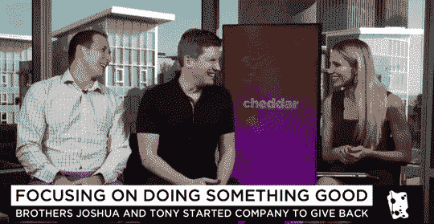
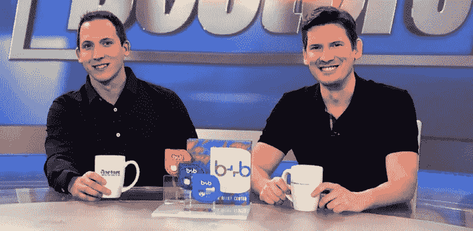

# “不要成为房间里最聪明的人”托尼&乔希·布里登的至理名言

> 原文：<https://medium.com/swlh/dont-be-the-smartest-person-in-the-room-19c2bbadec9c>

> 我有幸采访了托尼和乔希·布里登，他们是 Ole Smoky Moonshine & Whiskey 和他们的新“捐赠品牌”b+b 的企业家兄弟，通过“买一送一”的模式向美国各地的农村医疗中心和免费诊所提供基本的止痛药。截至 2017 年底，他们已经向美国各地的免费诊所捐赠了 424，800 剂止痛药，并有望在今年春天达到 150 万剂。

## 你的“背景故事”是什么？

我们在田纳西州的烟雾弥漫的山区长大。在 2009 年经济衰退最严重的时候，托尼创办了 Ole Smoky Moonshine and Whiskey，帮助田纳西州阿巴拉契亚的善良人们重返工作岗位。今天，作为一个全球品牌，我们很自豪地成为田纳西州最受欢迎的景点之一，也是世界上最受欢迎的酿酒厂，每年有超过 350 万游客。

这一成功超出了我们的预期，促使我们寻找另一个合作项目来帮助那些需要帮助的人。该国医疗保健系统的问题似乎成了焦点。获得医疗保险变得越来越困难，国家免费诊所和农村医疗中心承受着额外的压力。我们会见了 Americares 的一个团队，了解到这些诊所最大的需求之一是能够提供基本的非处方药，如对乙酰氨基酚和布洛芬。这就是我们需要听到的，b+b 被创造出来——来帮助提供这些基本的止痛药物。

## **你能分享一下自你开始领导公司以来，发生在你身上最搞笑或最有趣的故事吗？**

有很多有趣的故事可能不适合出版。

一些最有趣的事情来自于这样一个事实，我们从创立一个私酒和威士忌品牌到现在开始一个非处方药品牌。最近，在录制电视节目《医生 T4》的一集时，一名观众大声说道:“嗯，它们不都是用来止痛的吗？”这个节目的主持人和我们都很喜欢这个节目——我们怀疑这个节目是否能最终晋级！

## 你认为是什么让你的公司脱颖而出？可以分享一个故事吗？

让我们脱颖而出的是，我们是唯一一家在健康领域采用“买一送一”模式的公司。每购买一个 b+b 止痛产品，我们就向遍布美国的 1000 多个免费诊所和农村健康中心捐赠一个产品。我们的非处方药包括对乙酰氨基酚、布洛芬和萘普生钠。我们试图将我们的产品定价为与我们的品牌竞争产品相同或更低的价格，我们还提供无染料选项[目前没有任何其他国家止痛药品牌提供该选项]。此外，我们与 EOS 润唇膏背后的工程师合作，创造了我们酷的移动包装。我们的竞争对手被称为“大型制药公司”，但因为我们是兄弟，我们称自己为“家族制药公司”

## 你会给其他首席执行官或创始人什么建议来帮助他们的员工茁壮成长？

1.不要成为房间里最聪明的人。如果你是房间里最聪明的人，那你很可能走错房间了！雇用与你技能不同的人。

2.开始时微观管理是可以的，因为没有人会比你更关心你公司的细节。微观管理是你如何为你的品牌建立一个强大的基础。一旦这个基础建立起来，接下来的任务就是放松，让你的员工在这个基础上发展。

## **在前进的道路上，没有人能获得成功。有没有一个让你感激的人帮助你走到了今天？**

大概不止一个人吧。我们非常感谢那些一路上对我们说“不”的人，以及那些*劝阻*我们追寻梦想的人。他们一点也不知道，他们激发了我们的竞争精神，证明他们是错的。另外，“不”真的不只是谈判的起点吗？至少他们给了我们一个答案，我们会继续努力，让答案变成“也许”，然后是“是的！."

## 你是如何利用自己的成功为世界带来益处的？

我们公司的宗旨，以及我们公司成立的使命，就是为世界带来并分享美好。我们会说，没有事业，就没有生意。我们非常感谢全国零售商分享我们的愿景。我们正在全国范围内迅速扩张，从大型超市到超市和在线零售商。当这篇文章付印时，我们已经向全美的免费诊所捐赠了将近 150 万剂止痛药。我们为这个“家庭制药”感到骄傲，所有支持我们的顾客为他们自己和他们的朋友购买我们的产品，并把我们的信息传播给任何愿意倾听的人，这让我们感到惊讶。口碑对我们很有帮助。

## **你的“我希望在成为 CEO 之前有人告诉我的 5 件事”是什么，为什么？**

1.微观管理在开始是好的。一旦打下了坚实的基础，你的团队就有了前进所需的立足点，并对公司的方向和目标有了清晰的理解。

2.知道自己的优势和劣势，意识到自己不可能什么都擅长。你只需要善于相信你选择好人的直觉。如果你是这个房间里最聪明的人，你的自负会对你的品牌不利。一个朋友曾经说过，如果你不确定薄弱环节是谁，那很可能就是你。

3.有一种“赌徒”(#kennyrogers)的哲学。知道什么时候握牌，什么时候弃牌。含义:要灵活。因此，许多领导人都试图让一个方孔适合一个圆孔，但有时你只需要寻找方孔。不要勉强。

4.如果有人需要一个快速的答案，答案通常是否定的。如果他们能给你时间思考，那么答案可能会改变。重大决策需要快速决策的情况非常罕见。这不是急诊室手术。不要着急。

5.找到并坚持品牌一致性——从网站到包装到广告到名片。品牌凝聚力对讲述你的故事很重要。你会了解到一个强大的品牌销售的是一种生活方式，而不仅仅是一种产品。

## 你能说出你最喜欢的“人生格言”吗？

“如果你想走得快，就一个人走。想走远，就一起走。”这句谚语引起了我们的共鸣，因为我们必须记住，我们希望带客户一起冒险，确保包容性，并创造品牌传播者。任何人都可以购买超级碗广告，但与品牌冠军有机地建立品牌需要特殊的技能。即使在一个快节奏的世界里，缓慢而稳定也能赢得比赛。

## **在这个世界上，或者在美国，有没有一个人是你愿意与之共进私人早餐或午餐的，为什么？**

我想不出有谁会让我们放弃与家人的私人早餐时间。为人父母和企业家是艰难的，因为你的一天真的没有尽头。

午餐？或许安排一次与埃隆·马斯克的午餐。他看起来像是一个在世界上寻找解决方案的人，而不是被美元所驱使。在理想的情况下，马斯克会同意和我们共进午餐，但会在最后一刻取消。然后，他会感到内疚，给我们发一封鼓舞人心的电子邮件，激励我们在今年余下的时间里继续努力。

## 这篇文章发表在《T4》杂志《创业》(The Startup)上，这是 Medium 最大的创业刊物，有 317，238 人关注。

## 在这里订阅接收[我们的头条新闻](http://growthsupply.com/the-startup-newsletter/)。

