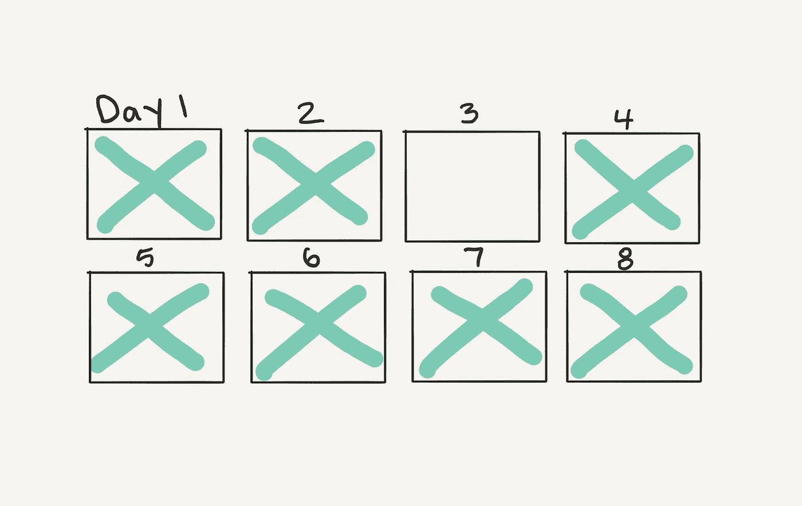

# 不要弄断链条

> 原文：<https://medium.com/swlh/dont-break-the-chain-4e96fa17102e>

你走在沙滩上。你找到一本书。

这几页有点潮湿，但清晰可辨。你看标题。

2043.

只有四个数字？你打开它。

你开始意识到这不是一本从前的书。

你开始意识到一些故事。

书中的人和你出生在同一年。他们的父母和你的名字一样。

这本书的主角是你。只不过现在是 2043 年，你已经 50 岁了。

现在这个标题有意义了。

你随便翻到一页。

2031:发生了很多事情。你结婚了。她很漂亮。

你继续读。

2033 年:你有了几个孩子。其中两个很棒。另一个也很棒，但需要更多一点的爱。

这本书按章节编排。每一个都是一年。它从你出生的那一年开始。

1993 年:出生在医院，父母都很爱她。

1994 年:当了一年的婴儿。爸爸总是带我去散步。

1995 年:第一颗牙。

这种记录。但是以一种更加时尚的方式。我在这里总结。我知道你很着急。

然后你跳到 20 多岁。

2013 年:满 20 岁。飘飘学生。

2014, 2015, 2016, 2017…

你到了今天。不管现在是哪一年。我在 2018 年写这篇文章，所以我们现在可以这样称呼它。

2018:开始做我想做的那件事，每天都是。**没断链子。**

为什么文本是粗体的？

你继续读。

前几章有一个主题。

2012 年:我想做东西，但我在学习其他东西。

2013 年:我不知道我想做什么。我的意思是，我知道，但我不知道。妈妈和爸爸说了一件事。我的老师说另一个。我什么都没做。很难想象。这让我心烦意乱。我应该已经在那里了，但是我没有。我甚至不知道哪里有。我会继续努力玩得开心。

现在它走到了一起。

2018 年:一直以来，我都知道我拥有它。我要做的就是每天出现。没有秘密。我很高兴我终于明白了靠在椅子上的技巧。如果我想做一件事，决定权在我。

你继续读。

这条链子是什么？

2018 年:我在墙上贴了一个日历。如果是我做的，我会在日期上打个 X。如果我不做，他们什么也得不到。

那是什么？

2018 年:没关系。我脑子里的声音告诉我要做的事情。今天是写作。明天可能会写作。我开始越来越享受了。开始的时候很难。我错过了一些日子。现在我有动力了。**我所要做的就是不要打破锁链。**

你继续读。

2018:当我们不匹配时，焦虑就来了。我们是我头脑中的声音和外在的我。扮演一个演员是艰难的。我想这就是为什么他们得到这么多报酬。我要做的就是继续做这件事。继续做我想做的事情。我迫不及待地想等到 2043 年再回头看这篇文章。到那时链条会相当长。

你的手臂垂下，书也跟着垂下。你小心。海洋在移动。它总是在动。

你把书放下。读书已经没有意义了。

你得到了未来的快照。但是你不想继续下去。已知的未来已经成为过去。

走在沙滩上，你在脑海中重复。

不要弄断链条。不要弄断链条。继续下去。

停车场附近有一家街角商店。你走进去。2019 日历在售。

你买一个上面有喜鹊图片的。看起来很奇怪。

你回家把它挂在墙上，然后拿出一个马克笔。

在最上面，你写下你的东西。

爱我自己。

爱别人。

每天都在创造。

链条开始了。

Hit a day, hit a day, miss a day. No worry, start again.

这篇文章最初是作为 Quora 上的一个回答出现的。你可以在那里找到更多我的作品。

## 这篇文章发表在[《创业](https://medium.com/swlh)》上，这是 Medium 最大的创业刊物，有+402，714 人关注。

## 订阅接收[我们的头条新闻](http://growthsupply.com/the-startup-newsletter/)。

