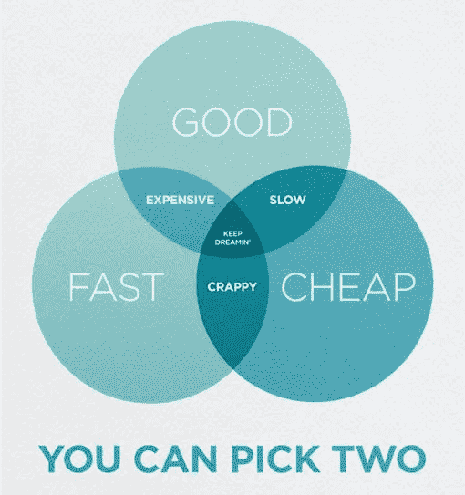
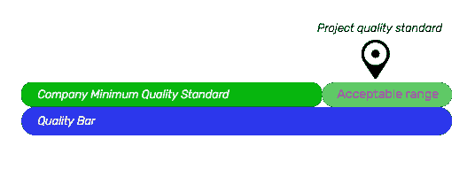

# 不要构建质量最好的软件

> 原文：<https://medium.com/swlh/dont-build-the-best-quality-possible-software-b81ffc5c7947>

无论你是构建原型的企业家还是构建软件问题的企业公司，都有可能希望尽可能快速、廉价、高质量地构建它。但是你知道那句老话:只能挑两个。

*   又快又便宜不是高质量。
*   价廉物美不算快。
*   快速和高质量并不便宜。

是的，这是老生常谈，但这是有原因的。大部分陈词滥调都是真的。

但是让我们深入挖掘一下。

由于价值的本质，这种陈词滥调听起来是正确的。作为一个工作定义，我们可以把“价值”想成*质量/价格*。即使一个产品是超级高质量的，如果你为它付出了太多，你也没有得到太多的价值。即使一个产品质量很差，如果你花相对少的钱，你仍然可以得到很多价值。低质量和高质量的产品都可以是低价值或高价值的——这是一个数学和两个变量的比率的问题。

有了这样的理解，我们就可以理解为什么有时候故意选择构建一个低质量的产品是有意义的。因为在项目开始时，我们需要了解两件事，以便对我们构建的产品的质量和类型做出正确的选择:

1.  公司的最低质量标准。
2.  商业目标

让我们把这两个都过一遍。

作为一家公司， [Rootstrap](http://www.rootstrap.com) 需要对我们的建设负责，不管是什么。我们有一个很高的最低质量标准。我们使用工具来确保这一点，例如强制自动化测试、与 CI 服务器的集成、在多个静态代码分析工具上的零警告、在 CodeClimate 等工具上的高分、我们要求至少两个审核者的批准，等等。所有这些，加上强大的团队和强有力的领导，确保我们建设的任何项目都符合这些标准。我们有可能开发出比我们设定的最低质量更好的软件吗？当然可以——但是需要更多的时间，而且可能会更贵。

这就是理解项目的业务目标变得如此重要的地方。作为一个开发机构，我们可以建立一个快速和肮脏的 MVP，需要尽快上市。我们可以构建一个任务关键型软件平台。我们可以支持一个数十亿美元的公司，它不会降低运营速度。对于这些项目中的任何一个，我们都需要满足我们的最低质量标准——但是除此之外，我们构建的质量取决于项目的需求。因为在资源固定的情况下，质量越高意味着时间越多。句号。没有捷径可走。

Balance between business goals, speed, and quality

这里有一个非常简单的图形反映了这一现实。作为一家公司，我们有一个最低标准。然而，*项目质量标准*应该基于业务目标来定义。这意味着:

不构建最好质量的软件是可以的。

不尽快发货也可以。

你必须构建满足你的最低质量标准的软件，以与业务目标相适应的速度产生结果，并且在你的限制(团队、资金、时间)内尽可能地高质量。

TEAM acronym: Time, Energy And Money

如果你有这些技能，你如何设定你的项目质量标准是一个选择。这种选择是由业务目标决定的。我们想快速进入市场来测试一个想法吗？我们需要慢慢来，为客户建立一个持续几十年的稳定基础吗？这完全取决于项目的商业目标。

如果你创造了超高质量的东西，但进入市场太晚，失去了所有的投资者，失去了成为可持续企业的任何机会，那么它就一文不值。

如果你做了一些低质量的东西，可以很快进入市场，但在找到一个适合市场的产品后，它就不能成长了，因为架构不允许。

一些公司制造一次性原型，速度非常快，质量很低，以测试市场上的一些假设。如果你知道自己在做什么，那没关系。问题是，大多数企业家一直在它的基础上进行建设，这是一个在未来搬起石头砸自己的脚的配方。

我们不是那种公司——我们不只是制造便宜的一次性原型。我们有很高的最低质量标准，因为这是我们想要瞄准的市场。但这是一种选择，我们应该认识到这一点。

在 Rootstrap，我们不是构建软件最快的公司(产生的结果质量很差)，也不是构建最高质量软件的公司(这需要很长时间)。我们的目标是战略性的。我们想知道我们与项目目标的关系，并在给定约束和业务目标的情况下以最高的质量构建软件。

**在 Rootstrap，我们的目标是成为创造最多*价值*** 的公司。

作为一名企业家或公司，如何配置这种价值取决于你自己。

随时给我写信。我很想从你的经历中学习。

*anthony@rootstrap.com*

*安东尼·菲格罗亚，首席技术官，* [*根带*](https://www.rootstrap.com)

## 这篇文章发表在 [The Startup](https://medium.com/swlh) 上，这是 Medium 最大的创业刊物，拥有+395，714 名读者。

## 在这里订阅接收[我们的头条新闻](http://growthsupply.com/the-startup-newsletter/)。

