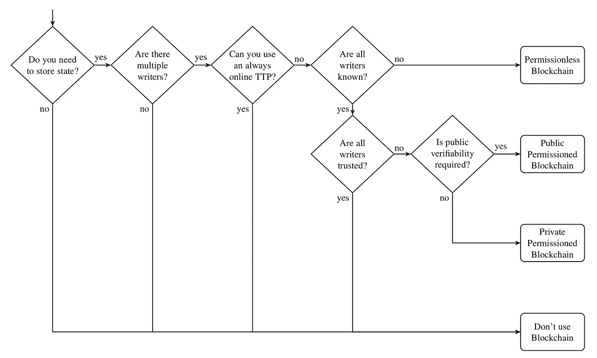

# 不要相信区块链的炒作

> 原文：<https://medium.com/swlh/dont-buy-the-blockchain-hype-3eae869e2de0>

但一定要买入加密货币的未来。

区块链是密码学在分布式、不可变日志概念上的一个杰出应用。但事实是:有 99%的可能性，区块链完全不适合你正在考虑解决的任何问题，尤其是当[劣势](https://www.kaspersky.com/blog/bitcoin-blockchain-issues/18019/) [是](https://arxiv.org/abs/1704.01414) [所以](https://due.com/blog/can-the-blockchain-scale/) [众多](https://www.techworld.com/startups/what-are-limitations-of-blockchain-experts-from-odi-explain-3648881/)的时候。

## 什么时候应该使用区块链？几乎没有。

卡尔·wüST 和亚瑟·热尔韦在《你需要一个区块链吗？》一书中，比我更优雅地总结了区块链的观点。:

> [区块链允许]互不信任实体在不依赖可信第三方的情况下交换金融价值和进行交互。

如果你正在考虑建立一个基于区块链的应用程序或投资一家基于区块链的初创公司，首先问问自己，正在解决的问题是否需要相互不信任的实体之间的互动或财务价值的交换？“不信任”是指你无法确定另一个实体的身份，以及你不信任那个实体的数据。如果不是，那你猜怎么着:你不需要区块链！

查看同一篇文章中的以下流程图，该流程图总结了您在决定区块链是否适合您的解决方案时应该遵循的流程:

Choose your own adventure, “how to get VC money in 2018” edition (taken from [Do you need a blockchain?](https://eprint.iacr.org/2017/375.pdf))

一些翻译:

*   这里的“状态”是指数据
*   “作者”实际上是指用户
*   “TTP”是指“可信任的第三方”(如个人、公司、政府)，他们可以信任您的数据
*   举例来说:当你使用脸书，国家包括你的饲料和职位，作家是你和 TTP 是脸书

**绝大多数应用程序都在流程图的第二步或第三步结束。也就是说你不需要区块链。**

## 区块链炒作 vs 加密货币承诺

那么，为什么会有这么多区块链创业公司出现呢？两个字:炒作和货币化。如果你有的话，围绕区块链的大肆宣传会让筹款变得更容易。

货币化部分更有趣。通过将你的公司建立在区块链的基础上，你有效地创建了一个独立的货币系统，其中的稀缺代币可以兑换成真实的货币。ICO 是利用这种可交换性的一种方式，但我觉得我们只是触及了表面。真正的巨变将是当我们不再把应用程序视为我们销售的产品或服务，而是视为我们参与其中并从中获利的相互关联的微型经济体——并且可能从中获利。

“应用作为经济”的潜力是我看好加密货币的原因之一，但我们还没有到那一步。你还不能用乙醚买牛奶和面包。直到那一天，区块链仅仅提供了一个低劣的技术解决方案，导致了更大的操作复杂性，更慢的交易速度，以及一个全新的(相对未经测试的)安全模型。*

*   *符合上述流程图标准的少数应用除外(如比特币、以太坊、Stellar)。*

## 这篇文章发表在[《创业](https://medium.com/swlh)》上，这是 Medium 最大的创业刊物，有 292，582+人关注。

## 订阅接收[我们的头条新闻](http://growthsupply.com/the-startup-newsletter/)。

