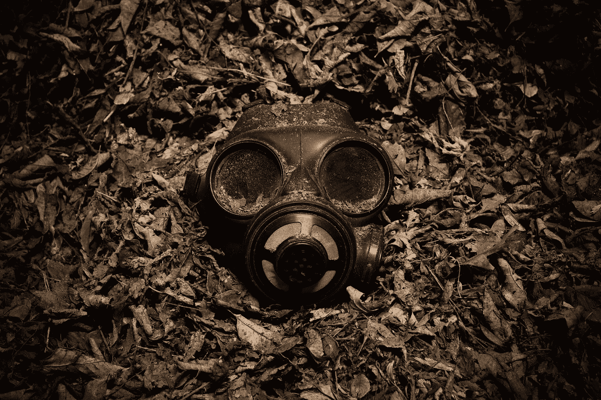
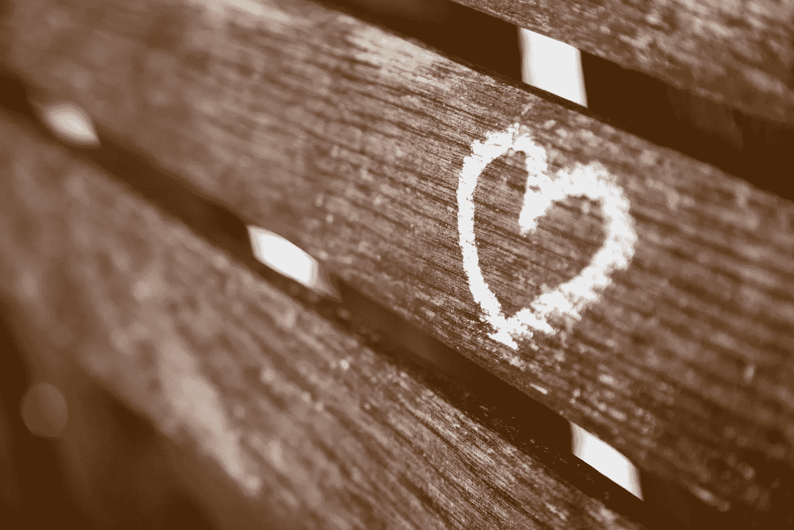

# 不要为了有毒的人而妥协

> 原文：<https://medium.com/swlh/dont-compromise-yourself-for-toxic-people-a68ba8333d4b>

我相信你现在已经注意到了，不是每个人都是令人愉快的。这并不一定使他们成为坏人；这只是意味着他们不一定起到健康的影响。

说某人有毒可能有点刺耳，尽管有时甚至是轻描淡写。然而，如果一个人以任何方式表现出对你有负面影响的行为，这对你来说是不健康的。老实说，你不应该让自己受到别人的毒害。尽管你倾向于假定某人是无辜的，但这并不是强制性的。

> *“人们要么激励你，要么榨干你——明智地选择他们。”—汉斯·汉森*

# **违背理由**

德国弗里德里希·席勒大学的一项研究显示，中毒的人有多严重。他们发现，暴露在引起强烈负面情绪的激励下，会导致你的大脑产生巨大的压力反应。这和你接触有毒的人是一样的。

暴露在哪怕几天的压力下都会损害大脑中负责推理和记忆的重要区域(海马体)的有效性。暴露在数周的压力下会对脑细胞造成可逆的损害，而暴露在数月的压力下会永久性地破坏它们。有毒的人不只是让你痛苦，他们对你的大脑很不好。 ***有毒人的行为是如此的不理智，简直违背理智。***

> “有些人你并不需要。没有他们你会更好。你的生活因为没有他们而变得更好。”—威廉·盖伊

有毒的人会做许多不同的事情来操纵他人和环境，使之对他们有利。以下是我认为我应该远离的五种最糟糕的有毒物质，你也应该远离。了解他们将有助于你我避免受他们的影响。

# **1。** **阴谋家**

阴谋家是最坏的！他们在友谊的伪装下吸走你生活中的时间和精力。他们很难相处，也很难被注意到，因为他们把你当成朋友，并试图建立一种真正虚假的信任(如果这有意义的话)。他们知道你的价值观，知道什么让你开心，知道你喜欢什么，知道你觉得什么好笑，他们把这些信息作为隐藏计划的一部分。

阴谋家总是想从你这里得到什么，如果你回顾你和他们的关系，你会发现他们都是索取，很少或没有给予。他们会不择手段把你争取过来，这样他们就可以一次又一次地欺骗你。

> “我们察觉到，阴谋家们一次又一次地回归常识和劳动。这就是历史的证据。”—亨利·大卫·梭罗

# **2。** **悲观的**

悲观的人通过把他们的消极和悲观强加给他们遇到的每个人来吸取你和房间里任何人的生命。他们的观点总是倾向于生活中缺少的东西，而不是值得欣赏的东西。他们会给最关心的情况注入恐惧和担忧。

圣母大学的一项研究发现，被分配到消极思维的室友的学生更有可能产生消极思维，有时甚至会抑郁。

> 悲观主义者:当他有两个魔鬼可以选择时，他会选择两个—奥斯卡·王尔德

# **3。** **判断题**

判断型的人会立刻以一种强有力的方式告诉你什么是可以接受的，什么是不可以接受的，他们主要是针对你的。他们拿走你最热爱的东西，让你觉得很糟糕。他们从来不会想到去欣赏和向与他们不同的人学习，因为喜欢评判的人总是瞧不起别人。

批判性的人扼杀了你成为一个热情可爱、善于表达的人的渴望，所以你最好把他们赶走，做你自己。

> 有时你遇到的最好的人身上都有纹身，有时你遇到的最挑剔的人也会在周日去教堂小厄尔·迪伯斯

# **4。** **受害者**

受害者很难识别，因为你最初同情他们的问题。然而，久而久之，你开始意识到他们需要的时候正在偷走你所有的时间。受害者通过把他们遇到的每一个问题都变成一堵不可逾越的墙，积极地推脱任何个人责任。

问题是，他们没有把困难时期视为学习和成长的机会，相反，他们把困难时期视为一张单程票。他们每次都选择受苦，那就是水让受害者如此有毒。俗话说得好:

> *“痛苦是不可避免的，但苦难是可以选择的。”—佛陀*

# **5。** **八卦**

搬弄是非者从别人的不幸中取乐。戳进别人的个人或职业错误可能很有趣，但随着时间的推移，它会变得很累，让你觉得恶心，并伤害其他人。最糟糕的是你在某一点上迷失了自我。

外面有太多的好东西，有太多的东西需要从有趣的人身上学习，所以不要浪费时间谈论别人的不幸。

> 伟大的人讨论想法，平庸的人讨论事件，渺小的人讨论人—埃莉诺·罗斯福

# **先善待自己**

我知道这一步很难走。尤其是那些善良的人们。善良可能是健康和有意义的关系的先决条件，但不设定界限会给那些情感需求枯竭的人带来邀请。太善良，你会开始吸引那些需要帮助的，过度情绪化的，控制欲强的，有负罪感的有毒的人。

***还是那句话，不要为了他们而妥协自己——先善待自己。***

*原载于 2018 年 3 月 10 日*[*ye-chen.com*](https://ye-chen.com/dont-compromise-yourself-for-toxic-people/)*。*

## 这篇文章发表在 [The Startup](https://medium.com/swlh) 上，这是 Medium 最大的创业刊物，拥有 277，994+读者。

## 在此订阅接收[我们的头条新闻](http://growthsupply.com/the-startup-newsletter/)。

