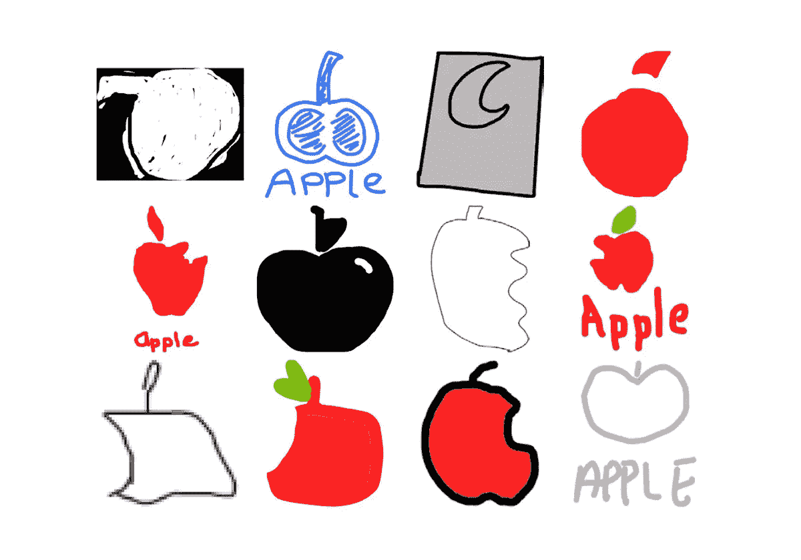
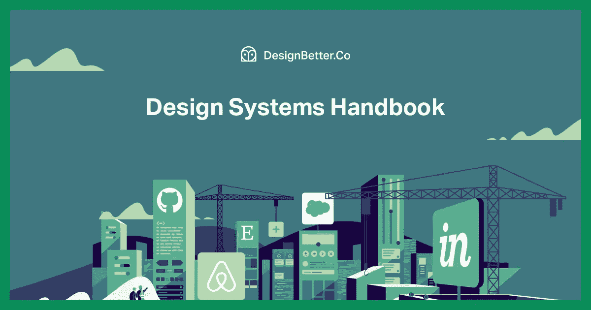
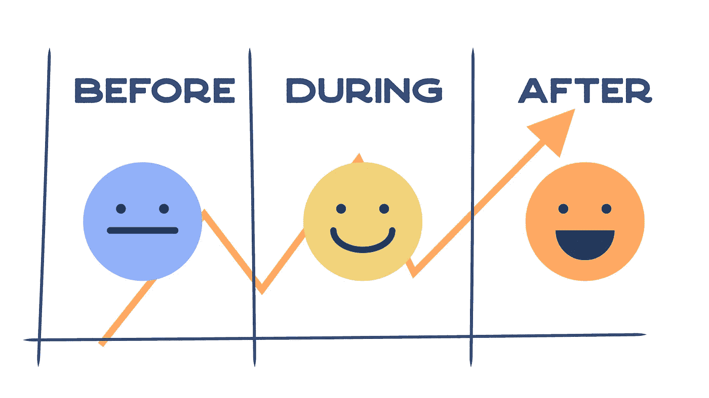
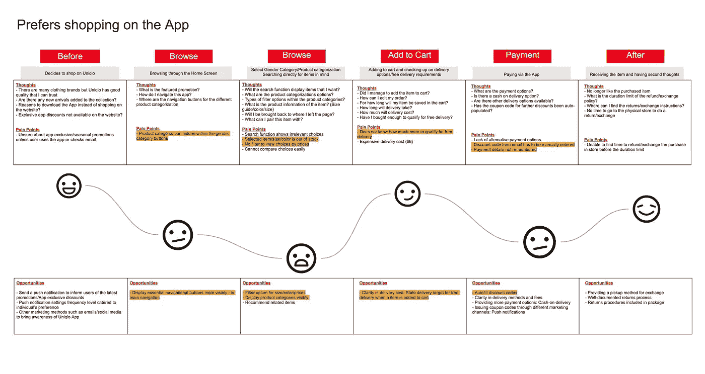

# 不要创造一个标志，建立一个独特的品牌体验

> 原文：<https://medium.com/swlh/dont-create-a-logo-build-a-unique-brand-experience-330c07846154>

Source: [Freepik](https://www.freepik.com/)

# 自由职业者的困境

当我在自由职业者的门户网站上寻找设计机会时，我经常会看到对标志设计服务的请求。我已经试着竞标了一些，但从未得到回应。

我可以在 10 分钟内轻松设计出一个简单的标志。我应该向我的客户收取 10 美元、100 美元还是 1000 美元？我应该提供三个独特的标志设计和最终矢量标志交付的报价吗？或者，我是否应该就如何应用标识提出全面的标识指南？我是否可以更进一步，提出一个如何为公司打造独特品牌体验的计划？我的直觉告诉我这是第一个选择。

公司是否过于依赖一个标志来让顾客认同一个品牌？

# 超越标记的品牌

> 虽然它们(标志)可以让人们知道你的品牌，并有助于发现和识别，但它们不能告诉你的客户你是谁，或者你关心什么，除非你给他们赋予意义。
> 
> —乔恩·霍兰比

自从[从平面设计师转型为 UX 设计师](https://blog.prototypr.io/transitioning-from-a-graphic-designer-to-a-ux-designer-in-2018-8027ec7b90c6)，我从不同的角度看待品牌。品牌不仅仅是一个标志。它涵盖了从包装到营销材料，从印刷到数字，从沟通到服务。它需要被整体看待，以提供一致的品牌体验。

在文章[《没人在乎你的 logo》(Fast Company，2018 年 7 月 26 日)](https://www.fastcompany.com/90207306/no-one-cares-about-your-logo)中，作家乔恩·霍兰比(Jon Hollamby)谈到了公司如何过度强调一个 logo 标志的重要性。他写道，“虽然它们(标识)可以让人们意识到你的品牌，并有助于发现和识别，但它们无法告诉你的客户你是谁，或者你关心什么，除非你给他们赋予意义。”

# 你的品牌唤起了什么情感？

人们会如何描述你的品牌？他们喜欢/不喜欢这个品牌的什么？为什么？

竞争对手怎么样？他们喜欢/不喜欢你的竞争对手什么？他们有什么改进的建议？

> 拿支铅笔，勾画出苹果的 logo。你记得左边、右边有咬痕，还是没有？
> 
> 你能回忆起微软标志上的颜色顺序吗？你还记得多少商标？

Source: [Branded in Memory, Signs.com](https://www.signs.com/branded-in-memory/)

根据 Signs.com 的一项研究，当被要求凭记忆画出苹果标志时，只有 20%的人能够画出几乎完美的标志。

上面的简单练习显示了人们是如何记住一个品牌的，不是通过商标本身，而是与品牌相关的情感和体验。他们通过自己遇到的或好或坏的经历来感知一个品牌。

# 定义你的品牌是什么

你能阐明你的品牌的独特主张是什么吗？你希望你的品牌如何最广为人知？

清楚地定义品牌体现的优点，并将其写在品牌声明中。陈述应该描述你是谁，你代表什么，你能提供什么。

只有把品牌的价值观用文字表达出来，设计策略才会更符合品牌。

# 开发视觉语言

如果没有合适的插图、图像和照片，设计一个标志是不完整的。

将徽标放在文具套装上看起来如何；当它覆盖在广告照片上的时候好看吗？

强烈的视觉语言会让其他人很容易想起一个没有商标的品牌。

大多数公司在他们的企业形象指导方针中有一个明确的视觉语言，以及关于标志的其他技术细节。这些包括图案、图形、图像的使用，主要用于印刷媒体。大公司有办法投资一个综合的指导方针来统一品牌信息。它有助于维护品牌资产，因为成百上千的员工都可以访问它。随着规模的扩大，中小企业可以逐渐建立起自己的品牌资产。

然而，标识指南不应该规定如何使用标志。它不应该限制其他设计师在潜在的未来营销活动中如何与之合作。

# 从视觉语言到设计系统

Source: [Design Systems Handbook by DesignBetter.co](https://www.designbetter.co/design-systems-handbook)

> 设计系统将产品团队团结在一个共同的视觉语言周围。它减少了设计债务，加快了设计过程，并在协同工作的团队之间架起了桥梁，使产品变得有生命力。
> 
> ——设计系统手册，DesignBetter.co

随着公司开始数字化转型，这些视觉语言需要转化为设计系统，以统一数字产品。除了在应用程序和网站中保持一致的外观，拥有一个系统还有助于加快产品设计和开发，因为它允许设计师和开发人员使用预定义的设计模式进行迭代。

在[设计系统手册(DesignBetter.co 出版社)](https://www.designbetter.co/design-systems-handbook)中，它描述了“设计系统如何围绕一种共同的视觉语言团结产品团队。它减少了设计债务，加快了设计过程，并在协同工作的团队之间架起了一座桥梁，让产品变得栩栩如生。

# 设计系统可访问性

Source: [Google Material Design](https://material.io/design/introduction/#)

公司，尤其是科技行业的公司，不再将品牌资产保留在公司内部。取而代之的是，他们在网上发布并公开他们的身份指南。

例如，谷歌制定了材料指南，以统一不同设备和不同应用程序或网站的数字体验。在确保其产品和社区的产品外观一致的同时，它通过展示其产品如何由良好的设计原则指导来建立设计思想的领导地位。

InVision 的“[世界领先品牌设计系统指南](https://www.invisionapp.com/blog/design-systems/)”中列出的其他优秀设计系统。

# 除了印刷和数字，还要看实体和数字服务体验

你能回忆起你在星巴克买咖啡或在优衣库买衣服的经历吗？

在我之前记录的 UX 案例研究[优衣库自助结账移动应用](http://design.leowhouteng.com/portfolio/uniqlo-self-checkout-mobile-app/)中，我和我的团队观察到，在优衣库实体店购物的体验与在他们的移动应用上购物的体验有很大不同。这促使我们在优衣库应用程序的重新设计中弥合了这两种体验之间的差距。

你的客户每次与你的公司互动时感受到的是品牌，而不是视觉形象。—乔恩·霍兰比，没人在乎你的 logo，快公司。

# 确定客户/用户角色

从识别关键人物角色开始，思考他们如何与品牌互动。设计相关的人物角色，让其他人对他们的需要、需求和愿望感同身受。

# 创建客户/用户旅程图

借助客户/用户旅程图，可视化客户/用户接触点。画出“之前”、“期间”和“之后”的旅程。找出旅程中的优点和缺点，抓住改进的机会。最后，规划优化客户/用户体验的未来之旅。

Source: [Uniqlo Self-Checkout Mobile App](http://design.leowhouteng.com/portfolio/uniqlo-self-checkout-mobile-app/)

# 统一营销

如果没有跨实体和数字平台的营销计划，品牌战略是不完整的。

> 创新和营销推动销售。

引用我最近在喝咖啡时认识的一位朋友的话，“创新和营销推动销售。”在创造了一个新产品(数字或服务)之后，下一步就是营销品牌。

品牌体验需要通过客户/用户使用的平台传达给潜在客户和用户。这可能是社交媒体、电子邮件、网站、应用程序或传统新闻广告，以及营销宣传材料。

为了圆满完成，营销需要与视觉语言、设计系统、用户旅程等协同工作，在一个有凝聚力的营销文案中带来有效的销售。

作为结束提醒，不要创造一个标志，建立一个独特的品牌体验。

如果你喜欢这篇文章，请👏 👏 👏 👏 👏 👏 👏为了它。

**跟我上:** [**Leow 侯腾**](https://medium.com/u/4d04dbd22751?source=post_page-----330c07846154--------------------------------) **|** [**投资组合**](http://design.leowhouteng.com/) **|** [**数字营销博客**](http://leowhouteng.com/)**|**[**Dribbble**](https://dribbble.com/houteng)**|**[**Behance**](https://www.behance.net/houteng)**|**

****

## **这个故事发表在 [The Startup](https://medium.com/swlh) 上，这是 Medium 最大的企业家出版物，拥有 355，974+人。**

## **在这里订阅接收[我们的头条新闻](http://growthsupply.com/the-startup-newsletter/)。**

****