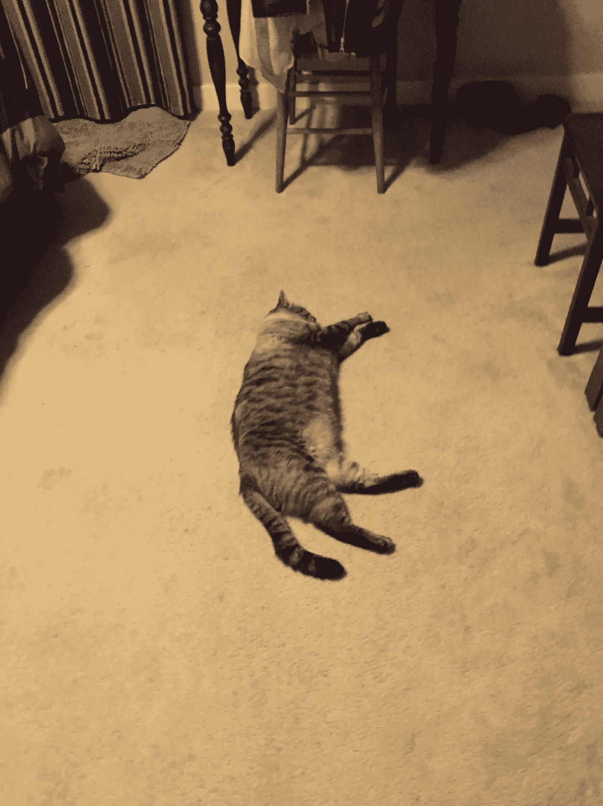

# 不要只是接受失败，要期待失败！

> 原文：<https://medium.com/swlh/dont-just-accept-failure-expect-it-6b23d798fa4c>

## 说真的。这是必然会发生的。

失败和成功是我们都经历过的事情。事实上，失败和成功是一个预期的问题。目标的问题。如果你没有目标或期望，你怎么知道自己是成功了还是失败了？

成功和失败的唯一区别在于我们拥抱成功。我们从不期待失败，也不接受失败。人们说为了成功你必须失败，但这并不完全正确。事实上，为了学习、成长和成功，你必须**接受**你的失败。

# 计划还是不计划？

去年夏天，我和我的生活伴侣去度了一个长假，其中包括在西海岸的自驾游以及在新奥尔良和纽约的一周。当我们第一次决定进行这次旅行时，我们的心是尽可能地自由。我们的目标是走出我们的舒适区。去学习和成长。
完成这个目标的征程早在准备部分就开始了。我们都是高度有条理的人，这通常在生活中很方便，但我们想体验放手的感觉。换句话说，我们计划把一些事情留在计划之外。

起初，我们想完全自发，但我们意识到，我们将在整个旅行中浪费时间和精力寻找住宿。因此，我们预订了我们想住的地方，但所有的日子都完全没有计划。我们不急于看任何东西。我们没有旅行时通常会有的“必看”清单。我们决定只住在空中旅馆，这样我们就能像当地人一样体验每个地方。我们也想走出去和人们说话——我们的主人和他们的邻居。事实上，我们正指望他们的建议。事实是——即使你预订并计划了假期的每一部分，某些事情还是会发生。总有一些事情你无法预料。你生病了。有些事情被取消了。有雨。下雪了。一场飓风。对我们来说，尽可能少地遵循我们的目标和计划是相当可怕的。但后来我们换个角度想了想。我们拥抱意外。毕竟，这是你未来几年都会记得的意外经历。

Sunset at Venice Beach, LA. A minute after we took this photo, it started raining. In August. At 100F.

# 两个人带着两件随身行李

A 于是，2017 年 8 月，只带着我们的护照、机票和订好的 Airbnbs，我们飞到了维多利亚(加拿大 BC 省)，我们的旅行从这里开始。我们轻装上阵，在旅途中的三个半星期里，每人只带了一件手提行李。

我们到达时，我的时差使我整夜未眠。经过 20 多个小时的通勤，这是一个寒冷而疲惫的夜晚。凌晨 5 点我终于放弃睡觉，走到外面看日出。太美了。第二天，我醒来时喉咙痛。我想:“这会毁了我们的整个旅行吗？如果接下来的一周左右我们都感觉不好怎么办？”
**我深吸一口气，提醒自己一切都好。**

你看，这比平常更容易接受这种“失败”，这是一种不可预测的事情，因为我们实际上预计它会发生。
那天我大部分时间都在休息，喝姜茶。那天我不觉得我会失去什么，因为我们没有任何计划。**就是这么简单**。没有压力，我在仅仅 24 小时内就几乎完全康复了。令人惊讶的是，我们的精神状态可以影响我们的身体。我痊愈了，因为我没有因为生病而紧张。

三天后，我们继续前往西雅图，在那里我们开始了南下洛杉矶的旅程。在去租车行的路上，我们和一名优步司机聊了聊。我们谈论着来自世界各地的文化和人们的美丽。几分钟之内，我们真的联系上了。我们上车后仅仅 15 分钟，他就把我们送下了车，他说:“有你们坐在我的车里让我过了一周！谢谢大家！”我们心存感激。租车柜台的那个家伙推荐了他最喜欢的当地景点——斯诺夸尔米瀑布。这是我们公路旅行的第一站。
太神奇了。如果我们事先安排好了行程，我们就不会选择那个地方。我们真的感到很幸运。

# 你的船舱号码是多少？

昨晚，瑞尼尔山在森林里为我们预订了一间小屋。晚上 9 点 30 分，在黑暗中(没有电话信号)开了很久的车，油箱还剩不到四分之一，我们终于到达了目的地。我们本该去拿钥匙的商店关门了。**现在怎么办？一个穿着睡衣的家伙向我们走来。他问我们是谁。我们解释说我们已经订了一间小屋并付了钱。他说:“对不起，我们晚上 8 点关门。”我们恳求他帮助我们。"只要你告诉我你订的是什么舱位，我也许能帮你。"如果我们知道商店晚上 8 点关门，我们可能会按时到达。但这是我们从这次旅行中获得的另一种体验。漫长的车程，迷失的地方，然后发现黑暗的露营地，那个穿着睡衣的家伙，用一个小手电筒向我们展示我们的小屋。幸运的是，我们打印出了预订细节。**

第二天早上，我们在神桥边遇到了两个摩托车手。他们分享了一些关于俄勒冈瀑布的有价值的信息。他们给了我们历史悠久的哥伦比亚河公路的方向，并推荐了他们最喜欢的小路。
**又到了晚上，另一件不可预知的事情发生了。**我们到达了 Airbnb 房东给我们的地址，但是没有人在那里。我们敲了门，给主人打了电话，但是没有人回答。

这很有趣。直到我开始写下这个帖子，我才记起这件事。只是因为我们没把它当回事。我们无法控制的事情注定会发生。
如果你想知道的话，他最终还是出现了，甚至推荐了一个当地的湖泊进行夜间游泳。第二天，我们交了更多的新朋友，他们给我们指了一个可以看到野生麋鹿的地方。太壮观了。

# 化失败为成功

我们在旅途中游览了许多精彩的地方(红杉国家公园和约塞米蒂国家公园，仅举几例),交了更多的朋友。我们谈论了生活、精神和宗教、金钱和政治。我们从遇到的每一个人身上学习并获得真知灼见。从打算为无家可归的青少年开设艺术工作室的男孩，到离开家乡堪萨斯州搬到洛杉矶的女孩。我们没想到会遇到这么多了不起的人。这只是由于我们给自己设定的目标违背了我们的本性。
**当你走出自己的舒适区时，你的经历比以往任何时候都多。**

在我们的旅行中，许多其他事情都出了差错。但是我们的方法是张开双臂欢迎每一个意想不到的事情。我们决定接受所有的失败。期待并接受它们。通过这种方式，我们把那些失败变成了小小的成功故事。
举几个例子:

*   **1 号高速公路部分路段的关闭—** 多亏了它，我们才更快到达圣路易斯奥比斯波，有更多的时间聊天(和喝啤酒！)和我们可爱的主人一起，抚摸他的猫 Flopsy(见下文)。
*   我们所有的 GoPro 坐骑都摔坏了——
    首先，这是一个很好的笑话。一对情侣在同一天无缘无故分手。我们拍的少，经历的多。当我们真的想拍电影时，我们必须有创意。
*   **在旧金山不涂防晒霜—** 嗯，哎哟！但也有点好笑。帮助我们决定在接下来的日子里购买和佩戴一些。
*   约塞米蒂的十亿只烦人的苍蝇—
    它们可能毁了我们的清晨远足，但多亏了这些苍蝇，我们走了一条捷径，遇到了一对可爱的夫妇。最先让我们聊起来的共同利益:那些讨厌的苍蝇！
*   **加州 106 度—** 谢谢你的冰淇淋！幸运的是，天气这么热的时候我们已经有防晒霜了。
*   **飓风/热带风暴厄玛几乎让我们取消了去新奥尔良的旅行—** 这让我们想到了其他可以去的地方，这可能会成为我们的下一次旅行！
*   **飞往纽约的航班延误—** 感谢代金券，达美！我们已经彻底使用并享受了它们。
*   **纽约糟糕的 Airbnb—** 我们看到了这座城市更多的地方，因为我们来到这里只是为了睡觉。

Flopsy in action!

这就是失败的有趣之处。这真的只是视角的问题。如果你从没想过会失败——你最终可能会失败很多次。如果你不接受失败，你就不会经历真正的成功。

不可预知的事情的非凡之处在于它如何向你介绍新的地方、新的想法和新的人。真正的问题是— **你会接受并期待意外吗？**

# 你好。感谢阅读。如果你喜欢，请鼓掌👏并做出回应💬。[跟我来](/@saaroron)这里:

 [## 萨尔·oron⁦⁦👈—中等

### 阅读萨尔·oron⁦⁦写的最新故事👈在介质上。我是萨尔。大多对音乐和人充满热情。在…

medium.com](https://medium.com/@saaroron/latest) 

## 阅读更多信息:

 [## 不，谢谢，我不想要彩票大奖

### 我已经选对了号码

medium.com](/swlh/no-thanks-i-dont-want-the-lottery-prize-8d52d84732c5) 

## 这个故事发表在 [The Startup](https://medium.com/swlh) 上，这是 Medium 最大的创业刊物，拥有 330，853+人关注。

## 在这里订阅接收[我们的头条新闻](http://growthsupply.com/the-startup-newsletter/)。

