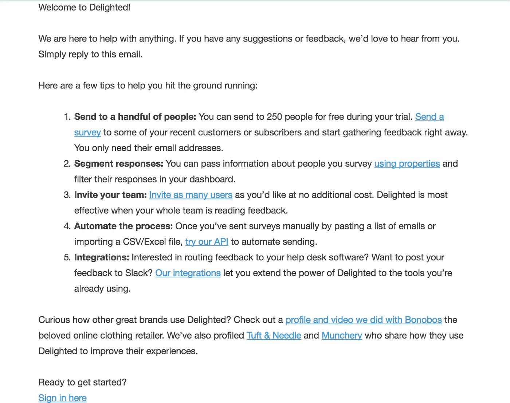
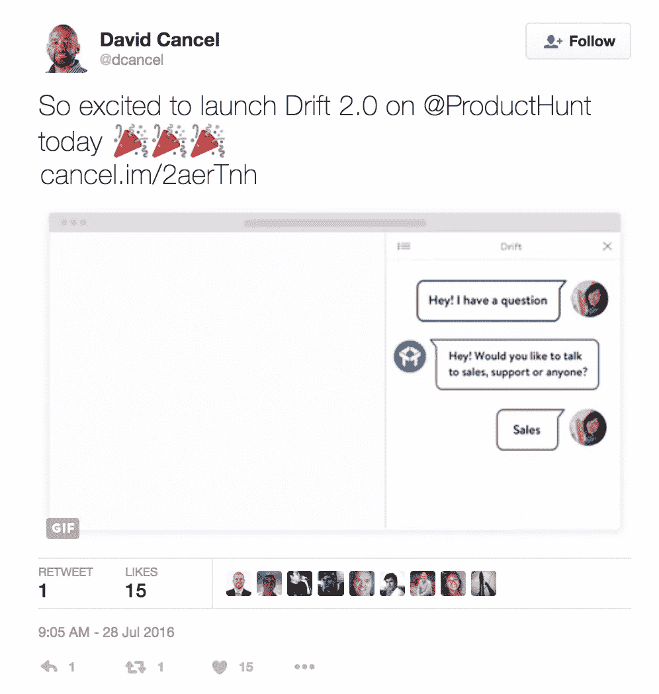
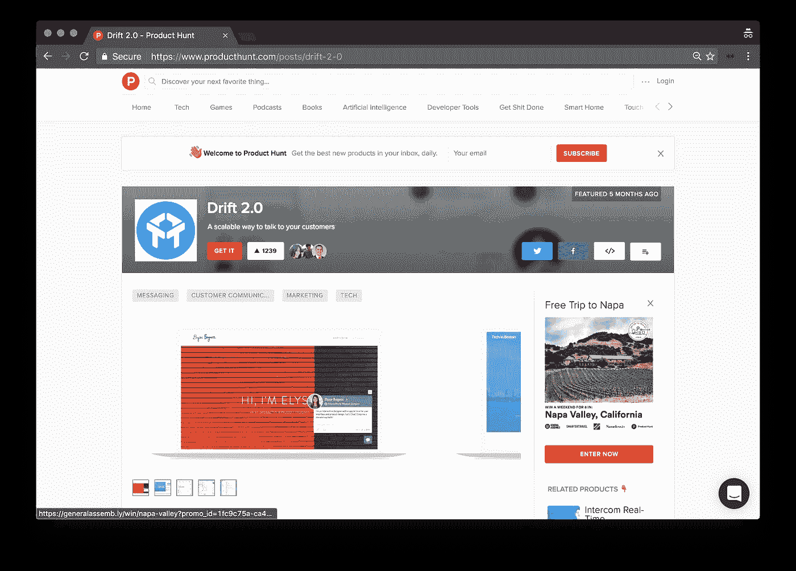
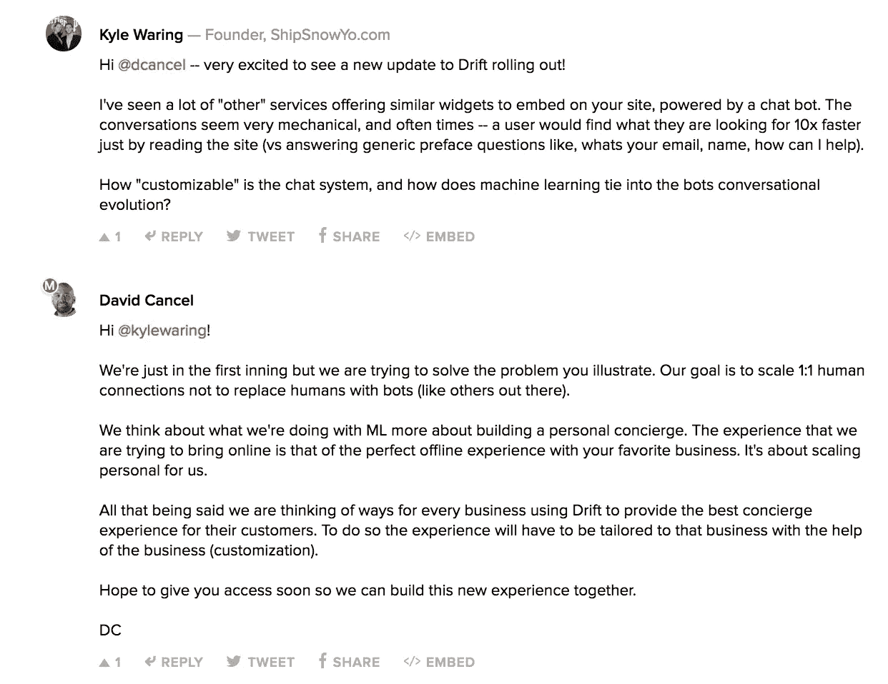
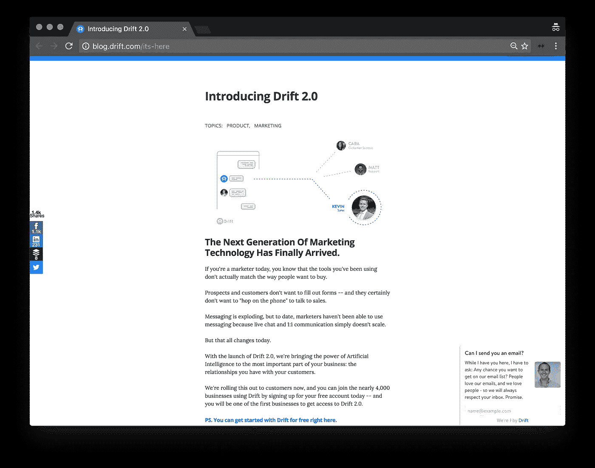
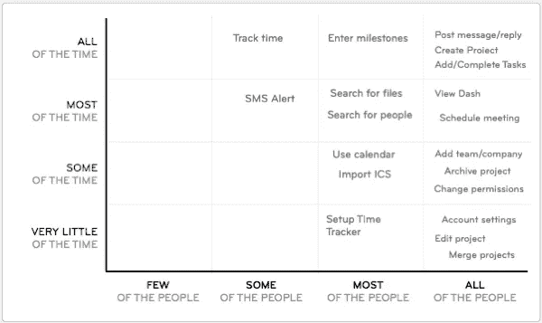
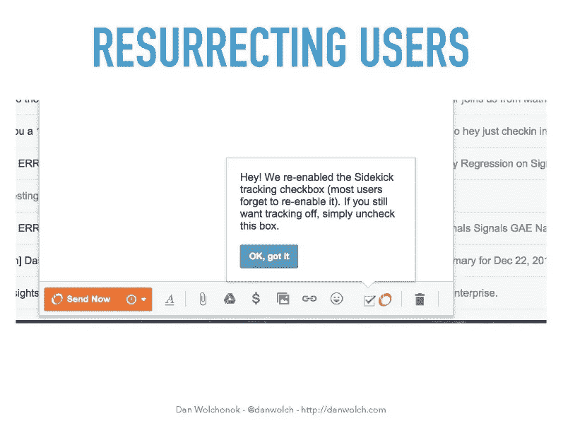

# 不要让糟糕的用户加入扼杀了你的创业

> 原文：<https://medium.com/swlh/dont-kill-your-startup-with-bad-user-onboarding-5a216051a39c>

好的入职培训就是要确保用户已经准备好快速完成他们想要做的事情——并且不妨碍他们。不幸的是，有些入职工具很容易给人发垃圾邮件。

像 Appcues 和 Intercom 这样的工具以一定的方式增强了 onboarding 流程和应用内消息传递。在他们出现之前，我们必须自己做所有的事情。尽管如此，在用户注册时给他们五个弹出通知和一封糟糕的欢迎邮件并不一定有助于他们使用你的产品。通常，这只会惹恼他们。

人们使用你的产品来完成他们生活中的一些事情——无论是组织他们的文档，做一个演示，还是招募有才能的人。你的加入应该帮助他们更快地完成他们想要完成的事情。

有了强大的欢迎邮件、产品更新和用户参与，就有可能以一种实际向用户展示你的产品如何让他们的生活变得更好的方式来实现用户入职。

首先，让我们深入探讨如何以一种有意义的方式接纳新用户，然后让我们谈谈如何与他们互动并随着时间的推移不断更新。

# 不要用一封糟糕的欢迎邮件搞砸了

我经常看到新公司在欢迎邮件上犯两个大错误。一方面，我看到的欢迎邮件太快了——仅仅是简短的“感谢注册”另一方面，我看到欢迎电子邮件太长，太多重叠的 CTA。

在这两种情况下，该公司都错过了在入职流程的早期吸引新用户的宝贵机会。

下面是一封欢迎邮件的例子，内容太多了:

当我读完这篇文章时，我对如何使用 jockey 的产品以及它如何帮助我收集客户反馈一无所知。我是应该查看他们的视频，还是邀请我的整个团队，或者试用他们的 API？我有太多选择了。

他们的第一个要求很明确。乐意帮助我做任何事情；我所要做的就是用反馈回复这封邮件。但是这个方向被其他十几个 CTA 埋没了。

你不想对一个全新的用户要求太多，但你应该问点什么。这是你们关系的开始。你的目标是让他们成功。从询问他们需要什么开始，不要问其他的。

这是一个来自细分市场的好例子:

的确，不是每个人都会回复这种类型的欢迎邮件。对于那些你可以通过电话联系到的用户，你将有机会确定是什么首先把他们带到你的产品上的，以及他们如何通过使用它获得成功。

当然，欢迎邮件只是顺利入职流程的一个方面。如果你认为入职不会随着客户的转变而结束，那么[你应该是](/welcome-aboard/user-onboarding-more-than-first-user-experience-fa360d4e7e34)，产品更新是另一个重要的组成部分。

# 作为入职培训的一部分，不要忽视产品更新

入职不会随着一封成功的欢迎邮件而结束，也不会随着转化或付费用户而结束。只要有新的东西让用户发现，Onboarding 就会继续——如果你在不断改进你的产品，这是个好消息。

作为入职流程的一部分，不要忽视产品更新。当你改进你的产品时，你需要让你的客户知道它的伟大之处——而不是向他们发送垃圾邮件。

一次重大的产品更新为用户创造了一次良好的入职体验。你有机会让他们更加深入地参与进来。不要用语无伦次的更新通知轰炸他们，从而错过机会。

让你的客户知道每一次更新背后都有一个原因——你让产品变得更好，因为它影响和改善了他们的体验。

通过协调跨渠道的大型发布活动来传达这一信息:

*   在你的博客上发布你正在做的事情的更新。
*   分享您的产品搜索更新，并在 SaaS 社区中为您的产品造势。
*   在社交媒体上分享。

传播功能和修复的消息，让用户蜂拥回到主要事件——你的产品。

让我们来看看随着漂移 2.0 的推出，漂移是如何做到这一点的:

# 推特

在推出 Drift 2.0 时，该公司创始人兼首席执行官大卫·坎塞(David Cancel)发布了一条简短的推文。他没有试图解释漂移所做的一切，而是简单地在他的信息中附上了一个简短的视频。

# 产品搜索

在 Drift 2.0 的[产品搜索页面](https://www.producthunt.com/posts/drift-2-0)，大卫·坎塞要求用户提出他们可能有的任何问题。

大卫在产品搜索上给客户留下了深刻的印象，因为他把自己放在了 Drift 客户服务的最前沿。他谈到了这些问题，并一一作了回答。通过这样做，他展示了漂移是如何围绕其客户，既有现有客户和潜在客户。

# 博客帖子

产品搜索、Twitter 和产品内消息有助于让新的受众了解你的更新。但是并不总是有足够的空间来提供背景——你为什么要更新你的产品？对用户有什么好处？

为此，你需要一篇博文。你自己的博客是一个空间，在这里你可以深入挖掘为什么和如何更新。展示为什么这项新功能对客户有意义。展示如何利用它来改善人们的生活。

如果你把用户入职看作是防止流失的一种方式，那你就错了。一封有效的欢迎邮件和一个适时的产品更新是让用户更深入地接触你的产品，并把他们变成拥护者的方法。当你对用户进行细分时，你会发现更多的参与机会。

# 不要让人从缝隙中溜走

当涉及到应用内的入职信息时，它们需要具体且有帮助——绝不是垃圾信息。你必须从观察实际的用户行为开始。

你可能听说过脸书的“10 天 7 个朋友”标准。早期，脸书发现达到这个里程碑的用户更有可能留下来。因此，脸书的成长团队在入职期间倾其所有帮助用户实现这一目标。

像脸书一样，你需要弄清楚人们在哪里真正锁定并使用你的产品，在哪里人们正在溜走。一旦你发现你应该关注哪些指标(你可以衡量的东西，比如“10 天 7 个朋友”)，你就可以调整你的入职流程，将用户推向正确的方向。

根据用户实际使用的功能对他们进行细分。利用来自您的[分析平台](http://amplitude.com/mobile-analytics)的参与度数据，无论是 KISSmetrics、Mixpanel 还是 Amplitude。

然后退一步:

你的分析可能会显示，当用户在你的生产力应用中发布消息时，他们更有可能长期停留。太好了，你已经发现发布消息是你产品的一个核心动作。

但是如果有一大群用户没有完成这个动作呢？

此时，您可能希望将应用内消息传递作为入职体验的一部分。针对需要查看您的消息的用户群。让他们看看他们错过了什么。

你也可以使用工具提示和消息来重新启动一个用户以前没有注意到的老功能。HubSpot 的电子邮件生产力工具 [Sidekick](https://www.hubspot.com/products/sales/email-tracking) 的团队发现，开放跟踪是一个令人难以置信的粘性功能，可以让人们继续使用该产品。

不幸的是，很多人在给朋友发邮件的时候会关闭这个功能，而忘记打开它。Sidekick 的开发团队做了一些非常简单的事情:他们重新打开了这个功能，并添加了一个小工具提示来解释原因。

Sidekick 团队知道该消息与他们要发送给的用户相关。该消息的收件人都曾使用过 Sidekick 产品，并知道它的好处。看到这个消息弹出来不太可能让他们困惑或分心，因为他们有理解它所需的所有上下文。

当你发现真正有粘性的特性时，你就知道你需要向用户传达什么信息才能让他们留下来。

# 提供服务是你的工作

入职是防止流失的最佳防线。你必须有策略地去做，抵制发送杂乱的欢迎邮件和一百万个应用程序内通知的冲动。

把入职看作是在更深层次上吸引用户的一系列机会。

使用你的入职流程向用户展示你的工作是为了让他们的生活更轻松。这就是软件即服务。为用户服务，在你考虑打断他们的体验之前，注意他们在你的产品中的位置，倾听他们的需求。确保入职不是一蹴而就的事情。下面是一些你可以做的事情，让用户从开始使用你的产品时就感觉和你的产品有联系，并且只要他们继续使用它:

*   保持欢迎邮件的个性化、简单和开放。这不是一句“感谢您注册。”它也不是“这里有你可能需要知道的一切。”这是你发展客户的第一个大好机会。拿去吧。
*   **优先考虑产品更新的价值。不要对你修复的每一个 bug 都发出推送提醒。这并没有告诉用户你的产品是如何改进的，以使他们的体验更好。在多个平台上协调重大产品更新，以吸引新用户，并提醒现有用户您正在不断改进。**
*   **对于粘性功能，谨慎使用应用内消息。**有意识地定位产品中的用户，专注于让人们与你保持联系的东西。在正确的时间提醒正确的人关于这个功能或那个更新，而不是向用户发送垃圾邮件。

入职[以注册](https://blog.kissmetrics.com/succeed-critical-point-saas-sales/)开始，但不以主动使用，甚至付费使用结束。如果你在发布更新或发送信息的方式上不具有战略性和个性化，即使是最成功的早期用户也会失败。如果你抓住每一个机会去了解你的用户，并提醒他们你的产品是多么有价值，他们会对你的产品为什么以及如何帮助他们有更深刻的认识。更好的是，他们会留下来。

**你应该注册我的免费邮件简讯，** [**产品习惯**](https://producthabits.com)——*我每周都会分享最好的产品开发和商业内容。*

## 这个故事发表在 [The Startup](https://medium.com/swlh) 上，这是 Medium 最大的企业家出版物，拥有 271，476+人。

## 在这里订阅接收[我们的头条新闻](http://growthsupply.com/the-startup-newsletter/)。

