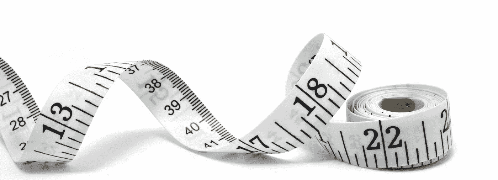

# 不要把钱留在桌子上

> 原文：<https://medium.com/swlh/dont-leave-money-on-the-table-cc122889af2>

What gets measured gets… well, invoiced.

大约十年前，我是一名自由网络开发者。或者——用我当时喜欢的定义来说——我通过经营一家小网络代理公司谋生。

不管贴什么标签，我做过网页开发、设计和一些战略咨询。我有一个产品:我自己的内容管理系统(CMS)，叫做*drumroll*，Sitereactor。