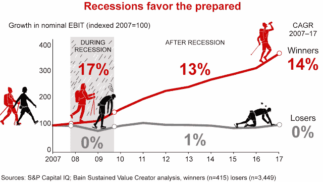

# 你应该为下一次低迷做些什么准备

> 原文：<https://medium.com/swlh/dont-let-anyone-burst-your-bubble-what-you-should-do-to-prepare-for-the-next-tech-bubble-burst-b41c0a470705>

随着纳斯达克在过去几个季度一再收于创纪录高位，这让我想起了 2000 年的互联网泡沫。这是科技泡沫破裂的信号吗？根据弗罗里达大学沃灵顿商学院教授杰伊·里特(Jay Ritter)汇编的[数据，去年上市的公司中，76%的公司当年每股都没有盈利…](https://site.warrington.ufl.edu/ritter/files/2018/01/IPOs2017Statistics_January17_2018.pdf)