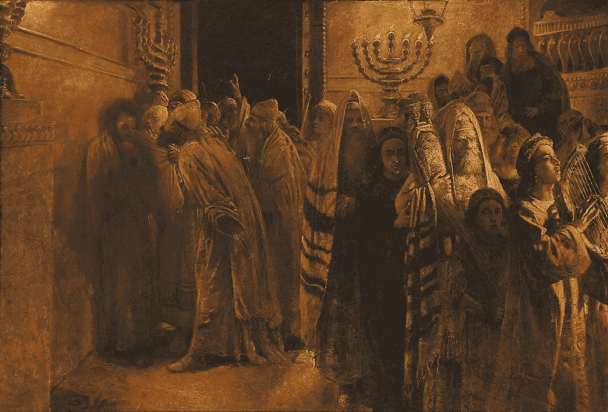

# 不要让群体思维毒害你的团队

> 原文：<https://medium.com/swlh/dont-let-groupthink-poison-your-team-d52b9f4dceb7>

## 古代希伯来人可以教给我们很多关于决策的知识

Nikolai Ge. “The Judgement of the Sanhedrin” 1892 (Public Domain)

> 《犹太法典》规定，必须推翻公会(犹太法庭)的一致裁决，被告必须无罪释放。
> 
> (伊弗雷姆·格拉特。佩斯国际…