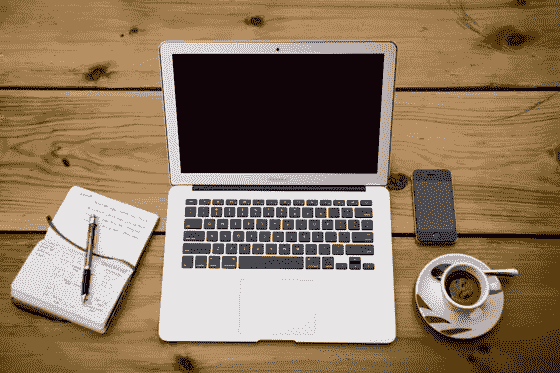

# 不要往下看

> 原文：<https://medium.com/swlh/dont-look-down-9863e69a03e5>

我们团队中有人问我，当创建一家公司变得困难时，是什么让我保持动力。我的秘密是:谁在乎我是否有动力？

我的心情就像天气，少了一种来自内心的力量，多了一股从四面八方向我袭来的外部狂风。它们可以在瞬间被扭曲，被任何东西扭曲:在超市站在一个特别悲伤的人后面；一种早已被遗忘的青少年时期的屈辱又重新浮现在我的意识中；阅读电影*花园之州的维基百科概要。*(我发誓，最后一个真的发生了。)

问我如何保持动力就像问一个台球如何保持滚动。我们可能有一个答案给你，但是如果我们认为我们在控制中，我们是在欺骗自己。不管我们现在感觉到多少动力，桌子的边缘正在向我们走来。

所以我努力练习不依赖某种心情去做某种工作的技巧。我们企业家和艺术家认为我们很特别，有我们的惯例和动力，我们需要一切都井井有条。那些以毫米级精度排列的笔记本电脑、Moleskine 和卡布奇诺的艺术图片是有毒的。当*他*没有灵感的时候，没有人会问砌砖工他是如何把下一块砖砌好的。

This image is killing you.

公司呢？我心血来潮创办了一家创业公司，根本不知道自己在注册什么，然后我眨了眨眼，想改变主意已经太晚了。人们认为当你经营自己的公司时，你就能成为自己的老板，但那是谎言。我们的顾客是我的老板。我们的投资者是我的老板。市场是我的老板。如果这是一份真正的工作，至少我可以辞职。但是我不能。任何人都是如何做任何事情的？我不知道，他们就是这么做的。唯一的出路是通过。

做一件事已经够难了，不需要同时担心你做这件事的感受。这就像郊狼把走鹃追下悬崖边缘——如果不往下看，它可以一直走下去。我也是。所以我就不往下看了。

