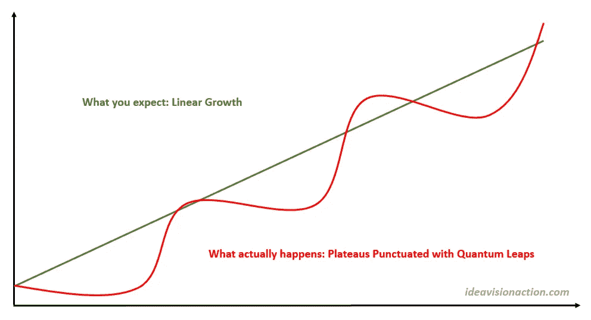

# 不要牺牲无法衡量的东西

> 原文：<https://medium.com/swlh/dont-sacrifice-what-can-t-be-measured-9b3e1c86b17d>

[Quangpraha/pixabay](https://pixabay.com/en/the-beach-scalloped-animal-3060085/)

六周前，我发表了一篇关于用成长指标来衡量我的博客和电子邮件通讯的成功的文章。从那以后，我痴迷于数字，并深入研究我的统计数据。

我发表了几篇关于[的帖子，以及我从统计数据中获得的经验](https://ideavisionaction.com/blogging/i-analyzed-seven-factors-that-affect-my-medium-stats-this-is-what-i-found/)。以下是一些亮点。

这些和其他许多帮助我接触到更多的观众，更好地表达自己，并得到更多的回应。这就是为什么我说“[数据是金子，如果你知道如何使用它](https://ideavisionaction.com/marketing/data-is-the-gold-if-you-know-how-to-use-it/)”

**使用数据的陷阱**

数据非常有用，但也可能非常分散注意力。如果我钻研[谷歌分析](https://analytics.google.com/) **，**我可以花几个月的时间在上面，而不会给我的博客增加任何价值。这是使用数据的一个明显的陷阱。

还有一个不太明显的陷阱。那就是**专注于数字，而忽略了无法衡量的东西**。这是一个微妙的陷阱。

别搞错了。我不贬低数字的重要性。在一天结束时，我们都有账单要付，账单是按数字支付的。但从长远来看，只关注数字可能会适得其反。

> 从长远来看，只关注数字可能会适得其反。

**我是如何被数字欺骗的**

在之前的一篇文章中，我认为我的“关于 T21”页面没有那么重要。只占我博客浏览量的 2%。

当我第二天写帖子的时候，我改变了主意。“关于”页面可能很重要。其 2%的页面浏览量可能来自最热情的读者。由于没有关于页面的最新信息，我可能会错过一个机会。

**不能测量的东西同样重要**

数字很重要，但无法衡量的东西同样重要。一方面我们有定量分析，另一方面有定性分析。

> 我们如何衡量一篇博文的诚实度？然而，诚实是博客长期成功的关键因素。

**短期与长期**

我认为这可以归结为短期和长期的对比。数字是优化短期结果的绝佳工具。

> **有时候，优化短期结果也有利于优化长期结果，但并不总是如此。**

如果短期目标和长期目标相互矛盾，我更喜欢长期目标。

> 大多数时候，长期来看价值更大。

正如我在我的帖子[中解释的那样，到目前为止，我还没有从我的博客中赚到一分钱。我用 Steemit 做了几周的实验，已经开始在这个平台上赚钱了。](https://ideavisionaction.com/entrepreneurship/quick-cash-or-long-term-value/)

如果我看一下数字，在 Steemit 工作似乎比在我的博客上工作要好。

几周后，为了专注于我的博客，我退出了 Steemit。Steemit 似乎不是一个可持续的商业模式。我的博客的终身潜力似乎比 Steemit 的潜力更大。

如果我短期内需要一些现金，我会继续在 Steemit 工作。我不知道。这就是为什么我跳过快钱。

> **从长远来看，快速变现的成本更高。**

**实现正确目标的正确工具**

为正确的目标使用正确的工具很重要。有些工具更适合优化定性目标。其他的更适合优化量化目标。

两周前，我发表了一篇关于评论媒体的帖子。在那篇文章中，我认为对媒体发表评论不会增加一个人的追随者数量。我收到了很多对那个帖子的回复。我的读者争论评论的好处。

我同意评论有很多好处。

*   它与其他读者和作家建立关系。
*   你和其他人一起开发新的想法。
*   你会收到问题的答案。
*   你想出新的话题来写。

所有这些好处都是质量上的好处。如果你用评论来获得质量上的好处，那么你的行为会和用评论来获得数量上的好处有所不同。

**评论质量效益**

如果你评论文章的质量优势，你会花时间去理解这篇文章，你会给讨论添加一些东西，包括问一个问题。

如果你评论它的量化好处，你会阅读一篇文章的几个段落，快速记下几个句子，并每天重复几十篇文章。

猜猜哪个会更有效？

**量化目标可能与现实不符**

> **“生活就是当你忙于制定其他计划时发生在你身上的事情。”**约翰·列侬

使用统计学的另一个陷阱是我们制定线性计划。我每周 10%的增长目标就是一个典型的例子。很多时候，生活并不是这样的。[在长时间的平台期后，增长会出现峰值](https://ideavisionaction.com/personal-development/this-is-how-your-expectations-sabotage-your-success/)(图 1)。

Fig. 1\. Linear Growth vs Quantum Leaps

正如我在[之前的一篇文章](https://ideavisionaction.com/blogging/i-multiplied-my-blog-post-views-by-10-with-this-method/)中所写的，我花了 55 篇博文才在[创业刊物](https://medium.com/swlh)上发表。迄今为止，其中 17 篇帖子的浏览量为 0，12 篇只有 1，7 篇只有 2。

**结论**

你可以衡量一些因素，但你不能衡量其他因素。如果你不能衡量一个因素，并不意味着它不重要。

诚实，关系，因果报应都是无法衡量的。然而，他们在成功中起着关键作用。

> **因缘不可测。**

考虑定量分析来优化你的业务，但不能以牺牲定性分析为代价。

***报名参加我的*** [***每周邮件简讯***](https://ideavisionaction.com/email-newsletter/) ***关于创业、创业、博客、营销、人生的课程。***

## 这篇文章发表在 [The Startup](https://medium.com/swlh) 上，这是 Medium 最大的创业刊物，有 319，931+人关注。

## 在这里订阅接收[我们的头条新闻](http://growthsupply.com/the-startup-newsletter/)。

