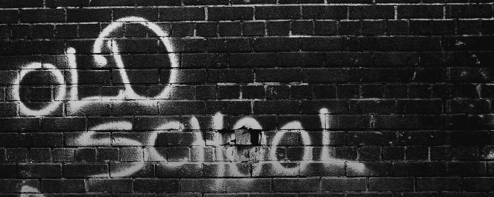

# 不要用 S.W.O.T .开始战略。

> 原文：<https://medium.com/swlh/dont-start-strategy-with-s-w-o-t-477c9758d7a9>

## 是时候让这个老派工具退休了吗？

Source: BigStock

在过去几年帮助组织开发新战略的过程中，我已经意识到一种普遍的模式，并对此感到相当震惊，我发现这种模式适得其反，甚至有害，尤其是在 VUCA 时代(波动性、不确定性、复杂性、模糊性)。它关系到战略工作的起点:几乎每次我开始与新客户合作时，我都会发现他们现有的制定新战略的方法是从聚合思维开始的。聚合思维与发散思维截然相反，我认为发散思维是真正的战略制定思维——即使用 [*为赢而战*的决策框架](/swlh/state-your-strategy-in-a-sentence-554cafb2c0)——的要求，至少在你考虑新的战略方向时是如此。

为了显示这种模式有多根深蒂固，请花一点时间用一个最先想到的答案来填补空白:

**战略 _______________**

**s . w . o . t . _ _ _ _ _ _ _ _ _ _ _ _ _ _ _ _ _ _**

当我在策略会议上做这个简短的练习时，我得到的答案总是分别是“计划”和“分析”。

困难在于:规划和分析是趋同的思维模式。但是如果定义一个新的战略是要考虑很多可能性，做出关键性的选择，那么这种思路是行不通的。也许这就是为什么这么多人纠结于策略。

事实上，这可能正是大多数人开始进行优势、劣势、机会、威胁分析的原因。S.W.O.T .可能是开始战略努力的最主要方式。听起来很酷，对吧？"我们已经完成了一个 S.W.O.T . "吼吼！这是一个伟大的缩写…听起来像 SWAT(特种武器和战术)。所以这是一个绝妙的营销手段。实际上没有人知道是谁想出了 S.W.O.T .，这有点奇怪…也许不管是谁想匿名都是有原因的。

尽管如此，还是让我们考虑一下 S.W.O.T。通常情况下，一些贫穷的年轻 MBA 被派去做一个 S.W.O.T .分析，然后这个分析会变成一个“战略计划”，包括谁、什么、何时、如何以及多少钱(美元)。

但是让我们来回顾和分析一下 S.W.O.T，从 S 开始，看强度。什么是实力？当我们说“力量”时，我们是在无声的语境中装载这个概念。上下文首先赋予这个词意义。在商业生活中，不存在放之四海而皆准的力量。我想不出任何一种优势在任何情况下都适用。一种情况下的优势在另一种情况下可能是劣势。

事实上，这正是马尔科姆·格拉德威尔在他 2013 年的书《大卫和歌利亚》中提出的观点。这一句是我从这本书里学到的主要内容:“强大的人并不总是像他们看起来的那样。”格拉德威尔谈到了语境的力量，讽刺的是，他在他的第一本也是最好的一本书《T2:引爆点》中向我们介绍了语境。大卫击败了歌利亚，因为他改变了战争的背景，在一个背景下看起来是弱点的东西在另一个背景下变成了优势。

优势只是在战略核心的两个关键战略选择的背景下的优势:具体的*在哪里玩*和*如何在那个空间赢得*。就此而言，弱点仅仅是在*在哪里玩/如何赢*选择的背景下的弱点。机遇和威胁也是如此。

我的观点是:如果你从一个 S.W.O.T .开始你的战略努力，没有一个明确的、明显不同的战略选择，实际上正在做那个 S.W.O.T .的可怜的笨蛋必须决定注意什么和忽略什么。原因是，不可能对所有事情都进行 S.W.O.T .分析。这是一个长达一个世纪的作业，大约有 100 万页，而我们年轻的 MBA 只有六周和几页来做他的 S.W.O.T。

你认为对 S.W.O.T.er 来说最容易做的事情是什么？是的:假设现有战略计划中隐含的选择。“根据我们目前的计划，我们的 S.W.O.T .看起来是这样的。”

这解释了为什么大多数“新”战略最终看起来很像“旧”战略，只是有了一些更新的事实和数据。

我曾经是神盾局的不可知论者，现在不再是了。我强烈反对把它作为策略的起点。我现在意识到，为什么我讨厌商学院教授战略的方式，但现在却喜欢我从罗杰·马丁那里学到的方式。

我现在认为，在锁定和加载策略之前，最好仔细考虑各种战略选择，询问这些选择的正确与否，并通过有效的实验探索这些假设。这是创造性和发散性的思维，与激发计划和分析的聚合性思维截然相反。

发散思维和收敛思维的区别，就是象棋和跳棋的区别。两个游戏都在同一个棋盘上进行，两个游戏都有相同数量的玩家。然而，对于跳棋，你真的没有太多要考虑的，所有的参与者都是一样的，移动基本上是单一的，线性的步骤，或者是同一步骤的简单倍数。国际象棋有更多种类的玩家，更多的可能性和选择要考虑，包括对一步棋的竞争性反应。这就是为什么当你看象棋大师下棋时(不确定你为什么会想这么做)，这个“动作”几乎是看不见的…他们在思考自己的选择以及对这些选择可能的反应。

如果你想要并且需要一个新的策略，不要从 S.W.O.T .开始，我会在接下来的几篇文章中向你展示一个更好的方法。

## 这个故事发表在 [The Startup](https://medium.com/swlh) 上，这是 Medium 最大的创业刊物，有 292，582+人关注。

## 订阅接收[我们的头条新闻](http://growthsupply.com/the-startup-newsletter/)。

