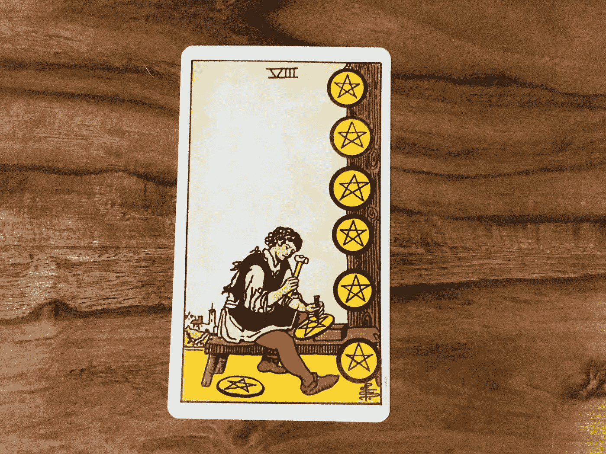
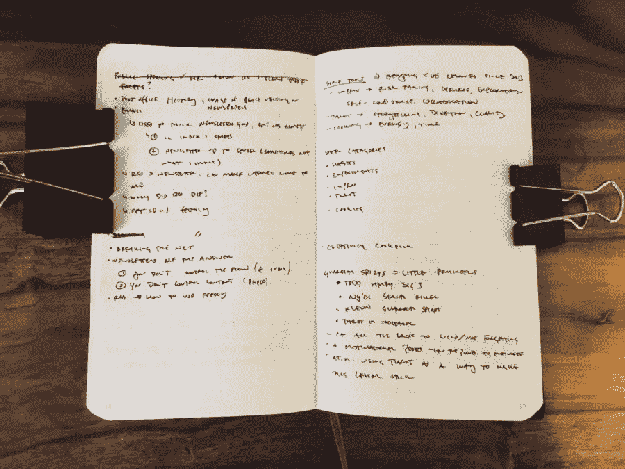

# 不要“想透”你的问题。通过它们来写。

> 原文：<https://medium.com/swlh/dont-think-through-your-problems-write-through-them-2e73c6c5f0af>

*The Eight of Coins is about taking some time to yourself to learn and master a new skill.*

我从来都不是一个坚持写日记或日志的人。蒂姆·菲利斯推荐[晨报](http://juliacameronlive.com/basic-tools/morning-pages/)。我的朋友杰森·祖克每天早上给[写 1000 字](https://jasondoesstuff.com/writing/)，但他经常会把这些字扔掉。奥斯汀·克莱恩(Austin Kleon)给[留了三本日常使用的笔记本](https://austinkleon.com/2017/02/23/my-notebooks/)。另一方面，我自己的写作总是为某个目标服务——客户工作、博客帖子、书籍草稿。

我的许多作品从未被公之于众，但我很少只是为了个人启迪而写作。我意识到这是一个缺点。为自己写作，知道没人会看到那些私人想法，会有回报的。

第四任美国总统詹姆斯·麦迪逊经常写作，不是为了出版，而是为了更好地理解他的主题:

> “每当他面临一个具有挑战性的政策问题时，他都会回到书本中，研究这个问题，试图对最伟大的权威人士所说的话进行改进，并将其整理成一篇私人论文。”

在 1787 年制宪会议之前，他花了几个月的时间研究宪法设计，并在纸上综合自己的想法。写作的行为——而不是简单地在他的头脑中思考事情——迫使他与自己的信念进行斗争，并加强自己的论点。最后，他是大会上准备最充分的代表，并利用他的专业知识为自己的政策立场进行游说(其中许多立场成为了最终批准的文件)。

一个更现代的例子，是散文家大卫·塞达里。他用自己的私人日记作为超过九本书的灵感来源:

> “在给定的三个月时间里，”他写道，“可能有 50 条值得注意，有 6 条我可能会考虑读出来。”

他一年大概写四本笔记本，没有任何期望，永远不知道什么想法或者偶然听到的对话会在以后派上用场。他相信这个过程，并经常通过详细的索引来回顾他的日记。

当我反思这些做法时，我想，“这些人哪来的时间？”谁会消失几个月去研究和撰写关于宪法历史的私人论文(现在已经不是 18 世纪 80 年代了)？Sedaris 是如何做到的，不仅写日记，而且有一个有用的组织计划？今天，在一致的时间表上发布、分享你的过程和工作的压力如此之大，以至于似乎不可能牺牲哪怕一个小时来写一些最终会在你的硬盘或笔记本上消失的东西。

但是为自己写作可以是一种自我照顾的形式。当我把我的问题写在纸上的时候，我发现我更有可能解决它。

正如作者[玛里琳·鲁宾逊](https://www.nytimes.com/2017/09/22/books/review/marilynne-robinson-on-finding-the-right-word.html)所写:

> 写作应该永远是探索性的。不应该有这样的假设:你事先就知道你想表达什么。当你进入语言之舞时，你会开始发现，有一些东西在你之前或之后，或者比你认为你想要表达的东西更绝对。当你工作的时候，其他种类的意义会出现，超出你的预期。

写下一个问题比思考一个问题更有力量。在纸上看到你自己的想法揭示了你自己的论点中的弱点，并引导你走向一个新的强大的解决方案的发现过程。这也可能导致一种魔法，你的潜意识和手指绕着你的意识运行，让伟大的想法凭空出现。

这就是为什么今年，我打算试着写一本[日志](https://austinkleon.com/2010/01/31/logbook/)。我会试着整理我的笔记本。我会试着留出更多的时间来写作，而不去期待。或许在自己身上多花一点力气，会更容易发现有趣的想法与你分享。

## 你的一个任务

*本周，我将推出一个名为“你的一项任务”的新功能在每篇时事通讯的结尾，我会给你一个行动项目，你应该在本周完成，以尝试一种新习惯，朝着你的创造性目标前进，并充分利用这篇文章。*

本周，**花 30 分钟写一些只属于你的东西**。你如何做并不重要(用手，在电脑上，刻在石碑上)，它有多长或关于什么也不重要。找点时间坐下来，把单词写在纸上(或电脑屏幕或石碑上)。你永远不知道你会发现什么。

如果你做了练习，拍下你的笔记本或电脑屏幕(或石碑)的照片，然后告诉我！

我的简讯是关于帮助忙碌的人通过可持续的创造力找到意义和满足感。 [**加入我们的**](http://immakingallthisup.com) 。

## 这篇文章发表在 [The Startup](https://medium.com/swlh) 上，这是 Medium 最大的创业刊物，有 282，454+人关注。

## 订阅接收[我们的头条新闻](http://growthsupply.com/the-startup-newsletter/)。

