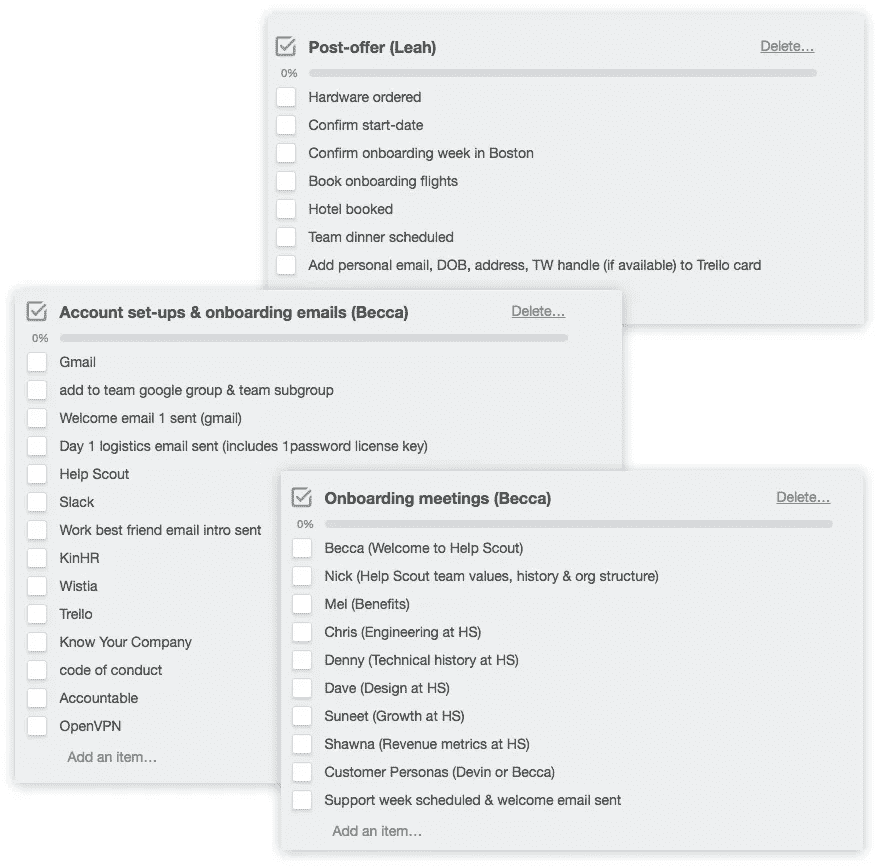
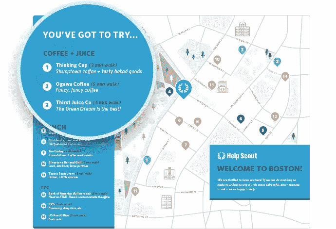

# 不要把新员工扔进狼群——和你雇佣员工一样小心

> 原文：<https://medium.com/swlh/dont-throw-new-hires-to-the-wolves-onboard-with-as-much-care-as-you-hire-8aac65bb7593>

> 当寻找下一个有天赋的队友的工作完成后，你手里就有了签好的聘书，留住他们的艰苦工作才刚刚开始。

创造美好的员工入职体验从一开始就是我们人力运营团队的首要任务，因为它影响到每一位新员工，我们不断改进我们的流程，以确保每个人从第一天起就为成功做好准备。

我们已经看到，我们在员工入职方面所做的努力在新员工的工作效率、员工保留率和创造良好的团队文化方面取得了令人难以置信的回报。

# 研究和准备

从第一手经验和定性研究开始。问问自己“我在公司的第一周是什么样的？”仔细想想哪些进展顺利，哪些需要调整。

接下来，收集数据。在新员工入职的头 90 天内，我会与他们进行几次交流，问一些类似这样的问题:“你对[帮助侦察](https://www.helpscout.net/)了解多少，现在你希望你知道自己的第一周？”回答这类问题并把员工体验放在首位，有助于我们做出有意义的改进。

# 如何打造出色的员工入职体验

## 1.向团队介绍新员工

队员们，来见见新人。我们要求新员工在第一天上班前向我们发送一份简短的简历，我们会在内部博客上与团队分享，这样人们就可以适当地欢迎他们。在他们的第一天，新成员填写一份五个问题的“破冰者”调查，分享更多关于他们自己的信息。这封信会发给整个公司，然后新人也可以看到其他人在第一天是如何回答同样的问题的。这有助于打破僵局，开始对话。

## 2.分享公司历史和愿景

每位新成员都会与我们的首席执行官 Nick Francis 会面，讨论 Help Scout 的历史、团队价值观和组织结构。这种会议是新员工最喜欢的，因为它使他们在我们的使命中扎根，并将他们的所作所为与更大的帮助童子军计划联系起来。

## 3.审查团队结构

我们安排新员工与六个团队的领导会面，了解每个人的工作。这让我们深入了解每个团队是如何朝着公司愿景努力的——这是防止团队孤岛的重要的第一步。额外的收获是，他们很快开始了解可以去找谁做什么。

## 4.安排随意的谈话

当我们让新员工在第一周进入波士顿办公室时，我们会特意带他们出去吃晚餐或集体午餐。和新同事一起吃饭很好，走出办公室鼓励你聊工作以外的事情。最有效的方法是，你尽全力让新成员参与进来，让他们成为表演的明星。

# 员工入职物流

对你和你的新员工来说，入职是一个激动人心(也是至关重要)的时刻，但它也伴随着一个扩展的待办事项列表。当我们每个月雇佣一个人时，Evernote 中的清单就是我们所需要的。一旦我们开始在一个月内接待多个新人，我们就开始寻找更好的系统。有很多工具，我建议试用几个(我们的团队使用 Trello)。

我们还使用 Trello 来管理入职福利和工资单。我们通过良好的电子邮件完善了我们的入职工具堆栈，为人们提供重要的物流信息以及一些一般的“预期”信息。

# 员工入职清单

## 文书工作

对于在多个国家/地区拥有员工的远程团队，定制此列表以适合您的员工居住的国家/地区:

*   ✔工资单+税务信息
*   ✔健康+牙科福利登记
*   ✔ W4 + I9 表单

## 第一周日程+信息

我们根据员工第一周是否在波士顿工作来定制电子邮件模板。这里有一个例子:

> **主题:**下周—入职信息
> 
> 劳伦，
> 
> 下周你能来办公室，我们非常高兴！这里是你需要知道的关于 Help Scout 员工入职的一切。
> 
> **你的第一天&如何找到办公室**
> 
> 当你星期一到达时(请在上午 9:30 左右来)，我会在那里帮你安顿下来。你和我将直接向你介绍在 Help Scout“走动”的一些基本原则:作为一个远程团队，我们如何相互了解，我们如何沟通，我们使用的工具等。这是如何找到办公室的细节。如有任何问题，请随时拨打 555–555–5555 联系我。
> 
> **你的新电脑**
> 
> 当你周一来上班时，你就可以设置好你的 Macbook Pro，并检查安全检查清单。当你打开你的电脑，你会想先设置 1pw，这样你就可以开始存储你所有的帮助侦察密码。如果你需要帮助，请告诉我！
> 
> **办公室文化**
> 
> 我们在办公室很随意，所以你可以随意穿你觉得舒服的衣服。我们很多人在办公室都戴耳机，所以如果这是你的风格，请随身携带一些。我们尽量在下午 1-1:30 左右一起吃午饭，如果你在那之前饿了，办公室里有小吃。
> 
> **与波士顿工作人员共进晚餐**
> 
> 我们想周一晚上带你出去吃饭！详情请查看 Leah 的日历邀请。
> 
> **收据**
> 
> 当你在这儿的时候，请保留食物和旅行的收据，以便我们能偿还你。我们财务团队的 Mel 会告诉你在那里做什么。
> 
> **会见团队**
> 
> 在第一周，您将与团队领导召开入职会议，并与我们财务团队的 Mel 会面，讨论薪资和福利。当然，您将与[直接下属姓名]相处很长时间。
> 
> **Help Scout 的客户支持**
> 
> 无论您在这里担任什么角色，客户支持对我们都很重要，因此从 3 月 6 日开始，您将会花一些时间与 Abigail 和支持团队一起学习我们的产品。我会给你发一封单独的电子邮件，提供更多相关信息。:)
> 
> 从现在到那时的任何问题，请让我知道！
> 
> 干杯，
> 
> 贝卡

入职电子邮件中应包含的最重要信息:

*   **去哪里:**地图和照片显示了我们的前门和从他们酒店步行即可到达的区域
*   **何时到达:**这样他们就知道有人会在那里让他们进去
*   会议日程:他们在这里的一周将会见哪些人
*   提醒:比如记录收据，这样他们就可以花掉所有的钱

你会花很多时间和每一个新朋友在一起，但是在一个地方完成整个“开始”过程会让你们两个都更容易。

# 让新队友感到受欢迎

让你的队友融入公司文化同样重要的是让他们从第一天开始就感觉舒服。这意味着让他们知道期待什么，并把他们介绍给人们。这里有一些我们认为有用的实践。

## 为第 1 天做好准备

当一名新员工走进我们的波士顿办公室时，我们为他们准备了一个座位，手边有 wi-fi 密码、一件 Help Scout T 恤和一张该地区的地图。这些事情看起来很简单，但是第一天热情的欢迎和实用的信息真的可以帮助缓解第一天的紧张。

我们还从 Campaign Monitor 获得了灵感，开始发送额外的细节，如建议的到达时间(上午 9:30)、我们通常穿什么去上班(匡威和牛仔裤)以及午餐将吃什么(下午 1:30 和我们一起吃饭！).消除第一天的焦虑让人们专注于了解团队和产品。

# 将他们与“工作中最好的朋友”配对

工作中的新人和学校里的新人没什么不同。第一天交个朋友不是很好吗？

对于每一个新队友，我们都会请已经在这里呆了一段时间的人成为他们的关键人物，并向他们展示诀窍。以下是我通过电子邮件发送给 Jordyn 和 Q 的介绍示例:

工作上的朋友很重要，虽然友谊会随着时间自然形成，但是稳定的感情不应该等待。以下是你指定的朋友可以做的几件事:

*   每隔几天通过电子邮件或聊天来查看事情的进展
*   分享一个团队静修的故事或在波士顿闲逛的感觉
*   分享“不成文的规则”，比如 Slack 中#个人话题频道和#非话题频道之间的细微差别
*   通过出现在进行视频聊天
*   告诉他们该向谁要什么(例如:尼克和贾斯汀处理关于时尚咖啡豆的问题)

在最初的几周有一个新的伙伴来咨询会更容易提出问题，提出问题会导致更少的困惑和更好的学习体验。

# 远程团队入职

入职远程团队成员与亲自入职的人并没有太大的不同——为他们提供成功所需的工具，并与他们的新团队成员进行充分的面对面交流。

面对面的会面是有效团队合作的基础，无论是远程还是其他方式。我们安排新人到我们波士顿的小总部呆几天，与他们面对面交流。我们管理旅行细节，概述去哪里和什么时候，并分享一些关于波士顿的信息，让他们在到达一个新的城市时感到舒适。

如果你没有总部，你可以考虑让新人飞到一个有很多员工的城市，这样他们就可以亲自与人见面，在咖啡店里一起远程工作，一起吃晚餐。如果你没有这种灵活性或结构，我的建议是，在安排大量视频面对面的机会时，要格外深思熟虑。

当你在头几个星期没有和很多人面对面交流时，新朋友对远程工作者来说尤其重要。有这么多要考虑的，现在不是让事情安静下来的时候。

没有尴尬和不确定，你会有友情、联系和热情的欢迎，这对于任何公司来说都是有益的做法。

# 欢迎来到公司

员工入职时做错的事情是递给某人一台电脑，并告诉他们坐在哪里。做得好的话，它会留下持久的第一印象，并成为让人才长期保持兴奋、快乐和投入的第一步。帮助某人成功需要思考和时间，但努力总是值得的。

*本帖原载于* [*帮侦察兵博客*](https://www.helpscout.net/blog/) *。*

## 这个故事发表在 [The Startup](https://medium.com/swlh) 上，这是 Medium 最大的企业家出版物，拥有 270，416+人。

## 在这里订阅接收[我们的头条新闻](http://growthsupply.com/the-startup-newsletter/)。

