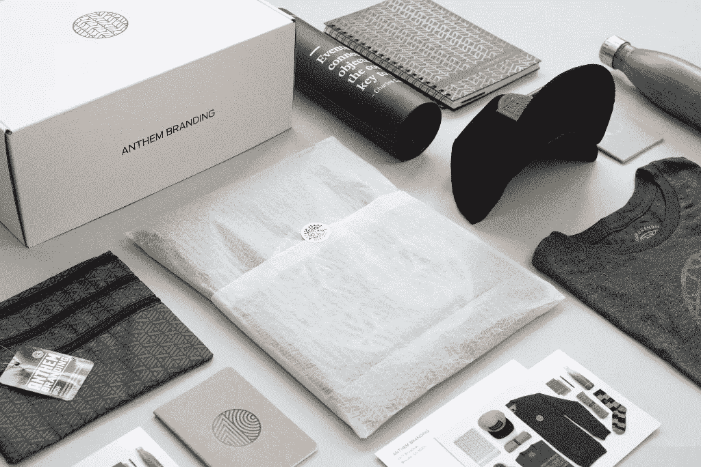
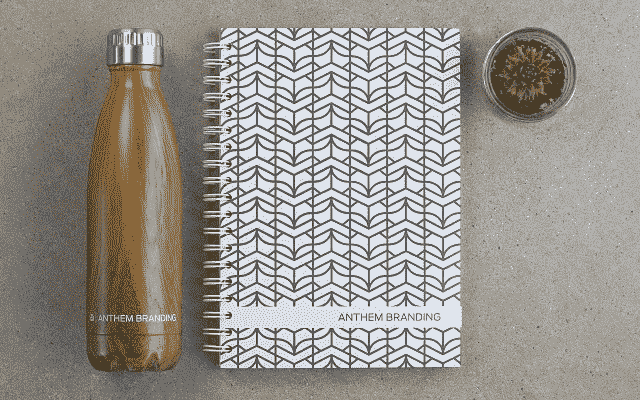
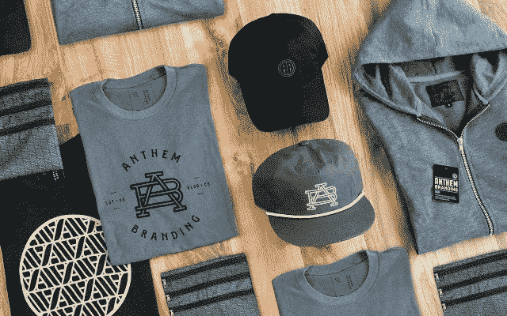
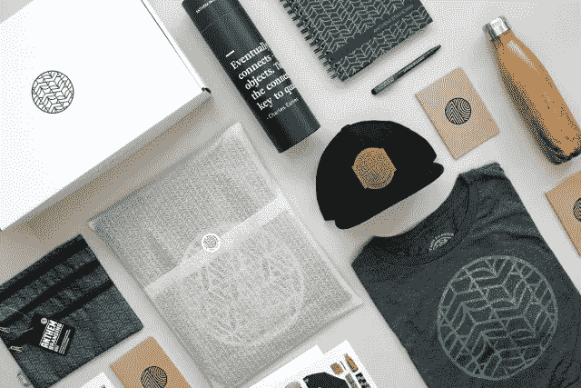
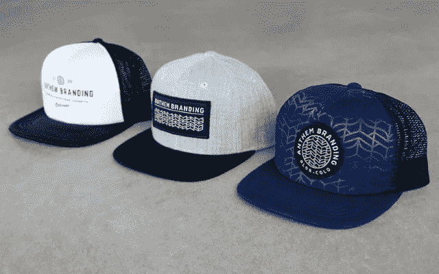

# 该做什么和不该做什么:如何制作伟大的品牌商品

> 原文：<https://medium.com/swlh/dos-don-ts-how-to-make-great-brand-merchandise-dcd3a921507e>

品牌商品一直是[赞助](http://blog.anthembranding.com/blog/sponsoring-a-tech-conference-follow-this-guide-to-rock-the-trade-show)和促销的重要组成部分。伟大的企业实施一种战略方法，确保他们的商品是他们整体营销战略的核心部分。最好的[品牌商品](http://info.anthembranding.com/branded-merchandise)有助于企业表达他们的品牌个性，在情感上与他们的目标市场联系起来，强化他们的信息并吸引他们的客户。

为了有效地利用商品的最大潜力，你需要考虑你的营销目标，建立质量标准，并决定如何衡量影响。这里有一些提示，以确保你有效地使用商品。

**做:使用可用性高的物品&感知价值**

最好的促销产品是功能性很强的生活类产品，比如[水瓶](http://info.anthembranding.com/private-label-drinkware-options)、[帽衫](http://blog.anthembranding.com/blog/5-premium-hoodies-with-added-touches-to-inspire-your-branded-apparel)、电源包、包包、日记本、[帽子](http://info.anthembranding.com/custom-headwear)。接受者从这件物品中得到的使用越多，你的品牌就越有可能保持在人们的脑海中。

投资于一系列不同的选项是一个好主意，这些选项共同讲述了一个关于你的品牌的有凝聚力的故事，而不会出现亏损。当你有各种各样的品牌生活方式商品时，你接触和多次接触你的品牌的可能性往往很高。为了实现更高的商品目标，你应该考虑将三个关键因素结合在一起:有创意和吸引人的设计，清晰的品牌个性，以及给你的受众带来价值的礼物。

**做:实施有效的战略**

从一开始，你就想以一种能传达同理心、可靠性、联系和品牌意识的方式来创造和使用你的商品。要做到这一点，清楚地了解谁是你的目标受众是非常重要的。定义他们的角色将有助于你[创造能引起他们共鸣的品牌商品](http://blog.anthembranding.com/blog/create-merchandise-with-impact-the-anthem-branding-design-process)。你可能想避免时尚或“新潮”的促销产品，因为它们往往会在一段时间后失去吸引力。

在某些情况下，如果一个知名品牌在你的目标消费者中很受欢迎，那么联合品牌是一个有效的方法。战略联盟可以带来强大的品牌认知度，并增加感知价值。

**Do:关注投资回报最大化**

从商业角度来看，这是创造[优质商品](http://info.anthembranding.com/branded-merchandise)的最关键的方面。重要的是，开始时要牢记最终目标。你想建立品牌价值，增加品牌认知度，促进销售，还是激发对话？这些目标如何融入您的信息中？你需要花费多少预算，你的销售模式是什么？很重要的一点是，你要能够为你要实现的不同目标设定衡量标准，以真正实现回报最大化。

**不要:限制你的主题**

这是一种微妙的平衡。一方面，你希望为你的商品建立有针对性的信息传递和分销计划，无论是季节性的、基于活动的还是诸如此类的，这将与特定的人口统计数据产生共鸣，如地区、年龄组或季节，以产生最大的影响。相反，具有交叉主题的品牌项目将允许持续使用，并接触到更广泛的人群。

满足这两种需求的一个很好的方法是[创造一个商品系列](http://info.anthembranding.com/custom-gear)，由一些提供尽可能广泛接受的主要服装和商品组成，另外在一个活动接一个活动的基础上换上更多独特的商品。例如，[定制帽衫](http://blog.anthembranding.com/blog/5-premium-hoodies-with-added-touches-to-inspire-your-branded-apparel)和水瓶可以跨越所有季节和年龄组的可见性，而品牌板短裤的相关性可以仅限于温暖季节的促销和温暖地区的人们。

**做:利用自动化订购**

自动订购确保您的商品只到达目标群体和感兴趣的团体。使用自动化平台非常重要，因为它能让你深入了解谁在订购、何时何地订购以及订购最多的商品。这些数据有助于您完善和调整策略，使市场需求与未来促销相匹配。最重要的是，自动订购可以让你最大限度地减少自己分拣和运送商品的时间和成本。

**不要:让某些因素限制你的能力**

当试图与新的或广泛的受众联系时，最好投资那些需要最小变化的项目，以便能够被最广泛的人群使用。例如，像袜子和帽子这样的物品是明智的选择，因为它们都是中性的，也消除了尺寸因素，允许任何尺寸、形状或形式的消费者使用。使用合身的 t 恤作为赠品可能会带来挑战，因为这需要手头有接收者的具体尺寸和风格。

**做:专注于质量**

大多数企业认为他们的[促销产品](http://info.anthembranding.com/unique-promotional-products)必须响亮，当着你的面才能产生最大的影响。对于收件人来说，这往往会变得过于乏味和乏味，以至于他们实际上不想使用。事实上，高质量和提供真正价值的产品给人留下最深刻的印象。

**不要:有侵犯性**

最好的商品是那种微妙的、诱人的和创造性的商品。一些公司将他们的[定制商品](http://info.anthembranding.com/custom-merchandise)专门提供给那些光顾他们的商店、参加活动、参与促销或通过他们的零售商的人。它应该是一个相当非侵入性的推广，才能产生持久的影响。微妙而有影响力的[商品广告](http://blog.anthembranding.com/blog/walking-billboards-the-advertising-approach-to-promotional-products)创造了一批优秀的忠实受众，并在那些已经购买了你的产品或服务的人中强化了你的品牌。创造一种独特或限量的元素是保持你的系列吸引力的一种强有力的方式。

**最终想法**

强大的品牌商品和真实的促销信息吸引了消费者、忠实客户和潜在买家，这是传统营销无法做到的。长期曝光往往会有力地加强你的产品与最终用户的相关性。你的商品不需要昂贵。它只需要深思熟虑，计划，创造力和对商品接受者的理解。如果做得好，这可能是最有效的广告策略，在销售方面带来高回报。

准备好[为你的企业创造伟大的品牌商品](http://info.anthembranding.com/branded-merchandise)了吗？[点击此处与品牌专家交谈](https://anthembranding.com/contact/)开始行动。让我们一起创造一些东西。

*原文来源:*[*http://blog . anthembranding . com/blog/how-to-make-great-brand-commodity*](http://blog.anthembranding.com/blog/how-to-make-great-brand-merchandise)

## 这篇文章发表在 [The Startup](https://medium.com/swlh) 上，这是 Medium 最大的创业刊物，有 272，171+人关注。

## 订阅接收[我们的头条新闻](http://growthsupply.com/the-startup-newsletter/)。

