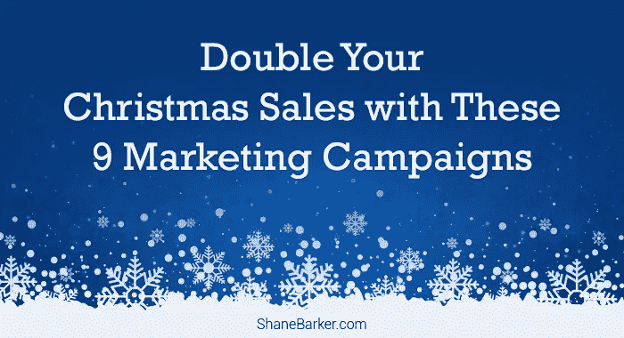

# 通过这 9 项营销活动，让您的圣诞销售额翻倍

> 原文：<https://medium.com/swlh/double-your-christmas-sales-with-these-9-marketing-campaigns-99009af0611d>

圣诞节是一个给予、友善，当然还有营销的季节。圣诞节营销活动已经变得非常流行和普遍。事实上，如果没有电视和社交媒体平台上的广告，这个假期就不完整。这主要是因为，多年来，品牌已经学会了利用这个节日来为自己谋利。

这是品牌投入时间和金钱设计最佳营销活动以促进销售的时候。虽然有无数的[圣诞营销活动](https://www.campaignlive.co.uk/article/christmas-2017-ads-best-so-far/1449421)可供你使用，但主要问题是哪一个最适合你？

精选的相关内容:

*   [最大化品牌影响力的 15 个标签活动](https://shanebarker.com/blog/hashtag-campaigns/)
*   [帮助你成功开展营销活动的 17 个基本 B2B 营销工具](https://shanebarker.com/blog/b2b-marketing-tools/)

再过几周就是圣诞节了，是时候准备好你的圣诞营销策略了。你还有时间设计简单而有效的圣诞营销策略，让你的销售额翻倍。

这里有九个表现最佳的圣诞营销活动，可以让你的销售额翻倍:

# 1.通过多网络赠品获得最大覆盖范围

社交媒体是促进圣诞营销活动销售的最有效方式之一。你可以从脸书开始，它是最受欢迎的社交媒体平台之一。脸书仍然以 21 亿活跃用户统治着社交媒体领域。

你也可以利用 YouTube 和 Instagram 等社交平台。截至 2018 年，YouTube 拥有 15 亿活跃用户，而 Instagram 拥有 8 亿活跃用户。这清楚地表明了这些社交平台所承载的潜力。

你所需要做的就是在你所有的社交媒体简介上运行一个简单的赠品。通过赠品，你还可以扩大你的品牌影响力，提高知名度。但是，要确保奖品与你的品牌相关，并且对你的潜在客户有用。这将增加你的潜在客户的参与机会。

此外，一定要用简单明了的语言提及赠品的规则。这将鼓励你的目标受众参与你的赠品。

橡树书店利用 Instagram 和脸书组织了一次赠品活动。他们让赠品非常简单，并要求他们的潜在客户分享他们最喜欢的圣诞故事。

精选的相关内容:

*   [优化电子邮件营销活动的 25 种最佳电子邮件营销工具](https://shanebarker.com/blog/best-email-marketing-tools/)

# 2.通过电子邮件营销产生销售线索

尽管社交媒体主宰着营销世界，但电子邮件营销仍然是最具成本效益的创造销售线索的方式之一。它还可以帮助你加强与你的潜在客户和客户的关系。

Campaign Monitor 甚至发现，在电子邮件营销上每投入 1 美元，就会产生 44 美元的回报[。但是，你如何利用电子邮件营销来促进圣诞节销售呢？](https://www.campaignmonitor.com/company/annual-report/2016/)

在圣诞节期间，确保你向你的目标受众发送两周一次或每周一次的电子邮件简讯。但是，要成功地产生销售线索，请确保您向潜在客户发送有用的相关信息。

这个节日是让你的潜在客户了解特价和折扣的好时机。你也可以推出一个新产品或服务，并向你的潜在客户更新。这种电子邮件有助于在节日期间提高对你的品牌及其产品的认识。

如果做得正确，这种类型的圣诞营销活动可以让你的圣诞销售额翻倍。然而，手动发送电子邮件可能非常费力。因此，要充分利用这种策略，最好是自动化你的电子邮件营销。

根据之前引用的 Campaign Monitor 报告，与非自动化电子邮件相比，自动化电子邮件产生的收入高出 320%。

这将帮助你在正确的时间瞄准正确的人。它还允许您向有相似兴趣的目标受众发送个性化的电子邮件。个性化可以确保电子邮件更贴近受众，从而提高点击率。

例如，如下图截图所示，设计师时尚珠宝系列 [Tuleste](https://tuleste.com/) 使用了一封互动的圣诞主题电子邮件。一开始，他们宣布了额外的折扣以及人们如何获得它。

# 3.通过推荐计划寻找新的追随者

推荐项目也是获得新追随者和潜在客户的有效策略。 [14.05%](https://www.referralsaasquatch.com/infographic-state-of-referral-marketing-statistics/) 访问推荐页面的客户中，有 14.05%采取了行动。所以，一定要设计一个吸引人的有趣的推荐计划，通过这个圣诞营销活动让你的销售额翻倍。

但是，确保在推荐客户第一次购买时给予奖励，并且奖励推荐人。

像 [W Concept](https://us.wconcept.com/) 这样的奢侈时尚品牌与相关的[社交媒体影响者](https://shanebarker.com/blog/identify-best-social-media-influencers-for-your-brand/)联手推出了他们的推荐计划。

在推荐计划中，品牌为推荐人和推荐人的下次购买提供 10%的折扣。正因为如此，在第一个月，该品牌成功创造了[2 万美元](https://rewardstream.com/blog/referral-program-examples/)的额外销售额。

精选的相关内容:

*   [23 个有用的内容推广平台和工具](https://shanebarker.com/blog/content-promotion-platforms-and-tools/)

推荐计划对客户、潜在客户，当然还有品牌来说是一个双赢的策略。你可以奖励你现有的忠实客户，同时获得新的潜在客户。圣诞节是实施这一策略以促进销售的最佳时机，因为消费者的购物量增加了。

推荐人 Saasquatch 还发现，68.67%的被推荐用户转化为客户。所以，你需要做的就是与忠诚的顾客分享特别的节日促销代码。并要求您的客户与他们的家人和朋友分享。确保清楚地提及您的客户和潜在客户在使用促销代码时将获得的好处。

像 [PlushBeds](https://www.plushbeds.com/) 这样的品牌在黑色星期五使用了这种策略。

4.使用优惠券和折扣代码增加圣诞节销售额

提高参与率、社交媒体关注者和/或优质线索都是至关重要的营销目标。然而，对任何品牌来说，最重要的目标都是让他们的圣诞销售额翻倍。还有什么比优惠券和折扣代码更有效呢？

如果做得正确，现有的和潜在的客户会喜欢折扣代码和优惠券。这个圣诞营销活动可以成功产生巨大的收入。事实上，拥有优惠券和折扣代码的顾客通常最终会比其他顾客多花费 [24%](https://www.blippr.com/wp-content/uploads/2018/07/Blippr-How-Coupon-Codes-Are-Influencing-Online-Purchase-Decisions.pdf) 。

为了鼓励更多的销售，您还可以为您的客户提供免费送货服务。当潜在客户注册或注册你的时事通讯时，提供优惠券。如何使用优惠券没有统一的规则。

[Brandless](https://brandless.com/) 是一家美国电子商务公司，销售个人护理和美容产品以及家居用品。当有新顾客注册时，他们会提供折扣券。

精选的相关内容:

*   [定制在线促销所需的 25 个 Instagram 营销工具](https://shanebarker.com/blog/instagram-marketing-tools/)

# 5.定制你的圣诞礼物包装

为了让你的圣诞销售额翻倍，你还可以[定制圣诞礼物的包装](/@anthembranding_boulder/the-importance-of-packaging-branding-in-marketing-1dfdb8a57440)。这会给你的品牌带来更多的节日气氛，让你的顾客兴奋不已。你需要将此视为一个让你的潜在客户和客户惊叹的机会。

不要认为包装只是包裹产品的包装材料。为了击败竞争对手，您可以定制包装，并确保它是您的客户的一种体验。一定要让你的顾客知道你关心他们。然而，设计和包装仍然应该类似于你的品牌的审美和风格。

你可以看看 Packhelp 的高品质定制包装，并得到一个适合圣诞节的包装。您可以简单地将您的品牌标志添加到现有的设计中，以形成您自己的定制包装。如果做得正确，这个圣诞营销活动可以促进你的销售。

6.让你的圣诞营销充满激情

圣诞节是与你所有最亲近的人一起庆祝的节日。这是一个向你所爱的人表达情感和爱的时刻。这就是为什么你的圣诞营销活动应该吸引你的目标受众的情绪。当你实施这一策略时，你将能够在情感层面上与你的客户建立联系。

但是你具体怎么做呢？

通过引人注目的故事突出你的产品或服务的优点。试着用一种你的观众会觉得有共鸣的方式来定位它们。不要依赖书面的产品描述，试着用一段丰富多彩、引人入胜的视频来娱乐你的观众。你也可以分享一些圣诞节期间的幕后花絮。

像 [Allegro](https://allegro.pl/) 这样的品牌制作了一个感人的圣诞视频来宣传和谈论他们的产品。

快速提示—您也可以选择将您网站上的“关于我们”页面重命名为“我们的故事”后者比前一个更能产生个人和情感上的影响。

精选的相关内容:

*   [23 个有用的内容推广平台和工具](https://shanebarker.com/blog/content-promotion-platforms-and-tools/)

*图片来源——YouTube*

# 7.使用圣诞节 PPC 单词

对于品牌来说，节日是一个竞争非常激烈的时期。因此，要从竞争对手中脱颖而出，你需要将你的广告词活动改为与圣诞节相关的季节性关键词。

例如，像“工艺品商店”或“工艺品供应”这样的关键词全年都很流行。但在圣诞节期间，像“DIY 圣诞装饰品”或“购买圣诞装饰品”这样的关键词使用得更多。

这只是表明在正确的时间使用正确的关键词会导致成功的 PPC 活动。所以，要想在这个圣诞季节让你的销售额翻倍，你需要改变你的 PPC 圣诞营销活动的关键词。

# 8.设计一个有吸引力的圣诞登陆页面

仅仅为圣诞节创造广告和优惠是不够的。你还应该设计一个圣诞登陆页面来吸引潜在客户的注意，并把他们转化为客户。

访问您的网站后，您的潜在客户和客户首先会看到登录页面。所以，你需要让它更吸引人，更有趣，更有互动性。您还可以在登录页面上添加视频。在登陆页面添加视频可以提高转化率 [86%](https://www.eyeviewdigital.com/documents/eyeview_brochure.pdf) 。

登陆页面应该定制一个季节性的圣诞信息。这将有助于你与潜在客户建立联系。这也会激发潜在客户的兴趣，从而促使他们继续购买。

精选的相关内容:

*   [优化社交促销的 21 种最佳脸书营销工具](https://shanebarker.com/blog/best-facebook-marketing-tools/)

正如引言中提到的，圣诞节是一个礼物和祝福的季节。因此，你可能不一定要提供折扣来吸引潜在客户的注意力。但是，一定要设计一个醒目的季节性[登陆页面](https://shanebarker.com/blog/landing-page-best-practices-boosting-conversions/)。

不要忘记谈论你的产品或服务给你的客户带来的好处。这将有助于你说服潜在客户，你确切地知道他们在寻找什么。这个圣诞营销活动不仅会增加你的销售额，还会提高你的品牌知名度。

[Next](https://www.next.co.uk/) ，英国跨国服装、鞋类、家居产品品牌。为了他们的圣诞营销活动，他们为自己的网站设计了一个吸引人的登录页面。登录页面顶部闪烁的小星星为整个页面增添了特殊的圣诞气氛。

9.提供圣诞礼物建议

在圣诞节期间，你需要向你的潜在客户突出你最好的产品或服务。你需要让你的潜在客户知道你最畅销的产品或服务。这会让他们知道该买什么样的圣诞礼物。

你还可以突出客户评价，以获得潜在客户的信任，并促进品牌销售。确保在你的产品页面和网站的特殊部分添加客户评价。

这个圣诞节，向你的潜在客户展示你的品牌的产品或服务是送给他们所爱的人的完美圣诞礼物。

英国的连锁药店[博姿](https://www.boots.com/webapp/wcs/stores/servlet/TopCategoriesDisplay?catalogId=28501&langId=-1&storeId=11352&webrewrite=Y&geoOpts=Y&geoCode=GB)很好地利用了这次圣诞营销活动。他们在网站主页上突出了他们最畅销的产品。这是吸引潜在客户和回头客注意力的一种非常有吸引力和有趣的方式。

*图像来源—开机*

精选的相关内容:

*   [创业公司使用内容营销的 8 种最有效方式](https://shanebarker.com/blog/content-marketing-for-startups/)
*   [25 个顶级电子商务模板，轻松打造强大的在线商店](https://shanebarker.com/blog/top-ecommerce-templates/)

# 最后的想法

对于品牌和消费者来说，圣诞节是一年中最好的时光。人们期待在圣诞节期间与家人和朋友共度更多美好时光。他们想慷慨地赠送礼物和庆祝节日。当然，品牌希望利用这个节日来提高销售额，并通过实施有效的圣诞营销活动来盈利。

离圣诞节只有几个星期了，但是寻找一些有效的圣诞营销活动的想法永远不会太晚。上面的建议可以帮助你设计一个有效的活动。

你知道任何其他成功的圣诞营销活动的有效技巧吗？如果是这样，请在评论中分享它们。

***最初发表于*******。****

***关于作者***

*[谢恩·巴克](https://shanebarker.com)是[内容解决方案](https://contentsolutions.io/)和 [Gifographics](http://gifographics.co/) 的创始人兼首席执行官。你可以在[推特](https://twitter.com/shane_barker)、[脸书](https://www.facebook.com/ShaneBarkerConsultant/)、 [LinkedIn](https://www.linkedin.com/in/shanebarker/) 、 [Instagram](https://www.instagram.com/shanebarker/) 上和他联系。*

**

## *这篇文章发表在 [The Startup](https://medium.com/swlh) 上，这是 Medium 最大的创业刊物，拥有+396，714 名读者。*

## *在这里订阅接收[我们的头条新闻](http://growthsupply.com/the-startup-newsletter/)。*

**