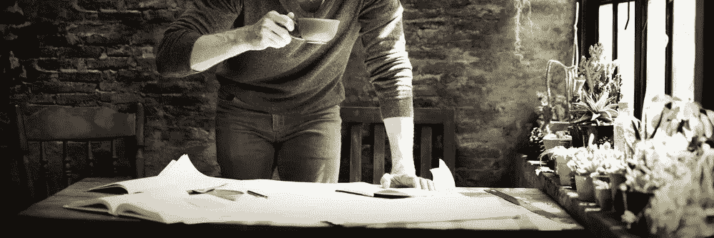

# 企业家的缺点

> 原文：<https://medium.com/swlh/downsides-to-being-an-entrepreneur-44791dd34e1e>

> 成功企业家做大多数人不愿意做的事情。他们愿意像其他人一样生活，像其他人一样生活。

如今，“企业家”这个头衔已经成为新的“流行事物”曾经有一段时间，作为一名企业家，在某种意义上，是宣布你是一个弃儿。你想做自己的事。你有了一个想法，想看看它是否可行。不久前，这种心态还没有被广泛接受。

如今对“企业家”的定义通常是以下描述:

*   改革者
*   创造性的
*   领导者
*   冒险者
*   “做自己的老板”
*   “在任何地方工作”
*   “过你梦想的生活”
*   等等。

它描绘了一幅非常迷人的画面，一个 25 岁到 30 岁左右的男人或女人，带着笔记本电脑和一杯玛格丽塔酒，懒洋洋地躺在沙滩上，回复几封电子邮件，然后用一天的剩余时间刷新他们不断增长的银行账户。

这与事实相去甚远。

任何一个真正的企业家可能会用上面的一些来描述高潮或某些经历，但绝不会是整个旅程。整个旅程看起来像这样会更好地描述:

*   使耗尽的
*   寂寞的
*   牺牲的
*   自力更生
*   贫穷的；贫困的
*   紧张的
*   责任
*   无尽的义务和承诺
*   误解
*   挑衅的
*   等等。

如果你想成为一名企业家，并希望被视为一名勇敢的、准备好应对世界的创意者，那你就走错路了。创业是卑微的。这意味着冒着失去一切的危险。意思是先承担起支付别人的责任，再支付自己。这意味着每天醒来准备为你的想法而战，也意味着每晚睡觉时知道你是相信它会成功的人之一(如果不是唯一的话)。这意味着不管你有多累或多失败都要工作——因为你的想法就是你的全部。你没有每两周一次的保底工资。你没有一个安全网以防事情不顺利。企业家精神，真正的企业家精神，是信念向未知领域的飞跃——没有安全着陆的承诺或保证。

不要希望它更容易；希望你能更好

感谢阅读！:)如果你喜欢，请点击下面的心形按钮。对我来说意义重大，也有助于其他人了解这个故事。

**在**上打招呼

[**Quora**](https://www.quora.com/profile/Ron-Gibori-1)**|**[**insta gram**](https://www.instagram.com/rgibori/)**|**[**LinkedIn**](https://www.linkedin.com/in/rongibori/)**|**[**Twitter**](https://twitter.com/rongibori)**|**[**Inc 杂志**](https://www.inc.com/author/ron-gibori) **|** [**网站**](http://www.idea-booth.com)

如果你喜欢这个故事，请点击👏按钮并分享，帮助其他人找到它！欢迎在下方留言评论。

## 这个故事发表在 [The Startup](https://medium.com/swlh) 上，这是 Medium 最大的创业刊物，拥有 290，182+人关注。

## 在这里订阅接收[我们的头条新闻](http://growthsupply.com/the-startup-newsletter/)。

