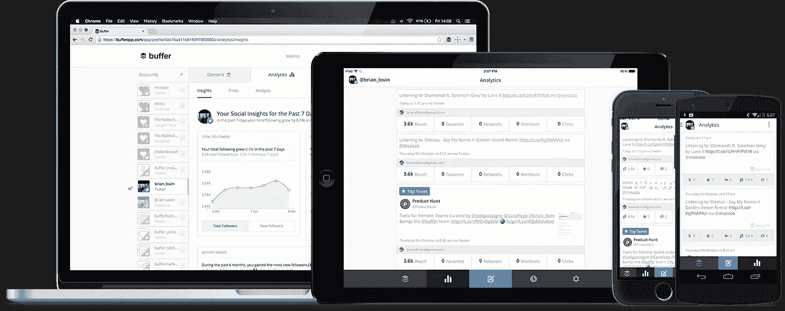

# 借助 Buffer 在社交媒体上提高流量、增加参与度并节省时间

> 原文：<https://medium.com/swlh/drive-traffic-increase-engagement-and-save-time-on-social-media-with-buffer-13bf22d6e781>

*最初发表于*[*【siftery.com】*](https://siftery.com/stories/drive-traffic-increase-engagement-and-save-time-on-social-media-with-buffer)*。*

[**Buffer**](https://buffer.com) 是一款直观、简化的社交媒体管理工具，深受品牌、企业、机构和个人的信赖，有助于推动社交媒体上有意义的参与和结果。

Buffer 于 2010 年 10 月由联合创始人[**Joel Gascoigne**](https://medium.com/u/cc7e684f6a25?source=post_page-----13bf22d6e781--------------------------------)在英国伯明翰开始开发。一旦他有了这个想法，他就创建了一个登陆页面，看看是否有足够多的人对这个产品感兴趣，从而使它成为一个有利可图的项目。在达到注册的临界质量后，Gascoigne 在 7 周的时间内构建并设计了应用软件的第一个版本。

2010 年 11 月 30 日，Buffer 初始版本上线。它包含有限的功能，只允许访问 Twitter。在 launch Buffer 获得第一个付费用户四天后。几周后，用户数量达到 100，然后在接下来的 9 个月内，用户数量增加到 100，000。现在已有超过 400 万人注册使用其发布、分析和协作工具套件，所有这些工具都是经过精心挑选和高度提炼的，目的是帮助社交媒体营销人员和团队更高效、更有效地工作。

[**凯文威廉大卫**](https://medium.com/u/8ea7bd91b1a4?source=post_page-----13bf22d6e781--------------------------------) 采访了 [**凯旺李**](https://medium.com/u/5187e5fad31d?source=post_page-----13bf22d6e781--------------------------------) 营销总监 [**缓冲**](https://medium.com/u/245d5483fb27?source=post_page-----13bf22d6e781--------------------------------) 了解更多。

## 你能告诉我们你正在做什么吗？什么是缓冲？

[**Buffer**](https://siftery.com/buffer) 帮助品牌、企业和营销人员充分利用他们在社交媒体上的存在。我们有一套直观的发布和分析工具，通过安排您的内容和轻松迭代最有效的内容，帮助您节省社交媒体营销的时间。

我一开始是 Buffer 的个人用户，负责管理我的个人品牌，我很喜欢它。从那以后，我用它来运行 Buffer 的社交媒体，我很高兴能与一群获得巨大价值的客户聊天。

## 你为什么要建这个？你想解决什么问题？

我们希望帮助人们在社交媒体上协同工作，保持一致的社交媒体存在，并轻松分析哪些工作有效(这样你就可以做更多有效的工作)。:)

## 谁是你的主要竞争对手& Buffer 与市场上已有的产品有何不同？你正在构建的东西有什么独特之处&为什么你认为公司应该使用 Buffer？

我们在社交媒体管理领域有很多优秀的同行——像[**Hootsuite**](https://siftery.com/hootsuite)[**Sprout Social**](https://siftery.com/sprout-social)和 [**Meet Edgar**](https://siftery.com/edgar) 这样的工具。有趣的是，我们的主要竞争对手之一是电子表格。人们喜欢在 Excel 和 [**Google Drive**](https://siftery.com/google-drive) 中规划他们的社交媒体！

我们认为我们做得很好的是 Buffer 使用起来简单直观。我们专注于提供最好的发布和协作工具，而不是致力于成为一体化解决方案。

此外，我们重视客户支持以及以人为本的营销和业务拓展方式。[我们是一家建立在一系列我们都渴望的价值观之上的公司](https://open.buffer.com/buffer-values/)，我们希望这些价值观能够在我们与客户和社区的所有互动中得到体现。

## 谁使用缓冲？您能告诉我们一些关于使用 Buffer 的不同客户群的信息吗？您的客户在他们的公司中担任什么样的角色？

使用 Buffer 的人通常是社交媒体营销人员，要么单独为公司工作，要么与社交媒体团队或大型营销团队合作。

我们也有一批使用 Buffer 的个人品牌和个人用户，他们从 Buffer 如何帮助他们保持一致的社交媒体存在中获得了很多价值。

## 您的客户如何使用 Buffer？你能分享一些不同的使用案例吗？

*   有些人将其作为内容监管流程的一部分。他们浏览互联网，阅读故事，当他们发现一个好故事分享时，他们可以通过缓冲浏览器扩展添加到他们的社交媒体队列中。然后，帖子会根据他们设置的自定义时间表自动分享到他们的社交资料中。

*   有些人用它来提前几周计划活动，安排具体日期和时间的内容，这样他们就能确定它会在那时发布(不管他们是否在)。
*   有些人用它来提前填充内容日历，这样他们就可以设置当天或一周的内容。在 Twitter 这样的网络上，你可能每天分享 10 次，或者每周分享 50 次，如果能一次性批量分享你的社交策略，会非常有用。

## Buffer 有没有你没有想到或预料到的独特用例？

有人用缓冲器当闹钟。他们会安排一条有点尴尬的推文在早上发布，因此给他们动力在它发布之前醒来，这样他们就可以删除它。

## 有什么早期的“成长秘诀”或策略促成了你现在的成功吗？

我们最大的增长渠道是内容营销。我们的联合创始人 [**利奥·维德里奇**](https://medium.com/u/55888232bfe9?source=post_page-----13bf22d6e781--------------------------------) 有一个史诗般的嘉宾发布策略，将 Buffer 的名字放在一些真正关键的受众面前。然后，他又推出了一个非常出色的博客，我们从此开始专注于社交媒体营销技巧和策略。该博客每月有近 150 万访客。

## 你加入的最有趣的整合是什么？有什么对你特别有影响的吗？

我觉得我们拥有的一些最强大的集成是与服务 [**IFTTT**](https://siftery.com/ifttt) 和 [**Zapier**](https://siftery.com/zapier) 的集成，在那里你可以通过将 Buffer 连接到其他应用程序来扩展它的功能。

我们在这里有一整页的集成，包括一些个人最喜欢的，比如口袋、饲料、T21。

## 你运营公司所依赖的顶级产品是什么&你如何使用它们？

这些是我们日常使用的一些营销产品:

[**收纳盒纸**](https://siftery.com/dropbox-paper) :我们用它来进行项目协作、做笔记和头脑风暴。能够与行内注释共享并一起异步编辑文档真是太棒了。

**:我们的博客在 WordPress 上运行，我们每天都在那里。我们喜欢灵活地编辑博客，所以我们认为可以通过插件添加功能，而不必自己编写解决方案。**

**[**Trello**](https://siftery.com/trello) :我们以多种方式使用 Trello，包括作为我们编辑内容日历的工具。每个内容日历都使用 Trello 日历功能，因此我们可以每天查看内容。**

**[**Buffer**](https://siftery.com/buffer) :我们使用 Buffer 来规划我们在脸书、 [**Twitter**](https://siftery.com/company/twitter) 、 [**Instagram**](https://siftery.com/company/instagram) 、 [**Pinterest**](https://siftery.com/company/pinterest) 、 [**LinkedIn**](https://siftery.com/company/linkedin) 和 [**Google+**](https://siftery.com/company/google) 上的所有社交媒体内容。这为我们节省了大量时间，因为我们能够一次性批量处理我们的社交媒体营销，让我们有时间在一周内通过其他渠道完成工作。**

**[**Canva**](https://siftery.com/canva) :这是我们制作图像的必备工具。我们为博客帖子、社交媒体帖子、视频创建图像——基本上，任何时候我们需要图像，都会求助于 Canva。(紧随其后的是 [**Pablo**](https://pablo.buffer.com/) ，我们在 Buffer 中构建的图像创建工具。它非常适合快速图片和报价。)**

> **你使用缓冲剂并推荐它们吗？你可以在这里做[https://siftery.com/buffer?recommend](https://siftery.com/buffer?recommend)。**