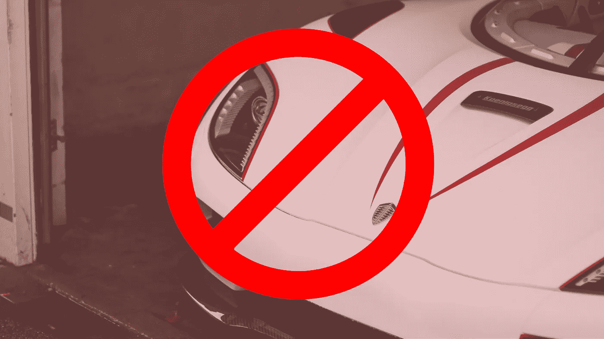

# 无人驾驶汽车可能不是你希望的答案

> 原文：<https://medium.com/swlh/driverless-cars-are-probably-not-the-answer-youre-hoping-for-cdfbb3011017>

“人类驾驶汽车的能力如此之差，以至于计算机不一定要那么好才能好得多。”**~马克·安德森，**安德森·霍洛维茨公司的联合创始人。

网络先驱马克·安德森在他支持自动驾驶汽车的[立场中提出了一个很好的观点。自动驾驶汽车，技术上称为自主汽车，在短短几年内已经从疯狂的幻想变为可能的现实，成为](https://www.businessinsider.com/marc-andreessen-robots-will-replace-human-drivers-2011-7?IR=T)[的必然](/@andrewng/self-driving-cars-are-here-aea1752b1ad0)。关于能够自动驾驶的汽车的存在的复杂性现在甚至不在辩论中，话题的热点已经转移到它们将对我们的生活产生多大的影响。

虽然谷歌自 2009 年以来就一直在追逐这种可能性，后来以 [Waymo](https://www.bloomberg.com/news/articles/2018-11-13/waymo-to-start-first-driverless-car-service-next-month) 的名字发展成为自己的东西，但自那以来，它已经吸引了像[特斯拉和 Ube](https://www.businessinsider.in/Self-driving-cars-could-be-deadly-but-they-arent-going-to-affect-Teslas-and-Ubers-business-as-much-as-everyone-thinks/articleshow/63444111.cms) r 这样的大型节目的注意。两者都对这项事业表现出热情，并引起了其他科技巨头的注意。

这是一场蓄势待发的革命。无人驾驶汽车很快就会无处不在。他们能提供的只有积极的东西，不仅对最终消费者，而且对环境和我们城市的糟糕状况。所有叫嚣着要分一杯羹的大公司都明确指出，它们将成为未来的“热门”产品。

但是自动驾驶汽车真的能拯救我们的城市吗？今天城市面临的问题不仅仅是因为由人驾驶的汽车。因此，在其他一切保持不变的情况下，改变等式中的特定变量，并不是目前所说的神奇解决方案。如果有的话，只会让事情变得更糟。

# **绿色的一边**

谈到自动驾驶汽车，有很多积极的方面！大多数需要在人工智能等技术领域做大量的工作才能重见天日，但说它们不可能是不明智的。Waymo 最近[获得了在加利福尼亚州](https://qz.com/1444810/california-is-letting-waymo-test-self-driving-cars-without-humans/)试驾的许可。优步[宣布](https://www.forbes.com/sites/davidsilver/2018/11/03/uber-will-resume-self-driving-car-testing-in-pennsylvania/)它也希望继续试驾。因此，它肯定会发生，并克服一路上的挫折。

无人驾驶汽车不仅仅是电动汽车。自治一词(这个名称是如何确定的是它自己的故事)意味着自我管理。它们不仅仅依靠电力而不是燃料运行，它们在很少或没有人类输入的情况下自行运行。所以你所要做的就是坐下来放松，[正如约翰·克拉夫茨克所说](https://www.cnbc.com/2017/11/07/waymo-to-take-on-uber-and-lyft-with-its-fleet-of-self-driving-minivans.html)，汽车会自动带你去目的地。

这对人们个人的影响是显而易见的。总的来说，通勤到工作地点或在城市中通勤是件麻烦事。没有人愿意把早上的时间浪费在挤在公交车和地铁里，或者被困在交通堵塞中诅咒这个系统。有了自动驾驶汽车，你可以在开车上班的时候，把一天中那些宝贵的时间夺回来！

当你的车为你开车时，你可以在手机上看书或玩游戏。此外，以紧凑形式行驶的汽车也为其他车辆和行人提供了更多的空间。他们也会自己停车。意思是禁止在马路上或不道德的地方停车。意味着更多的空间。

尽管人们谈论最多的电动车创新前景一直是让一个没有交通事故的世界成为现实。全电脑人工智能司机不会犯人类司机犯的错误。人类容易鲁莽驾驶，并在情绪激动时做出情绪化的决定。结果相当令人震惊——根据世卫组织的数据，道路死亡人数已经上升到每年 130 万左右。无人驾驶汽车肯定会拯救成千上万的生命。

# **不太环保的一面**

无人驾驶汽车似乎是继轮子之后的下一个伟大发明。它们似乎是当今城市生活方式所面临的一系列问题的解决方案。但是，从实用性的角度来看，所有伟大的承诺似乎都站不住脚。从长远来看，自动驾驶汽车最大的好处也将是它最大的坏处。那就是:太空。

的确，汽车在电脑控制的道路上行驶会节省空间。但是这能持续多久呢？如果你熟悉唐斯-汤姆森悖论，你就会知道这种特殊的“解决方案”是多么不稳定。随着道路变得越来越好，越来越宽，越来越多的人会走上道路。只要道路在一段时间后达到相同的拥堵水平，减少的通勤时间就不会持续。

更多的汽车也需要更多的空间来停放。一辆汽车在 [95%的寿命里](http://fortune.com/2016/03/13/cars-parked-95-percent-of-time/)只是毫无生气地坐着。这需要空间。有足够多的汽车接送人们上下班将导致汽车里程的浪费和时间的闲置。同样，需要空间。停车问题对城市生活是一个巨大的威胁，拥有更多的汽车似乎不是一个合适的解决方案。

当几乎每个人都能拥有一辆汽车时，让汽车变得负担得起的概念就失去了魅力。电动汽车将成为类似于奥拉和优步这样的出租汽车。他们不消耗昂贵的石油，现在甚至不需要司机的费用，这使得他们对于普通大众来说太便宜了。电动汽车完全有可能遭遇与出租汽车相同的命运。

毕竟是一个概念。大量的空骑、里程和时间损害了租车服务，因为人们被迫沿着他们的同车乘客的旅程进行他们宁愿步行的短途旅行。如果他们不分享，这可能会导致更大的问题。

到目前为止，无人驾驶电动汽车注定会对公共交通造成最大、最阴险的伤害。旧公共汽车和火车下的汽车的可用性和可负担性会吸引人们远离它们。但是，公共交通并不需要替换，甚至也不需要替代。正是这种通勤方式将城市联系在一起，以可承受的价格在众多的旅行中运送最多的人。

如果每个乘坐火车和公共汽车的人都决定乘坐电动车，那么交通拥堵一定会达到新的高度。如果地铁列车的一节车厢载有 50 人，那就相当于路上有 50 辆车。30，如果人们真的分享。这仍然比实际需要多出了 30-50 辆汽车。

所以所有这些都让我们回到了原点。你甚至可以说它让我们远远低于它！

# **故事的寓意**

无人驾驶汽车是朝着创造前所未有的城市迈出的雄心勃勃的一步。把汽车的舒适带给那些由于年龄限制而买不起也没有车的人的意图是值得努力的。他们提供的丰厚福利也是如此。

但它们并非万无一失。他们有自己的局限性，需要解决。在经历了无数阻碍之后，他们还没有全力上路，这一事实证明了这一切有多么艰难。将如此高水平的技术结合在一辆汽车中需要时间来完善。

最重要的是，我们需要将无人驾驶汽车视为城市交通拥堵的一种受欢迎的替代方式，而不是任何手段的替代品。事实上，我们应该集中精力减少对汽车的依赖，并推广其他方式。这样，人们可以有大量的选择。

当人们可以自由选择他们想要的出行方式时，城市就会繁荣。有些人喜欢步行，有些人喜欢乘公共汽车。谁知道呢，几年后，无人驾驶汽车可能会成为人们追求的幸福解决方案之一。

## 这篇文章发表在 [The Startup](https://medium.com/swlh) 上，这是 Medium 最大的创业刊物，有+391，714 人关注。

## 订阅接收[我们的头条新闻](http://growthsupply.com/the-startup-newsletter/)。

