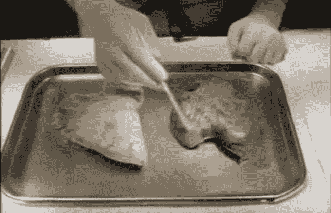

# 驾驶将成为新的吸烟方式

> 原文：<https://medium.com/swlh/driving-will-be-the-new-smoking-72e8f1d2ff75>

## 自动驾驶汽车和即将到来的反对“传统”驾驶的公共健康运动

Pam Laffin, left, in an anti-smoking ad from the 1990s. Right, a member of the California Highway Patrol inspects an accident scene.

20 世纪 90 年代十几岁的美国人可能会记得帕姆·拉芬的故事，即使他们不记得她的名字。在那十年中，记录她的故事的商业广告和长达一小时的 MTV 特别节目一起在电视上广泛播放。她 10 岁开始吸烟，很快就患上了从支气管炎到肺气肿等多种与吸烟有关的疾病。该广告活动由马萨诸塞州公共卫生部制作，采用了强有力的图像，包括帕姆正在接受侵入性治疗，以及在检查台上解剖她染有焦油和受损的病变肺。可悲的是，她在 2000 年去世，等待第二次肺移植。

不远的将来，有一天，全国各地的高中健康课程可能会放映一场类似的运动，重点不是吸烟，而是驾驶。尽管我们仍然对生产线和道路上的自动驾驶汽车感到害羞(保留一些原型)，但人类(或我将称之为“传统”)驾驶带来的风险与其自主继承人相比将越来越明显。

美国吸烟人数的上升和下降对预测针对传统驾驶的公共健康反应具有指导意义。20 世纪 40 年代末，流行病学研究中出现的证据表明，吸烟与一系列疾病有关，从呼吸急促到致命的癌症。受到富有的游说机构的正面挑战(可疑的*烟草协会*就是这样一个例子)，这些事实在美国花了几十年才成为共识，公共政策甚至花了更长的时间才达成共识。那个孤陋寡闻的时代的轶事如今令人震惊；歌手纳塔·金·科尔每天都吸烟，他相信香烟能让他标志性的声音保持“温暖”他 45 岁时死于肺癌。波士顿红袜队的传奇人物泰德·威廉姆斯花了几十年时间为儿童癌症医院筹款，[代言了](https://books.google.com/books?id=B0R6SzX0JM0C&printsec=frontcover&dq=the+kid+ted+williams&hl=en&sa=X&ved=0ahUKEwjZgaD907nMAhXs74MKHbETC5UQ6AEIHTAA#v=onepage&q=chesterfield&f=false)切斯特菲尔德香烟。海报宣称“抽骆驼烟的医生比抽其他任何一种烟的都多！”充其量看起来是虚构的。

Above, a comparison of Pam Laffin’s diseased lung, next to a non-smoker’s lung from the 1990s advertising campaign.

在 Pam 运动、公共禁烟和烟草税的帮助下，吸烟率在 20 世纪后几十年显著下降。1965 年，42%的美国成年人吸烟，而 2014 年只有 17%。尽管仍然很高，但与许多其他国家相比，这一下降是一个公共健康奇迹，例如中国，三分之二的成年男性仍然吸烟。

所以它会伴随着驾驶；如果自动驾驶汽车甚至比传统驾驶安全 50%(最初的[测试](http://www.google.com/selfdrivingcar/reports/)表明这一估计是保守的)，那么选择放弃这一技术将会给一个人的安全带来巨大风险，这将成为专利。这就是与吸烟的类比最有趣的地方:对他人的风险。我们知道，受损驾驶将其他人和个人一样置于危险之中(如果你愿意，可以称之为驾驶的“二手烟”)，这意味着放弃现有的自动驾驶汽车不仅对司机来说是鲁莽的，对整个人口来说也是如此。对于那些不得不拿走年迈亲戚钥匙的人来说，其他人的安全可能还历历在目。这里，简单地说，所有的因素都促使我们对长期以来认为不可避免的事情做出公共卫生反应(行为、风险、更安全的选择)。

> **32，675——2014 年美国机动车死亡总数。**
> 
> [来源:](http://www-fars.nhtsa.dot.gov/Main/index.aspx)美国国家公路交通安全管理局。

如果这种计算成立，那么反对传统驾驶的社会压力将从社区到州议会，再到国会大厅。反对酒后驾车的母亲( [MADD](http://www.madd.org/?referrer=https://www.google.com/) )很容易变成“反对传统驾驶的母亲”在更衣室偷偷吸烟的青少年可能会通过申请他们的学习许可证来发现更大的越轨行为。催化剂可能只是一个具有前瞻性思维的国家，采取了冒险，是的，禁止传统的道路驾驶。甚至不考虑接下来的抗议(另一篇文章的透视)，如果该州可以显示机动车死亡人数大幅下降，多种形式的政治支持将随之而来。马萨诸塞州、纽约州和加利福尼亚州的大胆禁烟措施不断向其他州施加压力，促使它们效仿。

所有这些预测中隐含的更难的问题是时机。行业估计无人驾驶汽车在美国道路上普及需要 [10](http://www.businessinsider.com/report-10-million-self-driving-cars-will-be-on-the-road-by-2020-2015-5-6) 到 [20](http://www.mckinsey.com/industries/automotive-and-assembly/our-insights/ten-ways-autonomous-driving-could-redefine-the-automotive-world) 年的时间。一旦他们成功了，他们应该用不了十年就能获得很大的市场份额，甚至更少的社会压力来反对传统驾驶。鉴于驾驶已经是一种令人难以置信的管制行为，各州的官僚机构已经到位，以遏制它，支持更安全的选择。对于驾车传统主义者来说，不要担心，你的爱好可能仍然被允许在非自动车道上行驶，或者在某些州。但正如我们所知，这种规范无疑正在走向灭亡，公共卫生官员有一个成功的剧本可以复制。