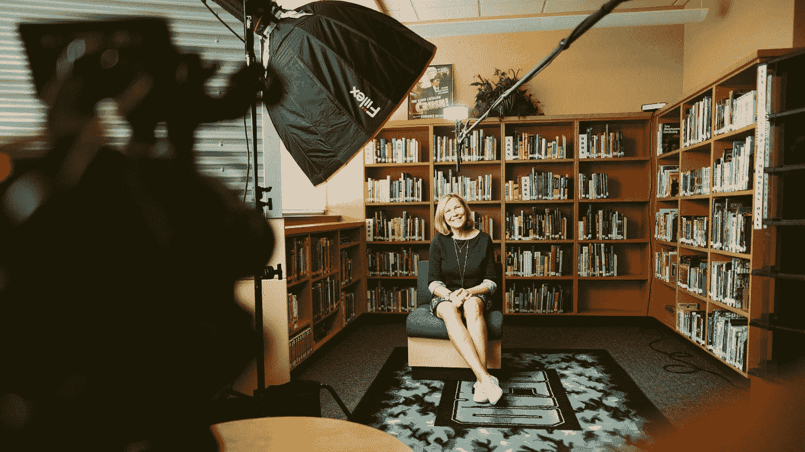

# 咄，你还能说什么？

> 原文：<https://medium.com/swlh/duh-what-else-are-you-supposed-to-say-60a9cff2381>

Photo by [Sam McGhee](https://unsplash.com/photos/4siwRamtFAk?utm_source=unsplash&utm_medium=referral&utm_content=creditCopyText) on [Unsplash](https://unsplash.com/search/photos/interview?utm_source=unsplash&utm_medium=referral&utm_content=creditCopyText)

前几天读了一篇采访，我看到 NBA 正在寻求扩大他们在亚洲的努力。当我深入调查时，我注意到标题来自一个非常简单的问题——*‘NBA 会在亚洲发展吗？’* —答案显然是“是”，因为他为什么要说“不是”？他还能说什么不属于“是”范畴的话呢？

太多时候，当涉及到面试和问卷调查时，人们会变得懒惰，问一些显而易见的问题。你会做 X 吗？你能做 Y 吗？不可避免的是，不管请求是什么，人们都会说“是”(说“不”是愚蠢的)。那么是面试官的错，还是受访者的错呢？

# 你应该在面试中问些什么？

面试是一项非常艰巨的任务——无论你是从雇主的角度还是从媒体的角度——你都需要花时间设计合适的问题，这样你才能从答案中获得价值。

简单的问题，如*‘你会做搜索引擎优化吗？’*是一个愚蠢的问题，因为你将得到的答案当然是*‘是’*。然而，询问“*你将如何为我们公司进行 SEO？”完全不同，这个答案会让你对候选人如何看待问题和制定解决方案有所了解。(如果候选人对前一个问题说*“不”*或者不能用一些智慧回答这个问题，那么他们显然不是这个角色的好候选人——顺便提一下，不知道在面试中问什么是[雇用数字营销人员如此困难的原因](https://www.fuandg.com/blog/2018/4/29/finding-our-own-niche))。*

作为媒体，采访者的角色对于好的内容至关重要。优秀的面试官不会问同样的典型问题，因为没有必要大量生产与众不同的文章(否则，作为消费者，你还不如在谷歌上搜索类似的文章)。重要的是要问一些探究有趣领域的问题，受访者不要只是机械地回忆答案(我们都见过这些)。播客越来越受欢迎是有原因的，因为这种格式允许采访者深入某个主题，并提出大多数媒体忽略的问题(很多时候因为时间窗口只有 5-10 分钟。社交媒体是脱颖而出的好方法，但是要做好它，你需要有创造力，并且[尝试一些不同的东西](https://www.linkedin.com/feed/update/urn:li:activity:6402734838557872129/)。).

虽然看起来提出突出的问题需要做很多工作，但不一定非要这样。[肖恩·埃文斯](https://www.youtube.com/playlist?list=PLAzrgbu8gEMIIK3r4Se1dOZWSZzUSadfZ)是一位出色的采访者，他的许多问题对每位客人都是一样的。他的突出之处在于他所做的研究和他的每个问题/部分的深思熟虑。对于[蒂姆·费里斯](https://tim.blog/podcast/)也是如此。

# 任何一个随机的局外人都能预测到答案吗？

如果有人能预测到一个问题的答案会是什么，那这个问题太基础了，需要改变。如果受访者甚至不需要停下来思考他们的答案，你可能问错了问题。

都在准备中。当考虑问题时，当然你可以从基础开始，但是花几分钟弄清楚你想学什么，并相应地改变问题。否则你只是在浪费每个人的时间。

## 这篇文章发表在 [The Startup](https://medium.com/swlh) 上，这是 Medium 最大的创业刊物，有 326，962+人关注。

## 在这里订阅接收[我们的头条新闻](http://growthsupply.com/the-startup-newsletter/)。

