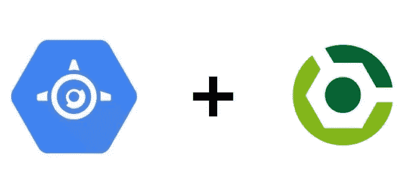
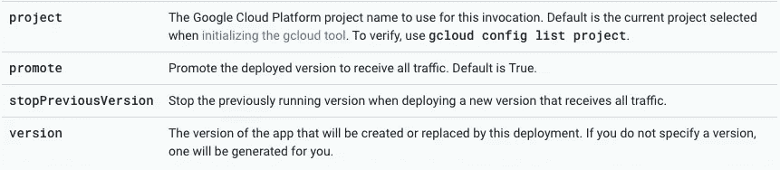
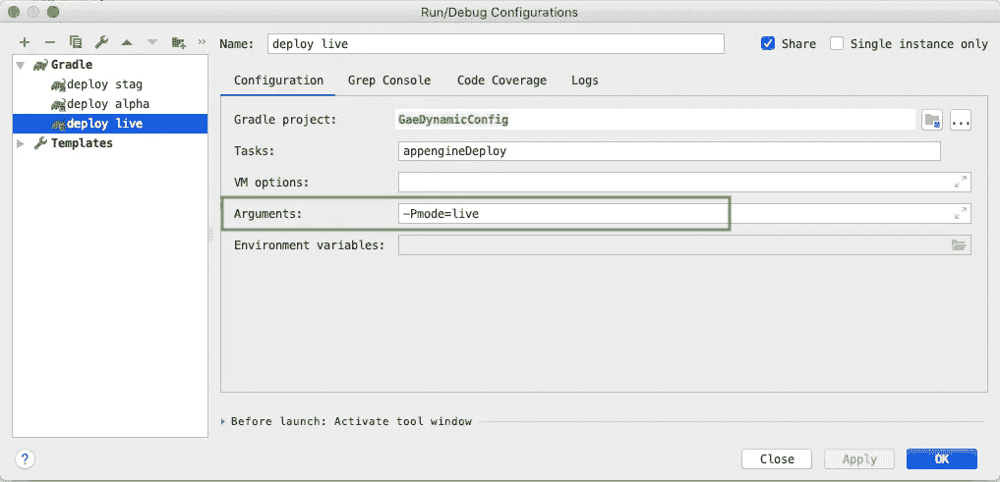

# 使用 Gradle 的动态 AppEngine 配置第 1 部分

> 原文：<https://medium.com/swlh/dynamic-appengine-configurations-using-gradle-part-1-e3959a39f31b>

当使用 AppEngine 应用程序时，我们经常需要使用[配置文件](https://cloud.google.com/appengine/docs/standard/java/configuration-files)，如 [appengine-web.xml](https://cloud.google.com/appengine/docs/standard/java/config/appref) 、 [cron.xml](https://cloud.google.com/appengine/docs/standard/java/config/cronref) 、 [dispatch.xml](https://cloud.google.com/appengine/docs/standard/java/reference/dispatch-xml) 等。此外，我们还需要应对多种环境，如试运行、alpha 和生产环境。

问题是我们需要为每种环境配置不同的配置，例如，

*   在 ***cron.xml*** 中，我们需要不同的配置来根据环境调度作业。例如:计划作业在分段中每两小时运行一次，在生产中每 15 分钟运行一次。
*   在 ***dispatch.xml*** 中，我们需要根据投产、生产等情况配置不同的路由规则。

同样，我们可能有几个理由让每个环境有不同的配置。在这一系列文章中，我们将探讨如何使用 Gradle 为每个环境设置这些配置。让我们开始吧。

**注意:**如果你想了解更多关于如何使用 Gradle 设置 AppEngine 的信息，请查看我的另一篇文章[使用 AppEngine 和 Gradle 的多模块项目](/@rameshlingappa/multi-module-projects-with-google-appengine-and-intellij-b3b2bc271bb1)

# 动态部署配置

在本文中，我们将介绍如何使用动态部署配置来执行 appengine 部署

当您通过 Gradle[**appengine deploy**](https://cloud.google.com/appengine/docs/flexible/java/gradle-reference#appenginedeploy)**任务执行 app engine 部署( *gcloud app deploy* )时，我们需要每个环境的以下信息:**

****

**appengineDeploy task properties**

**我们将在 [Gradle 项目属性](https://docs.gradle.org/current/userguide/command_line_interface.html#environment_options)的帮助下实现这一目标**

> **`***-P***`、`***--project-prop***` 设置根项目的项目属性，例如`*-Pmyprop=myvalue*`**

**因此，我们将为不同的环境部署传递一个名为 **mode** 的属性，其值如下。**

> **`***-Pmode=staging***`代表**集结**部署
> 代表**阿尔法**部署
> 代表**直播**部署**

**基于模式值，我们可以为部署属性设置不同的值，如下所示:**

**deploy config based on mode property**

**这就是我们正在做的，**

*   **在 **gaeVersions** 属性中，我们为每个目标环境设置了不同的版本号，这些值可以在我们需要部署到新版本时更新**
*   **在 **getDeployConfig()** 方法中，基于**模式**值，我们正在设置不同的项目 ID、版本和升级选项。默认情况下，模式为*分段*。**

**我们可以从 appengine 部署配置部分调用该方法，如下所示:**

**appenigneDeploy task config using mode**

**如您所见，所有部署配置都是使用从 **getDeployConfig()** 方法返回的配置字典设置的。**

**最后，我们现在可以用一个简单的 Gradle 命令部署到多个环境中，**

**用于暂存:`gradle appengineDeploy -Pmode=staging`**

**对于阿尔法:`gradle appengineDeploy -Pmode=alpha`**

**用于生产:`gradle appengineDeploy -Pmode=live`**

**如果您使用 IntelliJ，您也可以像下面这样设置运行配置，**

****

**deploy Run Configuration for each environment**

**如需完整示例，请查看 GitHub 中的演示应用程序，[单击此处](https://github.com/ramesh-dev/gae-dynamic-config-demo)**

## **结论**

**感谢您的阅读，希望这有所帮助。在接下来的文章中，我们将探讨如何基于环境创建动态配置文件。**

*****敬请期待，快乐编码……*****

****

## **这篇文章发表在 [The Startup](https://medium.com/swlh) 上，这是 Medium 最大的创业刊物，拥有+388，268 名读者。**

## **在这里订阅接收[我们的头条新闻](http://growthsupply.com/the-startup-newsletter/)。**

****