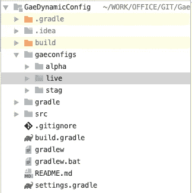
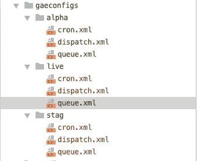
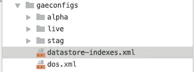

# 使用 Gradle 的动态 AppEngine 配置第 2 部分

> 原文：<https://medium.com/swlh/dynamic-appengine-configurations-using-gradle-part-2-49a30eb87672>


Appengine + Gradle Power

在之前的故事[使用 gradle 的动态 AppEngine 配置第 1 部分](/swlh/dynamic-appengine-configurations-using-gradle-part-1-e3959a39f31b)中，我们讨论了如何使用简单的 Gradle 参数轻松部署到各种环境，如(生产、测试、测试)。如果您之前没有阅读过，建议您在继续之前阅读。

现在让我们来看看如何为每种环境创建多个[配置文件](https://cloud.google.com/appengine/docs/standard/java/configuration-files) ( [cron.xml](https://cloud.google.com/appengine/docs/standard/java/config/cronref) ， [appengine-web.xml](https://cloud.google.com/appengine/docs/standard/java/config/appref) ，queue.xml)

# 可选配置文件

> 这些配置文件控制应用于应用程序中所有服务的可选功能:

*   `[dispatch.xml](https://cloud.google.com/appengine/docs/standard/java/reference/dispatch-yaml) (routing)`
*   `[queue.xml](https://cloud.google.com/appengine/docs/standard/java/config/queueref) (task processing)`
*   `[datastore-indexes.xml](https://cloud.google.com/appengine/docs/standard/java/config/indexref) (querying)`
*   `[cron.xml](https://cloud.google.com/appengine/docs/standard/java/config/cronref) (scheduling)`

为了让每个环境有不同的配置，我们将在根文件夹中创建一个名为 **gaeconfigs** 的文件夹，并在该文件夹下为每个环境创建一个**文件夹，如下所示:**



Folder structure for each environment

现在继续为每个环境添加这些配置文件，它看起来像这样，



Environment specific configuration files

例如，您现在可以根据环境编辑或优化配置

*   对于队列，**分段**的加工速率为 10/秒，对于生产，加工速率可以为 100/秒
*   在生产中，数据处理 Cron 应该每 5 分钟运行一次，但对于转移，它可以每小时运行一次

**适用于所有环境的通用配置如何？**

有时，某些配置不会因每个环境而改变，如 [datastore-indexes.xml](https://cloud.google.com/appengine/docs/standard/java/config/indexref) ，或者您对所有环境都有相同的设置，在这种情况下，请将这些配置直接放在 **gaeconfigs** 文件夹下，我们也会处理它们。比如，



Common configurations

一切就绪，现在我们需要在部署期间使用这些配置。我们将使用一个梯度任务来完成这个任务，

gradle copy configuration task

让我们来理解发生了什么，首先，我们声明必要的目录路径:

```
def configDir = "${project.projectDir}/gaeconfigs"def targetDir = "${buildDir}/exploded-" + project.name + "/WEB-INF"def envName = getDeployConfig().mode //live or stag etc
```

***configDir*** :指向 **gaeconfigs** 文件夹
***envName*** :环境值如 **live** 或 **stag** 或**alpha**
***targetDir***:指向 appengine explodedWar 的 WEB-INF 目录，其格式为

然后，我们将 **gaeconfigs** 文件夹下的常见配置，如(datastore-indexes.xml，dos.xml)复制到 *WEB-INF* 目录，这忽略了环境文件夹，代码如下:

```
from configDir
include '*.xml'
into targetDir
```

然后根据任务执行期间传递的**模式**标志，我们将配置从模式特定的环境目录复制到 ***WEB-INF*** 目录，

```
// copying env based configs
from fileTree(configDir + "/" + envName)
include '*.xml'
into targetDir
```

例如，当模式为`-Pmode=live`时，从`gaeconfigs/live`复制文件。最后，我们将这个任务绑定到**explode war**任务，这个任务将在本地运行或部署期间被调用

```
explodeWar.finalizedBy copyGaeConfig
```

就是这样。简单对吗？现在，对于部署，只需运行以下命令，它会自动复制必要的配置

```
gradle appengineDeploy -Pmode=live
```

让我们看看另一个我们还没有涉及的重要配置文件。

# [appengine-web.xml](https://cloud.google.com/appengine/docs/standard/java/config/appref)

> 这是一个主要文件，用于指定有关您的应用程序的信息，并确定应用程序的 WAR 中哪些文件是静态文件(如图像)，哪些是应用程序使用的资源文件。

与其他配置不同，该文件特定于单个模块(服务)。我们来看一个样本***app engine-web . XML***文件，

appengine-web.xml file

在这里，我们已经定义了服务、静态文件和扩展配置。问题是，如果我们需要根据我们所处的环境来更改扩展配置，该怎么办呢？

首先，我们将更改***app engine-web . XML***文件，如下所示:

appengine-web.xml with placeholder properties

注意到什么了吗？检查这个，

```
<instance-class>@INSTANCE_CLASS@</instance-class>
@SCALING_CONFIG@
```

我们只是用**占位符**名称 ***@INSTANCE_CLASS@*** 和***@ SCALING _ CONFIG @***替换了静态值，它们将在部署期间借助以下任务进行替换。

因此，在`**getGaeWebXmlConfig()**`函数中，基于**模式**标志，我们正在为 ***实例 _ 类*** & ***缩放 _ 配置*** 设置值，注意，对于缩放，我们只为活动& alpha 添加了一整套设置，但对于暂存，则使用默认值(这也有助于保持暂存成本较低)。

在 **explodeWar** 任务中，我们正在读取`appengine-web.xml`文件并用生成的文件替换占位符属性，最后，它被写入构建目录。

> **注意:** *原来的* `*appengine-web.xml*` *文件将原封不动*

仅此而已。现在，每次运行以下命令时

```
gradle appengineDeploy -Pmode=live
```

所有基于环境的配置都被自动配置并复制到构建目录中。 ***更多查看 GitHub 中的演示应用，***

[](https://github.com/ramesh-dev/gae-dynamic-config-demo) [## Ramesh-dev/gae-动态-配置-演示

### AppEngine 动态配置演示。为 Ramesh-dev/gae-dynamic-config-demo 开发做出贡献，创建一个…

github.com](https://github.com/ramesh-dev/gae-dynamic-config-demo) 

# 结论

这就是这个故事的全部技巧。使用这些技术，您还可以进行其他种类的配置和供应，如复制应用程序设置、标志、凭证等。如果你看一下，我们只是使部署变得更加容易。

感谢阅读！**部署愉快…**

这里是另一个有用参考，

*   [使用 Gradle 第 1 部分的动态 AppEngine 配置](/swlh/dynamic-appengine-configurations-using-gradle-part-1-e3959a39f31b)
*   [Google app engine 中的自动检测环境](/@rameshlingappa/auto-detect-app-mode-in-google-appengine-fd7749b100c3)
*   [Google app engine 和 IntelliJ 的多模块项目](/@rameshlingappa/multi-module-projects-with-google-appengine-and-intellij-b3b2bc271bb1)

[](https://medium.com/swlh)

## 这篇文章发表在 [The Startup](https://medium.com/swlh) 上，这是 Medium 最大的创业刊物，拥有+393，714 名读者。

## 在这里订阅接收[我们的头条新闻](http://growthsupply.com/the-startup-newsletter/)。

[](https://medium.com/swlh)