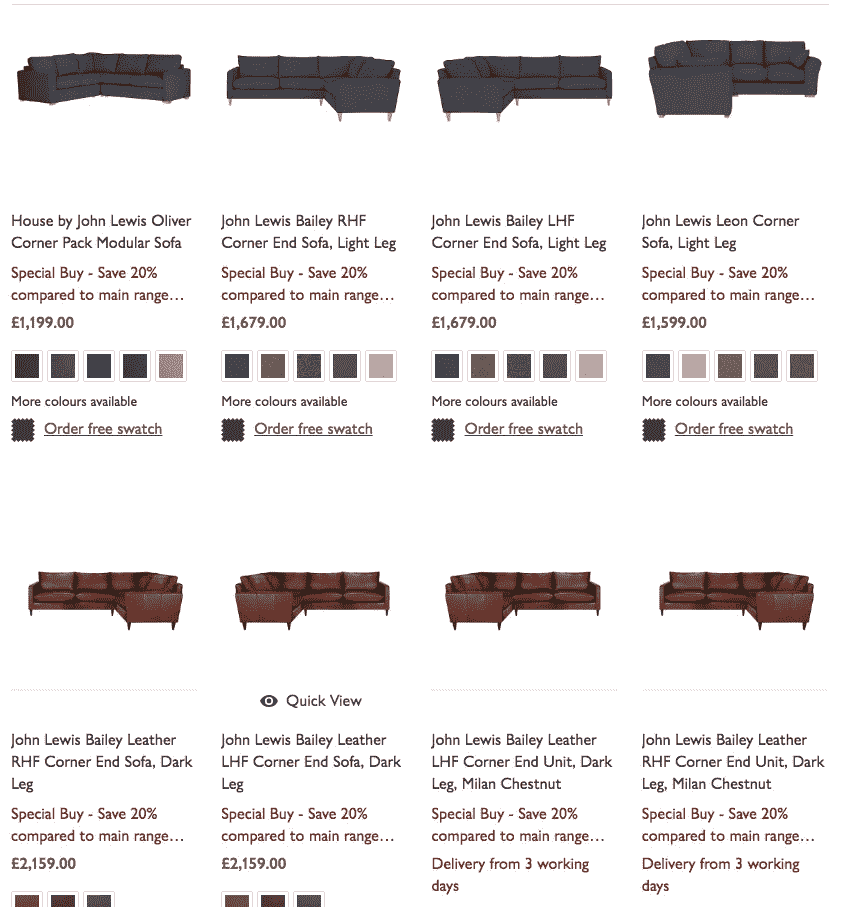

# 电子商务定价拆解:百货零售商约翰·刘易斯

> 原文：<https://medium.com/swlh/e-commerce-pricing-teardown-department-retailer-john-lewis-4b3cad8200e8>

在这个令人兴奋的关于 [Prisync](https://prisync.com/) 的新系列中，我们已经用我们的软件来挠我们自己的痒，或者这么说。我们花了上个月的时间分析零售商 John Lewis 的定价记录，结果令人难以置信。

如果你曾经想知道大公司是如何执行他们自己的定价策略的，请继续阅读，了解更多信息。

John Lewis 是一家高端百货商店，业务遍及英国、爱尔兰共和国和澳大利亚。第一家实体店于 1864 年在伦敦开业。

他们以昂贵和高端的商品以及著名的圣诞广告而闻名，是一个很好的在线百货商店，可以通过研究更清楚地了解各种有效的定价策略。

# 我们分析了什么？

我们使用了来自不同产品类别的 100 多种产品样本，包括:

*   婴儿和儿童
*   电气和电子
*   时尚
*   健康与美丽
*   家用电器

我们研究了 John Lewis 的竞争优势，他们拥有什么类型的客户，这如何影响他们的定价决策，他们是否利用特殊交易或优惠，以及他们定价结构的 UX。

所有这些数据被用来整合 John Lewis 定价策略的整体视图，为您提供如何在自己的电子商务商店中模仿相同技术的思路

# 约翰·刘易斯有什么样的客户？

正如我们之前提到的，约翰·刘易斯是一家百货商店，产品种类繁多。

总的来说，它们吸引了寻求高端产品和购物体验的客户。

根据 [Statista](https://www.statista.com/statistics/381042/john-lewis-edition-monthly-reach-by-demographic-uk/) 的研究，2016 年至 2017 年间，John Lewis 的印刷和数字杂志覆盖了广泛的人群，但覆盖范围最广的人口统计群体是 35 岁以上的成年人。

总的来说，约翰·刘易斯的人口统计数据可以描述为女性和 35 岁以上。

然而，最近几年的[报告](https://www.independent.co.uk/news/business/news/john-lewis-pulls-in-younger-customers-and-more-men-8914149.html)显示，约翰·路易斯开始吸引年轻顾客以及男性顾客。

我们现在将看看他们的定价策略和战术，并考虑他们的人口统计是否对他们如何定价产品有任何影响。

# 心理定价策略

在我们观察的产品中，47%的产品使用了 0.99 美元的策略，这是一种魅力定价[方式，产品使用数字“9”使其产品看起来比实际价格更便宜。](https://blog.prisync.com/psychological-pricing-strategies-for-e-commerce-retailers/)

这种策略似乎更常用于高端产品，而非低端产品。

想想吧。约翰·刘易斯是一家高端零售商，顾客乐意为他们的产品支付溢价。

这并不意味着他们也不想买便宜货。

John Lewis 可能没有在低端产品上使用魅力定价策略的原因是，尽管他们希望看起来像是一家廉价商店，但仍然希望给他们的客户提供一种划算的感觉。

一个完美的例子是如果我们拿走他们的雨伞。

自然，雨伞是一种更容易心血来潮购买的产品，而不是沙发。你会在上面看到，魅力定价策略还没有被使用。这是因为，一般来说，如果你正在寻找一把伞，你知道它不应该花费你太多的钱，因此你不需要一个特殊的定价策略来说服你购买。

# 竞争对手价格比较

由于 John Lewis 是一家高端百货商店，所以只将他们的定价策略与其他同等价值的商店进行比较是有意义的。

塞尔福里奇百货公司、弗雷泽百货公司、布鲁明戴尔百货公司和梅西百货公司都可以被认为是约翰·刘易斯的竞争对手。

根据我们的分析，在我们跟踪的所有产品中，我们看到，与核心竞争对手相比，31%的价格高于平均价格，68%的价格低于平均价格。

这可能有一个很好的理由。尽管约翰·刘易斯经营着一家高端百货商店，但还有其他商店(梅西百货、塞尔福里奇百货)销售更贵的商品，或许会向更高端的顾客推销自己。

尽管如此，John Lewis 仍然明白，在某些产品类别中，他们能够高于市场价格，并且仍然能够盈利。(我们将进一步讨论各个产品类别)。

# 价格变化的速度

在我们跟踪约翰·刘易斯的样本产品期间，我们发现他们减少了 4.12%的产品，增加了 8.25%，87.63%保持不变。

价格上涨和下降的百分比很低，这可能主要是因为 John Lewis 有一个可靠的定价策略，不需要太多的不断优化。

这也符合我们的想法。

跟踪你的价格，了解你的竞争对手的价格，并进行优化以支持价格，这一点非常重要。但话虽如此，当你有一个适合自己的策略时，不要急于太快地做出改变，或者一下子做出改变，因为害怕无法清楚地了解哪些产品在哪个价位有效。

# 特定类别定价

# 婴儿和儿童

在婴儿和儿童类，约翰刘易斯的价格低于平均水平。零售商遵循该类别中的竞争性定价策略。在这一类别中，John Lewis 的竞争对手在分析的时间段内减少了 7.25%的产品，增加了 7.97%，84.78%的产品保持稳定。

相比之下，约翰·刘易斯降低了 10%，提高了 50%，而 40%则保持不变价格。

我们之前提到，整体而言，John Lewis 在这一类别的价格低于其竞争对手的平均水平。

这可能是他们增加 50%产品的有力原因。在这种情况下，John Lewis 可以通过实验来观察提高价格如何影响顾客的购买意愿。

由于他们已经在以比竞争对手更低的平均价格销售这一类别的产品，他们有机会小幅提高价格，直到市场回暖。

# 电子学

在电子类中，28.95%的产品高于平均水平，71.05%的产品定价低于平均水平。

竞争者在指定的时间范围内，其产品减少了 8.96%，增加了 3.40%，87.64%保持稳定。

相比之下，约翰·刘易斯降低了 13.16%的产品价格，提高了 86.14%。

这一观点非常有趣，因为该类别中超过 70%的产品定价低于平均水平。

这可能是约翰·刘易斯产品增长 86.14%的一大原因。这可能是由于季节性的努力，人们不太可能在夏季购买大件商品。

您还会注意到，在主类别页面上，John Lewis 突出显示了顶部的清除部分。

这种策略用于让人们考虑他们以前可能没有考虑过的产品。

由于无法直接了解 John Lewis 的具体策略，我们不确定突出清仓部分是为了减少过剩库存、增加该类别的收入，还是仅仅鼓励人们进一步浏览该类别。

# 时尚

在时尚界，女性和男性品牌中，61%的产品价格高于平均水平，39%的产品价格低于平均水平。

就价格变化率而言，竞争对手的产品减少了 9.84%，增加了 14.21%，75.96%保持稳定。

然而，约翰·刘易斯降低了 20%的产品价格，提高了 80%的产品价格。

你会注意到，与电器类页面相比，约翰·刘易斯并没有突出时装清仓区，尽管确实有一个。

这可能是因为他们是一家高端零售商，知道当谈到服装时，他们的客户真的很重视产品质量，并愿意为此支付溢价。

这种“优质”的理念也可能是他们在这一类别中增加 80%产品线的核心原因。

# 家和花园

在家居和花园类别中，总体而言，32.35%的产品价格高于平均水平，67.65%的产品价格低于平均水平。在我们的分析中，竞争对手的产品增加了 6.51%，减少了 9.84%，83.65%保持不变价格。然而，约翰·刘易斯将他们的产品价格降低了 47.06%，提高了 52.94%。

销售家居和园艺类产品涉及一套不同于其他类别的营销。这是因为在很大程度上，你不太可能浏览这个类别，而是直接寻找你所需要的。

例如，您多久会购买一次新的户外花园家具？

只有当你需要它的时候。这类产品通常寿命较长，因此购买频率较低。

这也许是 67.65%低于平均水平的原因之一。John Lewis 可能试图削弱市场，使用有竞争力的定价策略，以便在潜在客户准备购买时抓住他们。

# 健康与美丽

当我们进一步研究健康和美容产品类别时，我们发现竞争对手的价格上涨和下跌幅度都很大(13.24%的产品价格下降，14.21%的产品价格上涨，6.62%的产品价格保持不变)。相反，在我们追踪的时间内，约翰·刘易斯提高了他们所有的价格。

这很有道理。你会看到，在健康和美容类别的顶部，John Lewis 有一个“价格匹配”工具，他们承诺匹配所有竞争对手的报价。

由于他们目前对该类别中的大多数产品定价过低，他们能够将报价与提价结合起来。

这是一个超级聪明的技巧，可以在不疏远客户的情况下提高价格。

从消费者的角度来看，你会很高兴 John Lewis 将匹配每个竞争对手的价格和交易，但从 John Lewis 的角度来看，他们能够在此类别内轻松提高价格。

# 约翰·路易斯定价 UX 拆解

在你的电子商务商店里有一个可靠的定价策略当然很好，但同样重要的是你如何向你的顾客展示这些价格。

定价的 UX 对于形象化你提供的价格及其背后的原因是非常重要的。

在一个分类页面上，John Lewis 在商品下面有产品的价格。这是一个有效的策略，因为你的眼睛自然会首先被图片吸引。

那么，你只会关注你真正感兴趣的产品的价格。

他们也用混合的颜色来表示商品何时打折，或者用红色来表示打折。

在产品列表页面上，John Lewis 保持整个页面的整洁，避免分心。这是一个很好的转换技巧，因为一旦客户进入这个页面，他们就会考虑购买，所以你要让这个过程尽可能的简单，这一点很重要。

约翰·刘易斯甚至两次列出价格，确保消费者不会对产品的价格产生任何混淆。

# 我们能从约翰·刘易斯的定价策略中学到什么

我们能够从追踪 John Lewis 在一系列类别和产品上的价格中学到很多。

最值得注意的是，任何拥有大量产品的电子商务商店的人都应该特别注意 John Lewis 提高和降低价格的速度。

当你有一个大的网上商店时，你可以更频繁地改变，因为在很大程度上，顾客使用网上商店来找到他们想要的东西。

例如，如果你有一个只有两种产品的商店，当一个通常可能是 30 美元的价格突然增加到 60 美元时，这将是非常明显的。

然而，当你经营的商店涵盖多个类别和这些类别中的数百种产品时，随着市场需求的上升和下降，你可以更好地试验你的价格。

如果你想开始跟踪自己的定价，看看它与竞争对手相比如何，为什么不试试 Prisync 的免费试用版，这是我们的 [*电子商务竞争对手价格跟踪软件。*](https://prisync.com/register)

## 这篇文章发表在 [The Startup](https://medium.com/swlh) 上，这是 Medium 最大的创业刊物，有 340，876 人关注。

## 订阅接收[我们的头条新闻](http://growthsupply.com/the-startup-newsletter/)。

