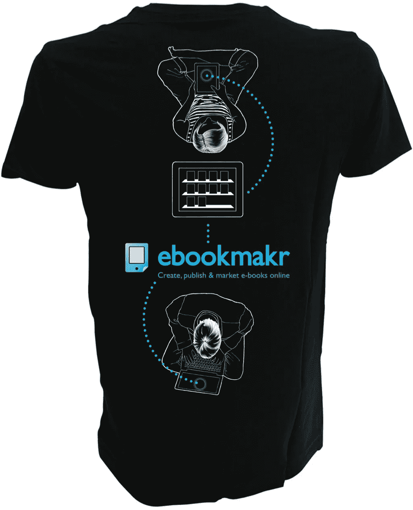

# Ebookmakr 失败:知道构建什么的谬误——迟来的事后分析

> 原文：<https://medium.com/swlh/ebookmakr-failure-the-fallacy-of-knowing-what-to-build-the-overdue-post-mortem-5cc4b045554f>

## 执行摘要—从 Ebookmakr 的失败中吸取的教训:

1.  爱问题胜过爱你的解决方案。
2.  不要把你手中的中国梦推得太远。
3.  在进行用户访谈时，使用[原型工具，如漫威](https://marvelapp.com/)。(更多信息，请点击这里:[让客户重视你的四条经验](https://age-of-product.com/four-lessons-learned-from-making-customer-value-your-priority/)。)
4.  小心用户面试的选择过程:你可能最终会选择那些支持你的愿景的人——这是一个自我实现的预言陷阱。
5.  谨防用户访谈中的误报。
6.  在一定数量的客户注册之前，不要开始写任何一行代码。(澄清一下:客户是付费用户。)
7.  当你没有全职工作来扩大用户基础和增加客户价值时，千万不要花钱开发原型。
8.  总是做 t 恤衫，以后经常穿，以保存对灾难的回忆。(见下文。)

## Ebookmakr 的起源:把一个美食博客变成一本食谱电子书

早在 2012 年初，我就想把我的美食博客——我喜欢做冰淇淋(虽然没有牛奶或鸡蛋，因为我对食物过敏)——变成一本食谱。鉴于我对电子书和自助出版的好奇心，我想自己在 Kindle 上出版它。

令我惊讶的是，把 WordPress 博客变成 Kindle 电子书是一个相当复杂的过程，更不用说。mobi 文件与其他电子书商店不兼容，如 iBooks、Kobo 等。所以，我对自己说:创造一个软件即服务，将可用的内容转化为电子书，特别是如果内容已经可以作为博客使用，这不是很好吗？

当时，内容营销仍处于起步阶段，我看到了收获大量可用优质内容、重新包装并以电子书形式分发的巨大潜力——无论是为了盈利、非营利、用户群增长还是个人声誉。机会似乎是无穷无尽的，特别是如果软件使用起来像打字机一样简单的话。(后来，我们有了一个基于这个想法的朗朗上口的广告词:“[在你用打字机写下第一封信之前，你是不是已经成为一名机械师了？”？不。那么，作为一名作家，你为什么要学习 HTML & CSS 来写一本电子书呢？](http://venturevillage.eu/ebookmakr)))

## 我知道需要建造什么

就在那时，Ebookmakr——我很快注册了这个商标，并保护了最重要的顶级域名——诞生了。2012 年春天，我采访了手头有很多内容的朋友和业内人士，他们证实了我对电子书生产混乱局面的看法。

过了一段时间，我确信我对出版业及其潜力的分析是正确的。一位业内人士称 Ebookmakr 为“系统相关技术”,对我来说，很明显这个项目很有可能成为全垒打。

回想起来，我不得不承认，在那个时候，我对 Ebookmakr 的热爱开始影响我的判断，这个项目开始走向失败。不过，它并没有以技术的方式做到这一点。我在弗罗茨瓦夫发现了一些优秀的开发人员，他们正在构建一个基于 JavaScript 的最先进的原型。(我可以强烈推荐 [Monterail](http://monterail.com/) ，让我知道你是否喜欢 Szymon 的介绍。)

## Ebookmakr 的产品/市场适应问题

我们最初有相当多的注册，但实际上只有几个项目被创建。人们似乎很喜欢 WordPress 和其他博客的导入功能，但没有一本基于博客的电子书从 Ebookmakr 的产品线中推出，通过 Kindle 商店发行。

用户突然开始抱怨 Ebookmakr 只有英文版本。

此外，用户开始询问 Word 文档的导入，这是原型当时不支持的功能。由于在德国提供，相当多的讨论围绕隐私和将在美国举办的 SaaS 提供。

事实证明，我们在我们的(早期采用意识)同行中进行了太多的用户采访，他们对英语很熟悉，Ebookmakr 在美国托管，没有隐私问题。

## 埃布马克尔的末日

2012 年 12 月底，我们关闭了 Ebookmakr。我的食谱从未出版，我的冰淇淋博客也早已消失。(不过，你仍然可以观看一些关于制作冰淇淋的[视频](https://www.youtube.com/user/EiscremeMann2)。)

我们从未销售或开源 Ebookmakr 的软件。(无论如何，你现在都必须重新开始。)

当我在 2015 年春天出版我的“[精益用户测试](https://age-of-product.com/user-testing-the-lean-way-hands-on-agile-series/)”电子书时，我使用了 Ebookmakr 的一个前竞争对手，效果很好。就像我期待的那样。

## Ebookmakr 故障—经验教训:

1.  爱问题胜过爱你的解决方案。
2.  不要把你手中的中国梦推得太远。
3.  在进行用户访谈时，使用[原型工具，如漫威](https://marvelapp.com/)。(更多信息，请点击这里:[让客户重视你的四条经验](https://age-of-product.com/four-lessons-learned-from-making-customer-value-your-priority/)。)
4.  小心用户面试的选择过程:你可能最终会选择那些支持你的愿景的人——这是一个自我实现的预言陷阱。
5.  谨防用户访谈中的误报。
6.  在一定数量的客户注册之前，不要开始写任何一行代码。(澄清一下:客户是付费用户。)
7.  当你没有全职工作来扩大用户基础和增加客户价值时，千万不要花钱开发原型。
8.  总是做 t 恤衫，以后经常穿，以保存对灾难的回忆。

***如果你觉得这个帖子有用，请点击“心脏按钮”，或者关注我的*** [***中刊***](https://medium.com/age-of-product) ***。更多阅读请上*** [***品时代***](https://age-of-product.com) ***博客。***

## 这个故事发表在 [The Startup](https://medium.com/swlh) 上，这是 Medium 最大的创业刊物，拥有 294，522+人关注。

## 在这里订阅接收[我们的头条新闻](http://growthsupply.com/the-startup-newsletter/)。

