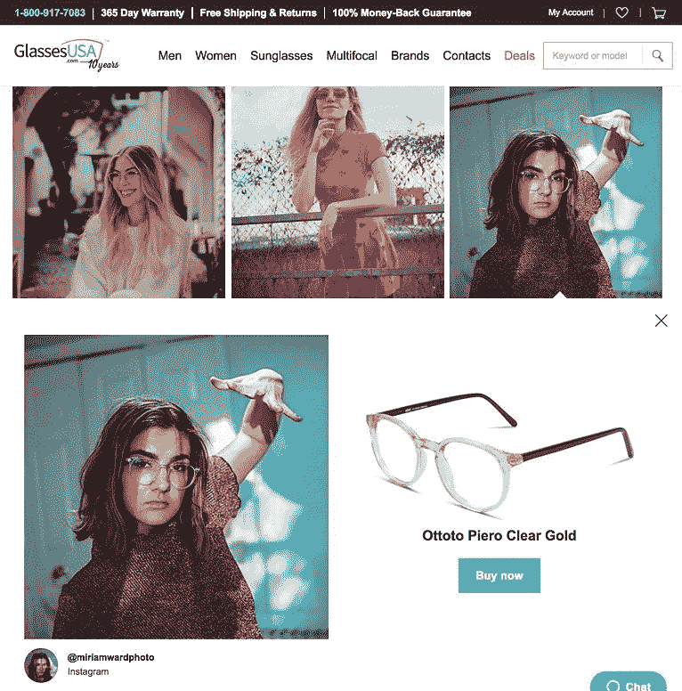

# 电子商务内容营销:权威指南

> 原文：<https://medium.com/swlh/ecommerce-content-marketing-the-definitive-guide-eca302ed5817>

**注:**这篇博文最初发表于 borismustapic.com

内容营销是一种专注于创建和分发相关且有价值的内容以吸引目标受众的营销类型。它让你不用向客户推销就能与他们交流，建立更深、更值得信赖的关系。

# 内容营销的好处

内容营销有如此多的好处，每个企业都应该这样做。以下是几个例子:

*   允许您与客户联系
*   有助于提高参与度和品牌忠诚度
*   推动交通
*   帮助你成为行业权威
*   建立品牌意识
*   帮助您最大化投资回报

此外，研究表明，内容营销[的成本比传统营销](https://www.demandmetric.com/content/content-marketing-infographic)低 62%，而产生的潜在客户[是传统营销](https://contentmarketinginstitute.com/2017/10/stats-invest-content-marketing/)的三倍。

# 如何规划你的内容营销策略

在进行内容营销之前，你需要考虑你将覆盖什么主题，你将制作什么类型的内容。我总是建议从分析你的竞争对手在做什么开始。

# 对手分析

在网上找到 5 到 10 个你的竞争对手，查看他们的网站、博客和社交媒体页面。他们写的是什么样的主题？他们制作什么类型的内容？他们写博客，创作视频，电子书或其他东西吗？

虽然你应该使用竞争对手的内容来给你一些想法，但你不应该试图复制它们。你应该试着创造更好的东西。

写下你想用你的内容涵盖的主题列表。思考覆盖每个主题的最佳方式。一些主题可能更适合在博客中讨论，而另一些则非常适合在视频中讨论。

在进行内容营销时，保持条理是很重要的。创建一个内容日历可以帮助你和你的团队走上正轨。

# 创建内容日历

创建内容日历没有正确的方法。您需要决定需要在内容日历中包含什么样的信息，以使内容创建过程简单明了。

[Curata](http://www.curata.com/resources/tools/content-marketing-editorial-calendar-template) 和 [CoSchedule](https://coschedule.com/blog/annual-content-calendar-template/) 提供免费模板，可以给你一些灵感来创建自己的内容日历。

在创建内容日历时，您可能希望包括诸如内容标题、内容类型和内容所针对的购买者旅程阶段等字段。这最后一部分对您的整体战略非常重要，也是我们接下来要讨论的内容。

# 考虑买家的旅程

买家的旅程包括三个阶段，每个顾客都要经历这三个阶段。这三个阶段是意识、考虑和决定。

在创建内容时，你需要考虑你的访问者目前所处的买家之旅的阶段。如果访问者对某个特定的内容还处于认知阶段，那么试图用这个内容向访问者推销你的产品是没有意义的。相反，你应该利用这个机会让来访者了解他或她问题。

你的目标应该是在顾客的购买之旅中推动顾客前进，并引导他们

做出购买决定。在意识阶段之后，客户进入考虑阶段，检查针对其问题的不同解决方案。对于这个阶段的客户来说，使用你的内容来展示你的产品如何帮助他们以及它与其他产品的不同之处是很重要的。

最后，在决策阶段，客户准备购买，你应该确保让他们尽可能容易地购买。

在我们讲述了基础知识之后，让我们来回顾一些内容营销的想法。

# 电子商务内容营销理念

# 互动内容

在你的网站上有互动内容是吸引潜在客户的好方法。为了创建互动内容，你需要确定你的客户遇到的问题，然后想办法使用互动内容(如应用程序或测验)来帮助他们解决问题。

我建议把你的互动内容放在一个专门的页面上，然后通过你的网站，以及社交媒体、电子邮件营销等来推广这个页面。如果你正在寻找互动内容的灵感，一个很好的例子是 [Sephora 的虚拟艺术家应用程序](https://sephoravirtualartist.com/)，它让用户给自己的照片化妆，以获得实际效果的想法。

# 产品指南

产品指南是内容营销的另一个很好的例子。您可以使用产品指南来解释:

*   如何使用你的产品
*   根据顾客的需求选择哪些产品
*   组合产品以达到预期效果的方法等。

产品指南是 Huckberry 的内容营销策略的主要部分。他们出售男士服装和装备，并出版指南，如 [9 款适合秋季探险的最佳男士靴子](https://huckberry.com/journal/posts/best-boots-for-fall)和 [8 款适合秋季最佳和最差天气的男士衬衫夹克](https://huckberry.com/journal/posts/8-best-shirt-jackets-for-the-fall-s-best-and-worst-weather)。

# 礼品指南

40%的购物者在 11 月开始为假日购物做调查，50%的人在 10 月前开始调查。节假日是使用礼品指南帮助顾客为他们心爱的人寻找礼物的绝佳机会。

当使用礼品指南来推销你的产品时，你有两种选择:向别人的指南推销你的产品，和创建你自己的礼品指南。为了获得最佳效果，请尝试使用这两种方法。

按照以下步骤开始**向礼品指南推销你的产品**:

*   **寻找你所在领域/行业的网站**——使用谷歌寻找你所在领域内过去已经发布过礼品指南的网站。
*   **联系** —找到他们的联系方式，通过电子邮件或他们的社交媒体页面联系他们。
*   个性化你的外展活动——他们可能会在假期前后收到一堆这样的请求，所以试着个性化你的外展活动来吸引他们的注意力。

# 客座博文

你可以邀请客座博主为你的品牌写内容。在你擅长的领域的博客上做一些研究，接触那些你认为可能很适合的人。你也可以创建一个客座博文提交页面，让感兴趣的博主来找你。

当讨论合作时，一定要让他们知道他们到底得到了什么回报:有价值的反向链接、流量或曝光率。你还需要解释你期望从他们那里得到什么样的内容，比如长度，需要的研究数量等等。

# 产品视频

[谷歌搜索结果前 70%被视频占据](https://blog.kissmetrics.com/product-videos-conversion/)。据估计，到 2021 年，视频将占互联网总流量的 80%。

产品视频可以[增加转化率](https://blog.bufferapp.com/social-media-video-marketing-statistics)和[在网站上停留的时间](http://www.insivia.com/27-video-stats-2017/)以及降低跳出率。您可以制作产品视频来展示您的产品或解释如何使用它们。最好的视频讲述一个故事，展示正在使用的产品。你的视频也应该让观众联想到你的品牌和整体信息。

一般来说，产品视频应该很短，不超过 30 秒。您可以制作三种主要类型的产品视频:

*   **总体概述视频** —这些视频旨在展示你的品牌和产品线，但不涉及太多细节。
*   **产品演示** —用于展示您产品的功能并演示如何使用。
*   **幕后** **视频** —旨在向客户展示您的产品是如何制造、准备或运输的视频。

如果您需要帮助来集思广益，决定视频中应该包含哪些内容，这里有一些问题供您参考:

*   你的产品的**主要特点**是什么？它解决什么问题？解释你的产品如何让你的顾客生活得更好。
*   关于你的产品，最常见的问题是什么？用你的产品视频来回答这些问题，让观众更容易决定购买你的产品。
*   你的产品或品牌背后有没有一个**有趣的故事**？如果有，让你的客户知道。

除了在你的网站上发布你的产品视频，你还可以在你的脸书页面、Instagram 账户和 Youtube 频道上分享它们，以增加曝光率。

# 用户生成的内容

用户生成的内容包括评论、照片、视频和客户创建的其他类型的内容。这种类型的内容已被证明可以建立信任并增加转化率，84%的千禧一代表示，用户生成的内容会影响他们的购买决定。

由于用户自己创建内容，用户生成的内容对于电子商务企业来说是一种非常划算的内容营销解决方案。

用户生成的内容通过向其他人展示使用你的产品并对其感到满意，有助于创建社交证明。这也是你与其他品牌区别的一种方式。

有很多方法可以邀请用户分享他们对你的产品的感受。以下是让你开始的一些想法:

**向您的订户发送电子邮件** —向您的电子邮件列表订户发送电子邮件，请他们分享他们的经验。考虑将这样的邮件作为欢迎邮件的一部分。

**邀请您的关注者分享** —邀请您的社交媒体关注者分享他们使用您产品的照片或视频。创建一个品牌标签，并建议你的追随者在发布与你的产品相关的内容时使用它。

**创建一个竞赛**——通过为客户创建的最佳照片或视频提供折扣或免费产品等奖励，激励您的客户创建内容。手表品牌 Shore Projects 奖励每月发布展示其产品的最佳 Instagram 照片和视频的客户一只免费 Shore Projects 手表。

**为用户生成的内容创建一个专门的页面** —在你的网站上创建一个专门的页面，在那里你可以展示用户生成的内容。如果你也在举办与你的用户生成内容活动相关的竞赛，这个页面是一个让人们了解它的好地方。

GlassesUSA 在其社交商店页面上展示了客户的照片，该页面由可购买的照片组成，显示满意的客户戴着 GlassesUSA 的眼镜。

只要有机会，你也应该分享你的客户(在他们的许可下)创造的内容。以下是一些可以显示用户生成内容的地方:

*   **主页** —展示您的客户在您的主页上制作的最佳照片或视频。
*   **产品页面** —将用户生成的内容放在您的产品页面上，通过展示社交证明和展示您的产品正在被使用来增加转化率。
*   **社交媒体** —在你的社交媒体页面上转发你客户的内容，让他们获得更多曝光率。

# 策划内容

整理与你的行业相关的网站内容，并通过你的博客、电子邮件和社交媒体与你的客户分享。确保通过添加相关见解或以有趣的方式展示内容，为您的客户增加一些附加值。

你可以使用 [BuzzSumo](https://buzzsumo.com/) 、 [Curata](http://www.curata.com/) 和[策展](https://curated.co/)等工具来帮助你更有效地策展内容。

# 改变内容用途

改变内容用途是在更短的时间内创建更多内容的好方法，也是确保您充分利用所有内容的好方法。以下是一些改变内容用途的方法:

*   博客帖子—您可以使用博客帖子的内容来创建信息图、视频、电子书、电子邮件课程和播客剧集。
*   视频—您可以将视频转录到博客帖子中，或者使用音频创建播客。

# 考虑外包内容创作

如果时间是唯一阻止你从事内容营销的东西，你应该考虑外包你的内容创作需求。大量的自由职业者和机构专门从事内容创作和内容营销，他们会很乐意帮助你。尤其是 Upwork，它是一个寻找能够帮助内容创作的自由职业者的好地方。

# 如何推广你的内容

内容营销不仅仅是创造内容。你也需要积极推广你的内容。这里有一些方法可以提升你的内容，增加它的整体影响力:

# 搜索引擎优化

你应该从优化搜索引擎的内容开始。这意味着尽可能优化元标题和描述标签，以及使用你希望你的内容在搜索引擎中排名的任何相关关键词。

为了帮助你的内容排名更好，你也应该尝试建立一些链接。最简单的方法是联系你所在行业的其他网站，为他们撰写客座博文，然后在这些博文中链接到你的内容。

# 社会化媒体

为搜索引擎优化你的内容后，下一步就是在社交媒体上推广。在你所有的社交媒体渠道上发布你的内容。

当你想在脸书、Instagram 或 Pinterest 等社交网络上推广博文时，一定要制作一些引人注目的图片。这将有助于更容易地抓住你的追随者的注意力。

# 电子邮件

你一定要利用你的电子邮件列表来推广你的内容。注册了你的邮件列表的人很可能对你的内容感兴趣，并且很乐意查看。

每周或每两周向您的电子邮件订阅者发送一封电子邮件，展示您的新博客帖子、视频或指南。

# 付费广告

付费广告是将你的内容传达给更多人的最快方式。最受欢迎的付费广告选项包括:

*   **Google Adsense** —适合推广博文。根据你的定位和你使用的关键词，这可能是一个昂贵的选择。如果你的广告预算很少，你可能会考虑使用社交媒体广告。
*   **Youtube 广告**——一个推广你的视频内容并给它一个初始推动力的好方法。
*   **社交媒体广告**——脸书和 Instagram 等网络上的社交媒体广告是一个伟大的低成本解决方案，可以让更多人看到你的内容。

# 影响者

在有影响力的人的帮助下推广你的内容是让很多人看到你的内容的好方法。如果你已经在参与影响者营销，问问你目前合作的影响者是否愿意与他们的追随者分享你的新内容。

否则，在你的领域寻找有影响力的人，并告诉他们潜在的合作。你可能需要提供某种激励，让他们有兴趣和你一起工作。

# 结论

内容营销是一项长期战略，将在未来几年产生流量和销售额。记住，说到内容营销，一致性是关键。确保坚持你的内容日历，定期制作内容。

最好关注质量而不是数量。不要在最短的时间内尽可能多地抽取内容，而是尝试为你处理的每一个主题创建最好的资源。

*最初发表于*[*【borismustapic.com】*](https://borismustapic.com/ecommerce-content-marketing/)*。*

## 这篇文章发表在 [The Startup](https://medium.com/swlh) 上，这是 Medium 最大的创业刊物，有+398，714 人关注。

## 在这里订阅接收[我们的头条新闻](http://growthsupply.com/the-startup-newsletter/)。

