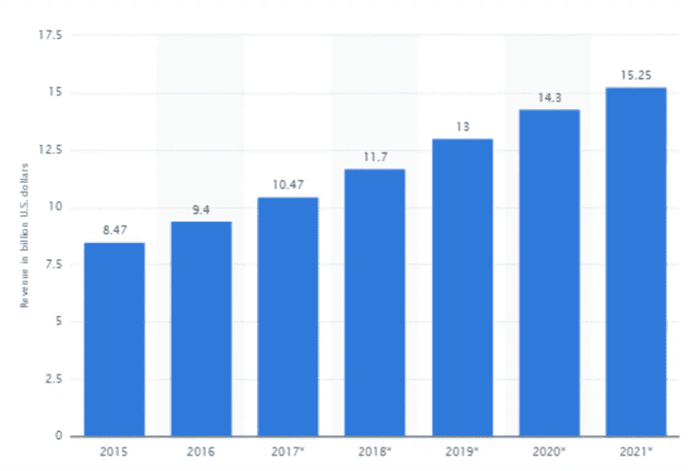
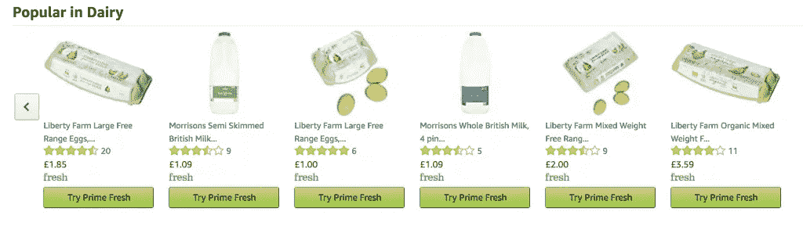
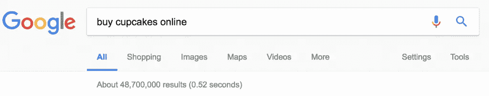
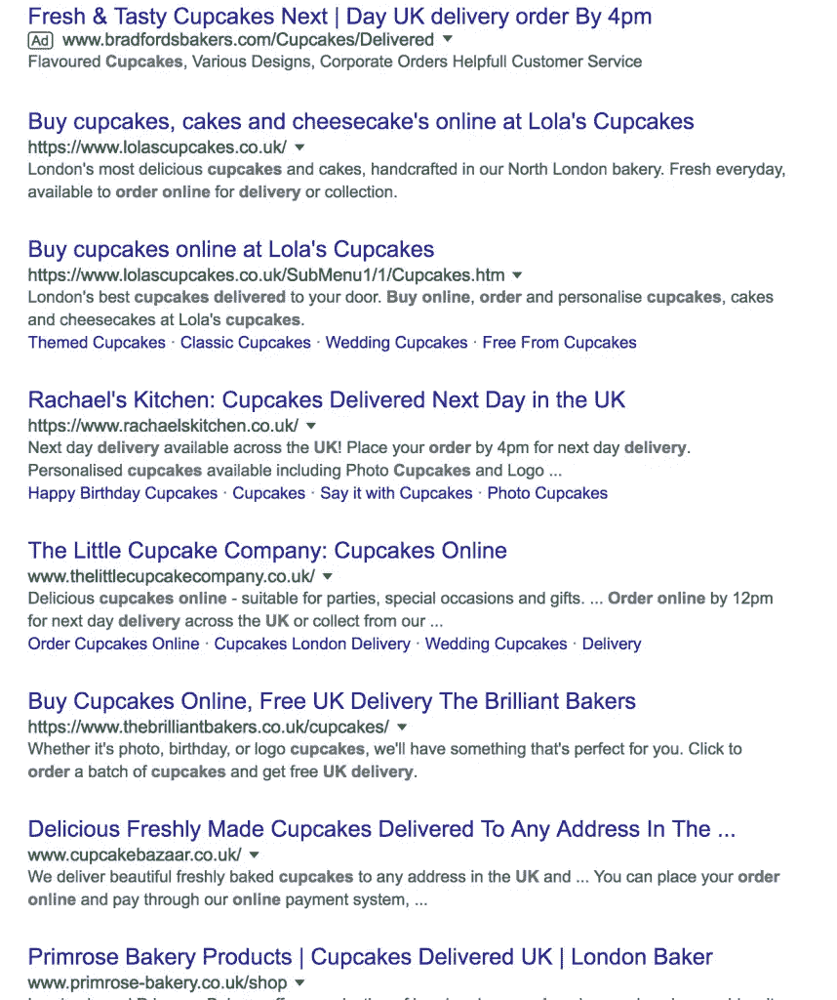
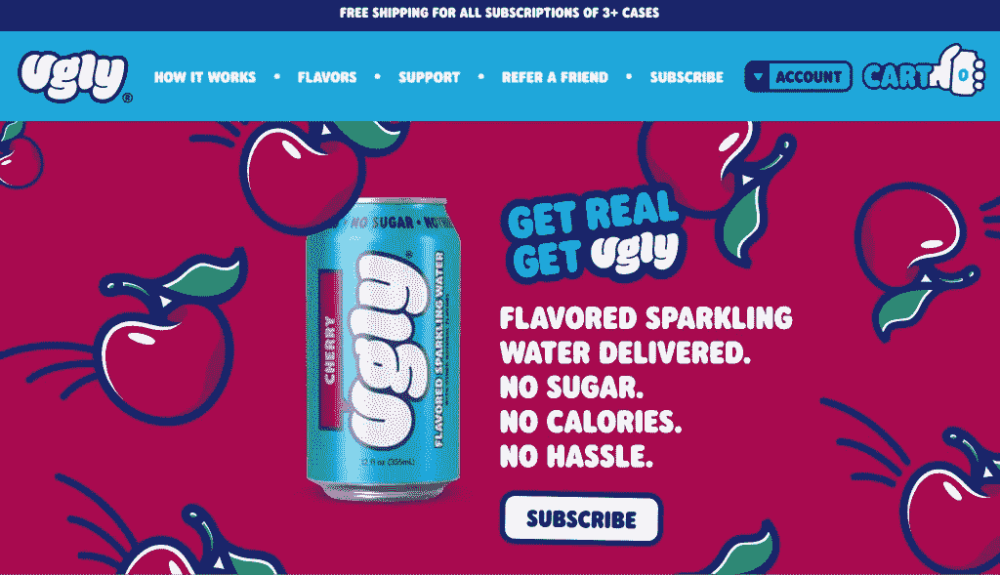
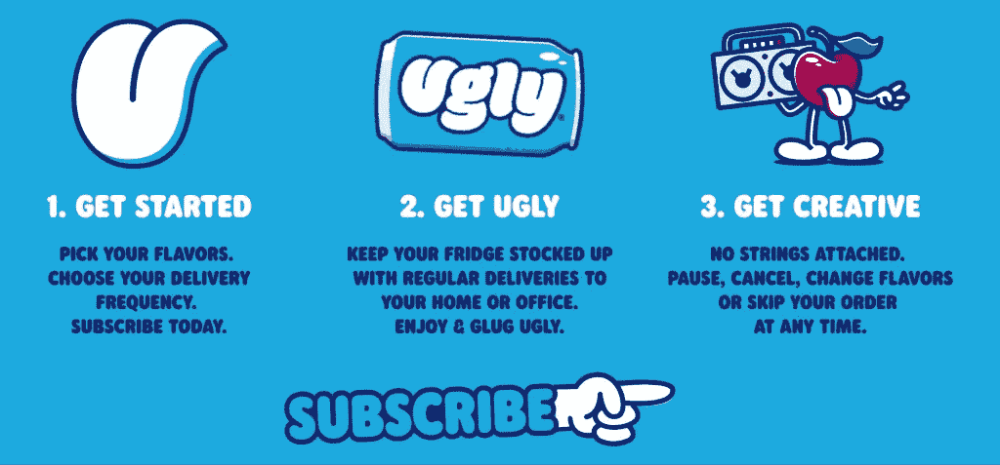
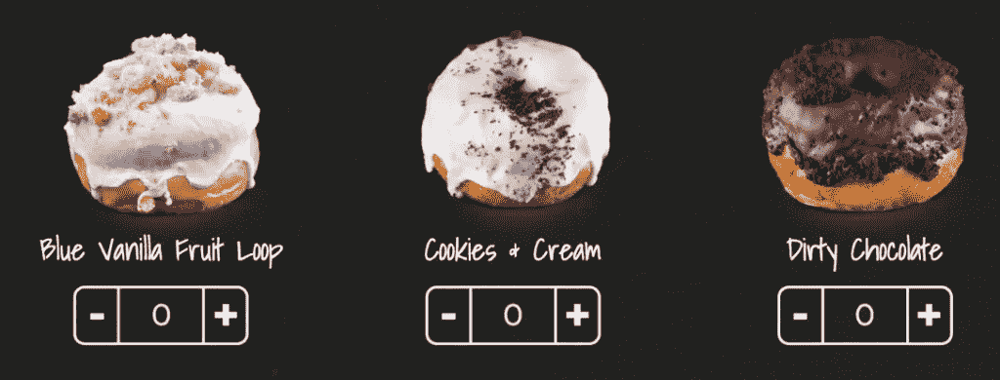
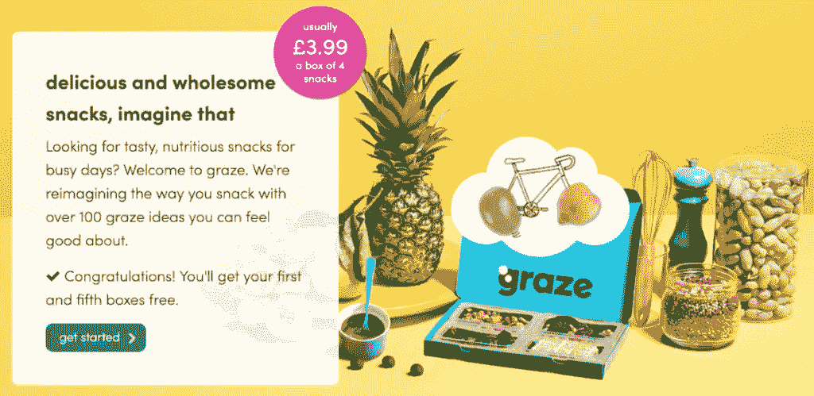
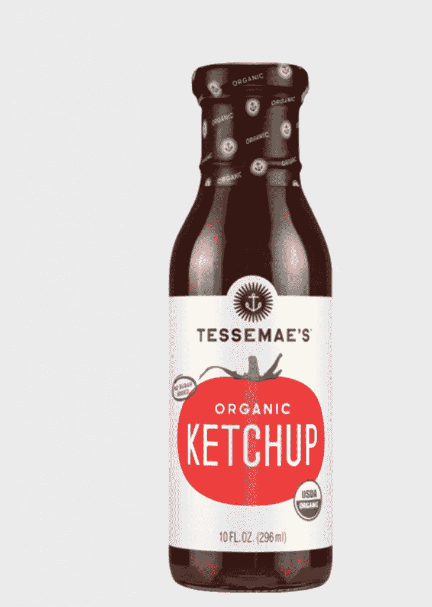
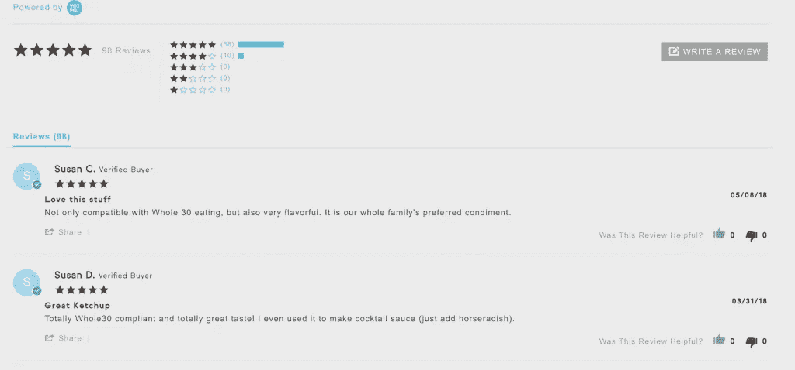

# 电子商务食品营销技巧

> 原文：<https://medium.com/swlh/ecommerce-food-marketing-tips-3e50b667f8ef>

# 你有一个食品品牌，是吗？你可能在当地市场的货摊上卖过你的产品，或者你甚至去过当地或全国性的超市，看看他们是否有你的产品。

虽然市场营销的一般规则适用于销售食品、饮料和杂货，但你也应该注意一些可以帮助你的利润飙升的特殊策略。

在本帖中，我们将探讨为什么你应该考虑食品或饮料业务的电子商务，并为你提供 5 个可行的步骤，你可以通过有效的电子商务食品营销来增加利润和建立品牌。

让我们跳进去，

# 为什么你应该考虑电子商务食品营销？

到 2021 年，食品饮料销售的零售电商收入有望达到 152.5 亿。如果你现在不加入的话，剩下的钱太多了。

当你考虑你想在你的电子商务商店上卖什么产品时，食物看起来确实是一个可行的选择。简单来说，每个人都吃食物，许多人对他们吃的食物和食物的来源充满热情。

尽管出售食品存在局限性，你也应该为此做好准备，比如潜在的许可证，以及确保你所有的食物都是在卫生的环境中制作的，但在这个市场上分得一杯羹可能会非常有利可图。

甚至亚马逊也利用他们的品牌“亚马逊生鲜”进军食品行业，将你可能需要的杂货直接送到你家门口。

但是让我们先谈谈你可以采用的实际营销策略。

# 你的产品独特吗？

“我想卖纸杯蛋糕。”你可能会考虑这一点，因为进入门槛低，而且你不需要花太多的初始费用购买太多的原料。

但事实是，除非你有庞大的营销预算(如果你刚刚起步，我假设你没有)，否则你如何与网络上的所有内容竞争。

让我们看看谷歌首页上的所有选项！

这么多其他企业承诺正是你希望做的。这是你需要脱颖而出的核心原因。

有许多不同的方法可以让你脱颖而出，你可以选择通过你出售的物品来做到这一点。

或者你可能利用你的品牌来销售你的产品，比如[丑陋的饮料](https://uglydrinks.com/)。

一开始，如果有人告诉你他们要开一家饮料公司，并称之为“丑”，你的第一想法会是什么？

可能不是积极的东西。毕竟，丑饮料卖的是什么产品？调味苏打水？

你可以在其他地方买到，对吗？是的，但是尽管如此，他们还是受到了媒体的关注。很大程度上，这可以归结为他们的故事和他们的营销。

你看，丑陋的饮料提供了我们都知道和喜爱的碳酸饮料的更健康的版本。他们还提供订阅服务，确保你的冰箱里始终储存着你最喜欢的口味。

# 快速运输和安全就是一切

人们不在网上购买食品的一个核心原因是他们担心食品的安全性。会在环境友好的地点生产吗？它会在去往我的旅途中毁灭吗？它到达时会受损还是破碎？

网上销售食品需要大量的信任。相信商品会在合适的时间到达顾客手中，就像描述的那样。

为了帮助改善这种挫败感，你可以尝试提供[免运费](https://blog.prisync.com/e-commerce-tips-ideas-in-e-commerce-shipping/)。

[Pipcorn](https://www.pipsnacks.com/) ，一家爆米花公司为他们的顾客提供任何超过 35 美元订单的免费送货服务。

当提供免费送货作为[定价营销策略](https://blog.prisync.com/category/pricing-strategies/)时，记得考虑你的间接成本。你不想提供免费送货，也不想想这个费用会如何影响你的底线。对于较轻的食品，如散装茶或爆米花，免费送货可能是一个简单的选择。

# 在电子商务食品营销中，图像就是一切

如果没有看到蛋糕的图片，你会买吗？大概不会。俗话说，一图胜千言。产品描述在电子商务食品营销中非常重要，原因如下:

1.  他们帮助你描述你的产品
2.  可以真正增加搜索引擎优化的推动力
3.  让你有机会谈论顾客可能有的任何潜在饮食要求，例如“适合纯素食者”“可能含有坚果”。

但是当涉及到销售你的产品时，书面的描述只能到此为止。你也需要[图片](https://blog.prisync.com/6-growth-hacks-grow-e-commerce-business-quickly/)。如果你打算外包你所做的任何电子商务食品营销，那么图片就应该如此。好的图片让你(字面上)渴望更多。

让我们看一个例子。

苏西 Q 甜甜圈店使用非常迷人的图片来展示他们的产品。注意他们不能确保所有的糖衣都是完美的。事实上，它并不完美的事实显示了你收到的产品的图像有多真实。

我们都知道麦当劳汉堡的形象，看起来一点也不像你收到的汉堡，但你不介意付钱，因为这是一种廉价的商品食品。

然而，对于像甜甜圈这样的产品，你想让你的顾客确切地知道当他们点击购买时他们的产品会是什么样子。

# 订阅服务

如果你出售一件新奇的物品，你可能会在特定的节日期间迎来顾客高峰，人们更有可能为他人购买礼物。但是，如果您想要全年定制，那么看看您的产品是否适合订阅模式。

Graze 是基于订阅业务的一个很好的例子。

他们的提议？

健康零食直接送到你的信箱。您可以选择频率，并根据您是否喜欢收到的项目来更新您的偏好。

**放牧的好处:**

1.  他们提倡健康饮食。它们的份量很小，但这意味着你不会坐下来一口气吃掉一整袋零食。
2.  这个盒子可以放入你的信箱。没有什么比不能收到包裹而不得不去当地的分拣所取包裹更糟糕的了。因为他们的包裹正好放在你的信箱里，你只要在回家的时候去取就行了。
3.  他们玩出其不意的游戏。打开你的食盒，发现这周你吃到了什么，这种感觉很棒。

所以为什么不看看你的产品是否适合订阅模式。请记住，如果你的产品是人们一年只买一次或两次的东西，它可能不会起作用，但对于以下产品:

1.  茶
2.  咖啡
3.  快餐

这可能是一个切实可行的尝试。

# 提高转速

许多人在网上购买食品时遇到的问题是，你只能根据产品描述来判断它的味道。只有产品描述是有偏见的，因为当然，他们会说它味道很好。

这就是为什么你应该认真考虑使用你的客户评论作为一个可行的营销选择。评论是真实的人对你的产品的真实感受的公正观点。

[Tessemae](https://www.tessemaes.com/) 明白购买像酱油这样的东西是一个很大的承诺。酱汁通常会持续很长时间，所以买不合你口味的是浪费时间。

他们小心翼翼地附上过时的评论，这样未来的顾客可以看到以前的顾客对这种酱的看法，以及他们搭配了什么样的食物。

# 你如何处理电子商务食品营销？

在这篇文章中，我们花了一些时间谈论食品行业，以及你如何开始考虑创建自己的电子商务商店。

也许你已经有一个电子商务商店，但还没有想出如何正确地营销它。

如果这是你的职位，那么这篇文章就是为你准备的。

希望这些策略能给你一些启发(原谅我的双关语),并帮助你提高电子商务收入。

如果你有任何其他与电子商务营销相关的策略，请在下面留下评论。

## 这篇文章发表在《T4》杂志《创业》(The Startup)上，这是 Medium 最大的创业刊物，有 326，962 人关注。

## 在这里订阅接收[我们的头条新闻](http://growthsupply.com/the-startup-newsletter/)。

