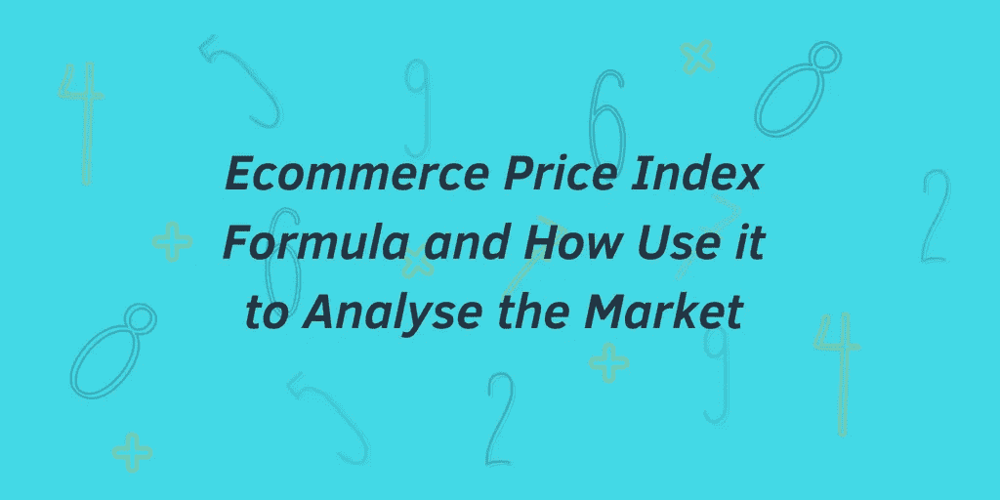
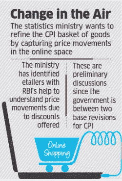
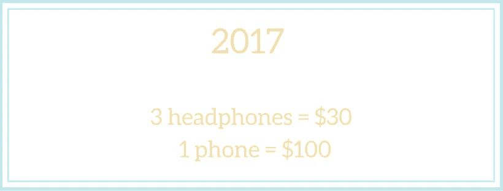
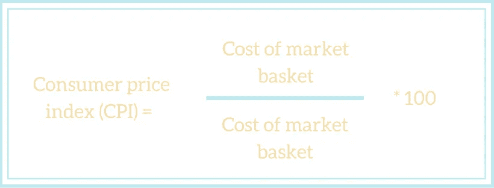
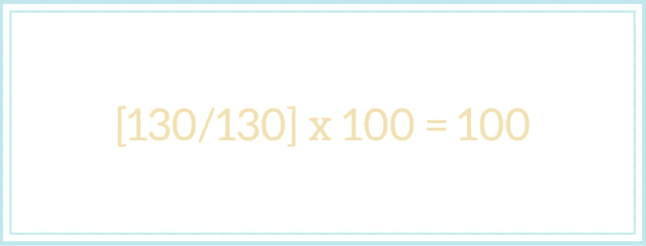
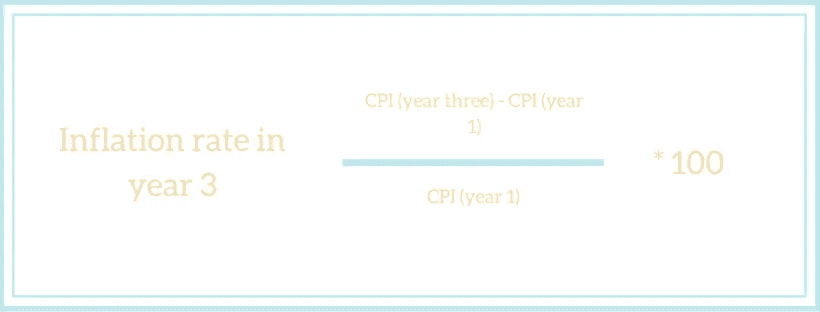
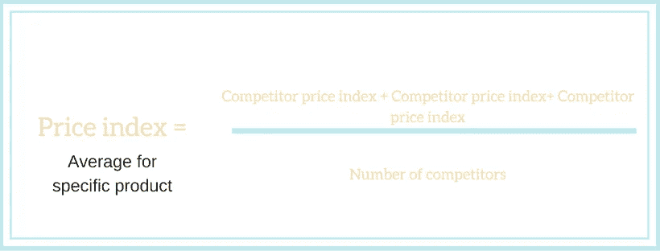

# 电子商务价格指数公式以及如何使用它来分析市场

> 原文：<https://medium.com/swlh/ecommerce-price-index-formula-and-how-use-it-to-analyse-the-market-9b18a7e88125>

竞争对手价格跟踪软件— [Prisync](https://prisync.com/?utm_source=medium) 的一篇文章。

价格指数公式是一种将不同地区、不同时间段的特定商品或服务组别或类别的相对价格平均值标准化的方法。

在电子商务的世界里，这是一个根据时间段或地理位置来比较价格差异的好方法。在更广的范围内，价格指数被用来衡量整体经济的价格水平和/或生活成本。

但在更小的范围内，你可以使用价格指数来帮助你在你的电子商务商店中定位你的价格点。

# 为什么消费价格指数应该包括电子商务行业？

消费者价格指数(CPI)是银行揭示通货膨胀率的关键指标。然而，到目前为止，电子商务在很大程度上被忽视了。

但这毫无意义，越来越多的人在网上购买他们的商品，所以这些统计数据应该包括在内，对吗？

随着如此多的商品和产品交易在网上发生，难怪政策制定者越来越接近跟踪在线空间的价格变动。

非常类似于我们鼓励电子商务店主在个人层面上做的事情。

# 如何在自己的电子商务商店中使用价格指数公式

正如我们提到的，电子商务价格指数让我们可以看到特定地理位置的特定产品类别在一段时间内的价格变化。

这个数据然后被用来测量通货膨胀。

为了成功地计算消费物价指数，需要四个步骤。

1.  固定市场篮子
2.  计算购物篮成本
3.  计算指数
4.  计算通货膨胀率

现在，如果你是经济和电子商务领域的新手，其中一些术语可能会令人困惑，但不要担心，我们会深入了解每个术语的更多细节。

# 固定市场篮子

如果你从未听说过“固定市场篮子”这个短语，那么用最简单的术语来说，它指的是消费者在特定参考人群中购买的所有商品。例如，你可以看看欧洲的农村人口。

CPI 市场篮子包括来自特定总体群体的一系列类别。为了计算这一点，市场领导者利用调查从家庭中收集信息，以清楚地了解他们的支出以及这些支出与购买商品的关系。

当收集了所有的数据后，分析人员就能够确定特定类别中各个项目的重要性。

然后，你将这些价格固定为一个平均值，计算出随后的成本。

比如，你发现每个消费者买 3 套耳机和 1 部手机，你就把菜篮子固定在 3 套耳机和 1 部手机。

# 计算篮子的成本

当你固定了市场的篮子，是时候计算篮子的成本了。这包括查看特定商品的当前和以前的价格。非常类似于你如何比较竞争对手的产品和商品以前和现在的价格。

但是，请记住，当分析师计算篮子的成本时，他们不会改变商品的数量。

在我们上面的例子中，固定市场篮子是他们用来计算成本的。从这个意义上说，他们唯一可以使用的变量是价格。这样做可以让我们隔离价格，因此我们只关注特定类别的价格变化。

让我们重新看看耳机和电话的例子。

如果在 2017 年，耳机售价 10 美元，手机售价 100 美元。三套耳机和一部手机的总费用是 130 美元。

现在，假设在 2018 年，我们现在为耳机支付 20 美元，为手机支付 200 美元。这些物品的总购物篮价格现在是 260 美元。

我们可以看到，从 2017 年到 2018 年，物价水平有所上升。

# 计算指数

但是你如何处理这些信息呢？所以你已经注意到，在一个固定的市场篮子里，一个特定类别的价格已经上涨。您实际上是如何使用这些信息的？

好了，现在我们实际上需要计算电子商务价格指数。但是为了做到这一点，应该确定一个基准年。这作为一个基准来比较其余的年份。

市场分析师倾向于全面使用同一年，以保持比较时的准确性。

例如，世界银行报告的 CPI 数据以 201 年为基准年。要计算它，用任何一年的一篮子商品的总价格除以基准年的一篮子商品的总价格。然后把这个数乘以 100。现在你就有了消费者价格指数(CPI)。

注意，基准年的总和总是 100。但是在变化的几个月里，你会看到变化有多大。

回到我们的例子，

如果我们从 2017 年开始使用耳机和电话:我们需要 130 乘以 130，然后乘以 100。

[130/130] x 100 = 100

但是如果我们拿 2018，我们必须做

[260/130] x 100 = 200

所以我们现在看到消费者价格指数上升了 100。

# 使用 CPI 计算通货膨胀

[通货膨胀被定义为](https://www.economicshelp.org/macroeconomics/inflation/definition/)“经济中一般价格水平持续上升的情况。通货膨胀意味着随着商品和服务价格的上涨，生活成本的增加。”

市场分析师使用 CPI 来了解通货膨胀率。计算通货膨胀的方法是查看一个时期与前一个时期的价格指数的增减百分比。

# 使用电子商务价格指数公式计算竞争对手对您销售的影响

你可以使用电子商务价格指数公式来计算出你的竞争对手会对你自己的销售目标产生多大的影响。

在这一部分，我们将帮助您定义谁是您真正的竞争对手，并使用价格指数来了解谁对您的销售影响最大。

我们在本文前面解释了市场分析师如何在更大的范围内观察价格指数，但我们也在引言中提到，你可以在更小的范围内使用这些技术来更详细地了解你的竞争对手，并了解他们的价格如何影响你自己的销售。

一个用例是:你作为一个零售商看着你的月销售额，并寻找它增加或减少的原因。

当您将价格指数与销售额进行匹配时，您可以更清楚地了解历史销售额和价格数据。

# 在你自己的电子商务业务中计算价格指数

当你在你的电子商务商店中计算你自己的价格指数时，你将能够看到你自己的产品价格和你的竞争对手的价格相交的地方。

填写上表后，你需要将竞争对手的价格除以你的价格，然后乘以 100%

举个例子，

5/3 x 100= 166%

如果你在寻找任何给定产品的平均电子商务价格指数，将该产品的所有价格指数相加，然后除以所分析的竞争对手数量。

然后当你做了这些，你需要计算出平均价格指数。你可以通过下面的等式来计算。

进行这些计算会给你带来大量的数据。最好使用直观的图形或图表来查看数据和各种偏差。

随着时间的推移，您将能够看到竞争对手的价格变化。如果您也将自己的销售指标添加到同一个图表中，您将能够看到您自己的销售是如何受到竞争对手价格变化的影响的。

例如，你可能会发现，随着时间的推移，你的产品通常比你的两个竞争对手更贵，但总是比你的一个竞争对手更便宜。

你可能还会发现，当你的一个竞争对手提高价格时，你会看到你的销售额增加。

# 电子商务价格指数公式最终想法

虽然消费者价格指数公式肯定属于更先进的定价技术，但如果你想扩大你的电子商务商店并达到更高水平，这是一个有用的考虑。

然而，使用电子商务价格指数，无论是在你自己商店的小范围内，还是通过查看地区甚至全球记录的大范围内，你都会对通货膨胀以及你的产品在特定市场的定价有一个更清晰的了解。

你试过用价格指数给你的产品准确定价吗？请在下方留言评论。

## 这篇文章发表在《创业公司》杂志上，这是 Medium 最大的创业刊物，有 343，876 人关注。

## 在这里订阅接收[我们的头条新闻](http://growthsupply.com/the-startup-newsletter/)。

