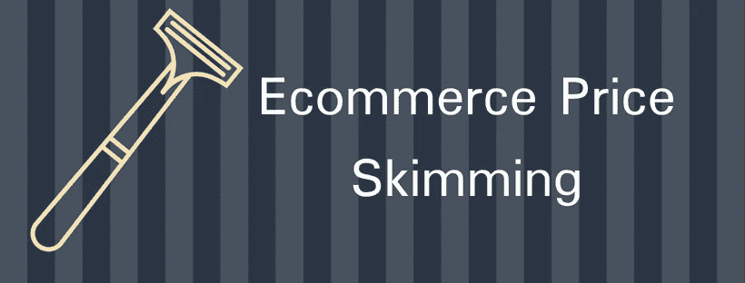
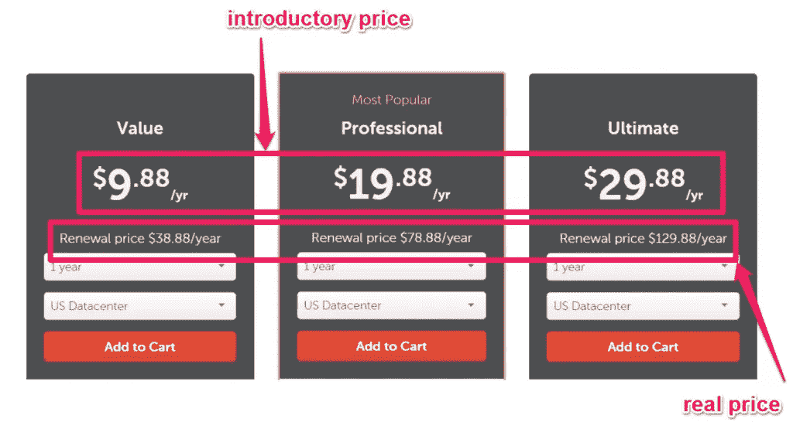
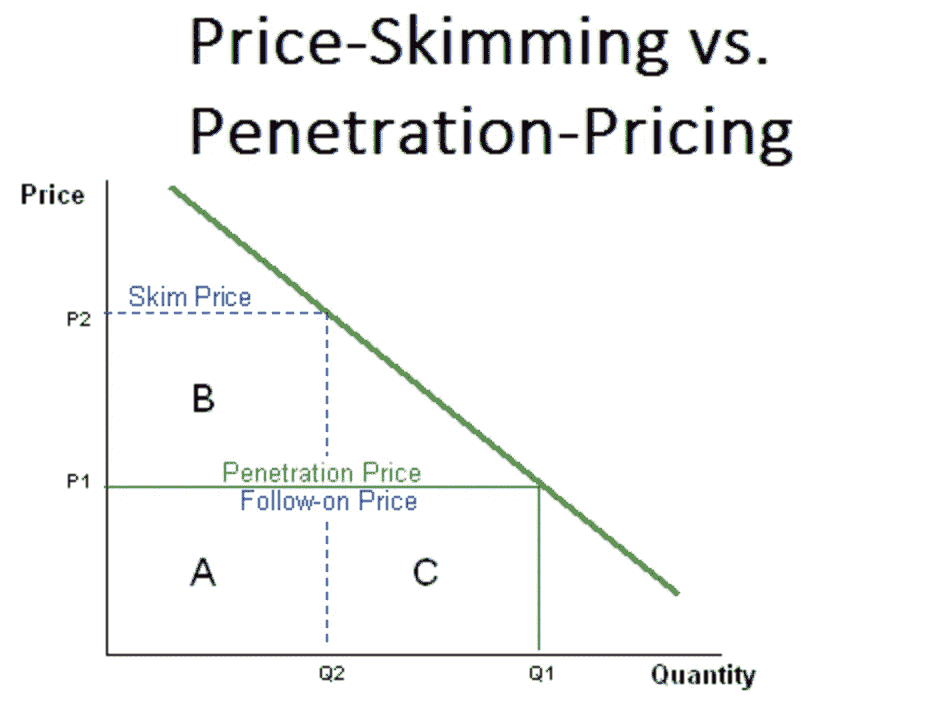
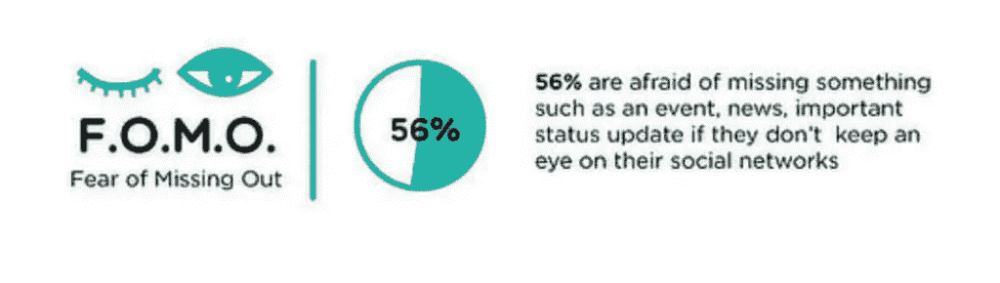
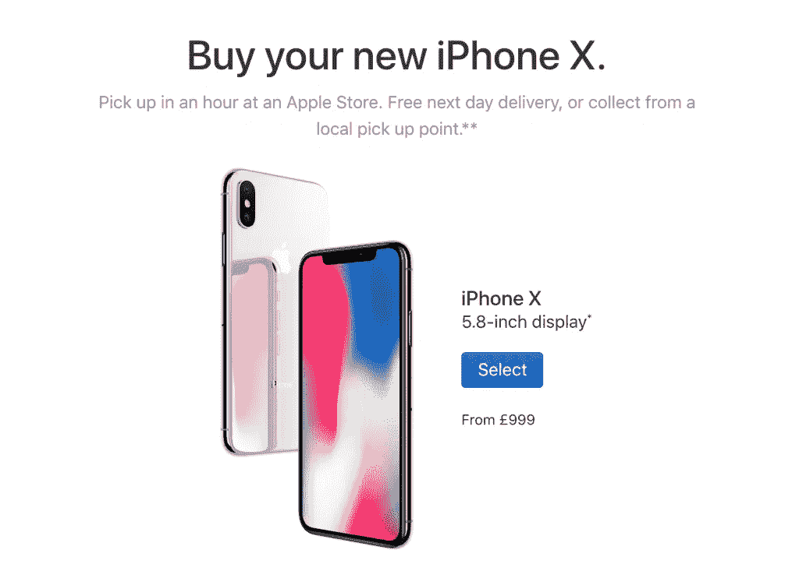

# 电子商务价格撇除。这种定价策略的优点和缺点

> 原文：<https://medium.com/swlh/ecommerce-price-skimming-advantages-and-disadvantages-of-this-pricing-strategy-eb4c3f56ce93>

电子商务价格撇除是[**价格歧视**](https://blog.prisync.com/price-discrimination-dynamic-pricing/) 的一种类型，可以是一种有用的定价策略，具体取决于你的业务行业。

许多 [**电子商务定价策略**](https://blog.prisync.com/ecommerce-pricing-strategies/) 谈论与竞争对手竞争。一些电子商务店主甚至会降低价格，以确保他们拥有市场上最好的交易。

但是，如果有一种方法可以让你的价格保持在高位，同时还能获利呢？

如果你能够通过提高早期用户的价格来利用你的新产品，会怎么样？

这一切都有可能与电子商务价格撇除。

在这篇博文中，我们将探讨什么是价格撇除策略，如何实施它，以及使用它的一些优点和缺点。

# 什么是电子商务价格撇除？

用最简单的话来说，电子商务价格撇除是在介绍阶段为你的产品设定高价的艺术。

这意味着企业能够利用其产品的“新颖性”，从一开始就最大限度地提高利润。

然而，重要的是要注意，当新的竞争对手进入市场时，电子商务店主降低价格时，价格撇除通常最有效。这不仅能帮助你与当前的市场价格保持一致，还能鼓励注重价格的购物者进行购买。

*来源:*[*https://marketing-insider.eu/new-product-pricing/*](https://marketing-insider.eu/new-product-pricing/)

# 如何实施价格撇除？

关于价格撇除，你需要记住的是，总有消费者想成为第一个获得产品的人。他们喜欢独一无二的感觉。在某种程度上，这让他们觉得自己是一个特殊俱乐部的成员。

如果你想实施价格撇除，那么你可以考虑在你的营销文案中使用诸如**“独家优惠”或“限量供应”**“成为第一个拿到手的人”等短语，以确保你强调了消费者立即采取行动的需求。

你甚至不需要有一个巨大的预算来创建这种活动，你可以使用社交媒体，甚至你自己的电子邮件列表来建立对你的产品最初的兴奋。

但是，一旦你实施价格撇除，你需要确保你密切关注你的数字，以确保你充分利用它。

不要急于降低价格，尤其是如果还有机会保持高价的话。

只有当消费者对你产品的需求下降，或者竞争对手以更低的价格出售相同或相似的产品时，你才应该考虑降低价格。

# 电子商务价格撇除的优势？

使用价格撇除作为初始价格策略有两个核心优势。首先，它可以让你的利润最大化

不仅如此，它给你一个机会，使你的产品看起来更难以捉摸和特殊，因为围绕产品的威望的感觉。

*来源:*[*https://www . sky word . com/content standard/marketing/how-the-fomo-phenomenon-is-driving-new-trends-in-marketing/*](https://www.skyword.com/contentstandard/marketing/how-the-fomo-phenomenon-is-driving-new-trends-in-marketing/)

当你实施价格撇除策略时，你就向那些愿意并愿意以更低价格生产你的产品的竞争对手敞开了大门，尤其是当他们见证了你的产品发布所产生的最初吸引力时。

对于许多电子商务供应商来说，这可能会吓跑他们，但事情不一定是这样的。尽管如此，你仍然有办法利用这一点。

它包括调整你的市场营销，这样尽管有竞争，你的产品看起来还是更好的。

通常，这是通过突出产品的优点和品质来展示产品的价值来实现的。

当你的顾客知道你的产品是最好的，他们就会理解为什么你的价格更高。他们知道你的额外功能会带来更高的价格，他们很乐意付钱。

价格撇除的另一个好处是能够细分市场，从而控制一部分客户的价格。这样，当新的竞争对手出现时，他们可以瞄准愿意支付不同价格的不同客户群。

# 电子商务价格撇除的缺点？

许多人对价格撇除犯的一个错误是认为他们可以把它作为一个长期策略。现在，虽然这可能是许多高价值物品的情况，但它通常不适用于大多数产品。

这是因为很快，当一个新的、令人兴奋的产品出现时，市场就会饱和，如果你不小心，你可能会疏远注重价格的买家。

如果你试图将一种产品推向已经有大量竞争对手的市场，这也是行不通的。如果市场的早期采用者已经确立，那么以更高的价格进入将会困难得多——除非你的产品在低价竞争中具有显著优势。

# 电子商务价格撇除的最佳例子？

苹果是最有效利用价格撇除的最好例子之一。在新 iPhone 发布的准备阶段，甚至在发布之前就有足够多的谣言。

一旦到了实际宣布的时间，已经有足够的兴奋被鼓出，增加了买家的购买欲望。

你会看到新闻，想拥有 iPhone 的人会在商店外面扎营，成为第一个拿到最新款的人。其他人甚至会在拿到手机前几周就预付手机款。

因此，尽管 iPhone 很快将面向所有人，但他们限制了初始数量，增加了产品的不确定性。

苹果没有做的是降低他们的价格，这符合价格撇除。当最新的手机型号最终面向所有人公开发布时，价格保持不变。

他们可以为如此高的价格辩护的原因是，未来的迭代承诺增加功能。

# 外卖食品

电子商务价格撇除是一种定价策略，允许供应商收取较高的初始价格，然后随着时间的推移慢慢降低价格。实际上，这可以比作从市场顶部撇去奶油。

他们这样做是为了坚持需求，并确保在新的竞争对手进入市场时，他们已经拥有竞争优势，并已将自己设定为事实上的购买品牌。

价格撇除通常用于帮助供应商收回他们可能产生的任何开发成本。

如果你有足够多的潜在客户愿意花高价购买该产品，以便成为第一批购买该产品的人，这是一个有效的策略。

此外，你应该记住，如果降低价格对你的整体单位成本和销售量的增加有重大影响，那么它可能对你没有效果。

## 这篇文章发表在《初创企业》杂志上，这是 Medium 最大的创业刊物，有 333，853 人关注。

## 订阅接收[我们的头条新闻](http://growthsupply.com/the-startup-newsletter/)。

